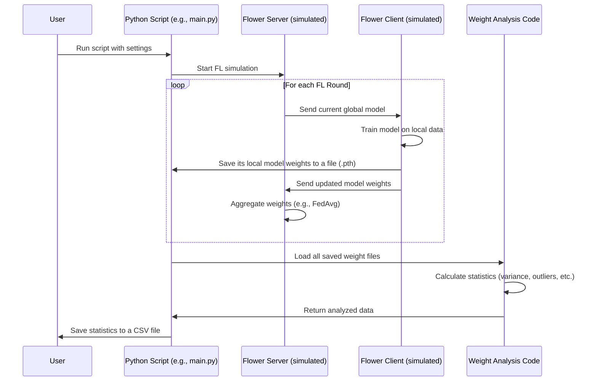

# Chapter 1: Federated Learning Simulation & Data Extraction

Welcome to the first chapter of our journey into understanding and analyzing Federated Learning systems! Today, we're going to explore how we can mimic a Federated Learning (FL) environment to generate valuable data. This data will be the bedrock for all the exciting analysis and model building we'll do in later chapters.

## What's the Big Idea? And Why Do We Need This?

Imagine a group of hospitals, each with its own patient data. They want to train a powerful AI model to detect a rare disease, but they can't share their patient data directly due to privacy concerns. This is where **Federated Learning (FL)** comes in!

In FL, instead of pooling all data in one place, each hospital (we'll call them "clients") trains a copy of the AI model on its own local data. Then, they send only the learnings (model updates or "weights") to a central server, which cleverly combines these learnings to create an improved global model. This process repeats, making the model smarter with each round, all while keeping the raw data private.

**Our Goal:** We want to study what happens inside these FL systems. How do the individual models at each client change over time? What if some clients are unintentionally (or intentionally!) messing with the process? To answer these questions, we need data *about* the FL process itself.

This chapter is about **simulating** this FL environment. Think of it like a flight simulator for AI. We're not flying a real plane (or using real sensitive data), but we're creating a realistic environment to:
1.  Observe how FL works.
2.  See what happens if we introduce "attackers" (clients trying to disrupt learning).
3.  Carefully record measurements, especially about the AI model's internal "knowledge" – its **model weights**.

The data we extract from these simulations will be crucial for building tools that can, for example, detect if an FL system is under attack.

## Key Concepts: The Building Blocks

Let's break down some terms we'll be using:

*   **Clients:** These are the independent participants in our FL setup. In our hospital analogy, each hospital is a client. In our simulation, these are virtual entities each with their own (simulated) dataset.
*   **Rounds:** FL is an iterative process. A "round" typically involves clients training locally, sending updates, and the server aggregating these updates to form a new global model. This new model is then sent back to clients for the next round.
*   **Model Weights:** Imagine an AI model as a complex recipe. The "weights" are the specific amounts of each ingredient (numbers) that define how the model makes decisions. When a model "learns," these weights change. We are very interested in tracking these changes.
*   **Attacks (e.g., Data Poisoning):** Sometimes, a client might be malicious. For example, in a "data poisoning" attack, a malicious client might deliberately feed its model incorrect information (e.g., labeling all "healthy" patients as "sick") to try and degrade the performance of the final global model. Our simulation allows us to model such scenarios.
*   **Data Extraction:** This is the process of carefully collecting specific measurements during the simulation. We're particularly interested in the statistical properties of the model weights from each client at each round – things like their average value, how spread out they are (variance), any extreme values (outliers), minimums, and maximums.

## How the Simulation Works: A Simplified Look

We use Python scripts (primarily `main.py` for a normal FL setup and `main_random.py` to simulate attacks) to run these experiments. Here's a bird's-eye view of what happens:

1.  **Setup:** We define how many clients participate, how many learning rounds to run, and what kind of AI model they'll be training. We also specify if any clients are "malicious" and how they might attack.
2.  **Federated Learning Rounds:**
    *   The simulation starts, mimicking the FL process round by round.
    *   In each round, every client:
        *   Receives the current global AI model.
        *   Trains this model on its own local data.
        *   **Crucially, it saves a copy of its model's weights (specifically, certain layers of the model) to a file.**
        *   Sends its updated model (or weights) back to a simulated "central server."
    *   The server aggregates these updates to create an improved global model for the next round.
3.  **Data Extraction & Analysis (Post-Simulation):**
    *   Once all rounds are complete, the script loads all the saved model weight files from every client and every round.
    *   It then calculates various statistical properties for these weights (e.g., variance across clients for a specific layer in a specific round, min/max values, number of outliers).
4.  **Saving the Results:** All these calculated statistics are neatly organized and saved into a CSV (Comma Separated Values) file – typically named `all_layers_summary.csv`. This file is the treasure we're seeking!

Here's a diagram showing the flow:



## A Glimpse into the Code

Let's peek at some simplified snippets from `main.py` to understand how these steps are implemented. Don't worry if not every detail is clear; the goal is to get the general idea!

**1. Setting up the Simulation:**
We first define some basic parameters for our simulation.

```python
# In main.py
NUM_CLIENTS = 10  # How many clients (e.g., virtual researchers)
NUM_ROUNDS = 10   # How many cycles of learning

# Where each client will save its model's "knowledge" (weights)
WEIGHT_SAVE_DIR = 'weight_pth_file_normal(10c10r)'
# Where the final summary of all collected data will go
SUMMARY_DIR = 'summary_results_normal(10c10r)'

# Create these folders if they don't exist
if not os.path.exists(WEIGHT_SAVE_DIR):
    os.makedirs(WEIGHT_SAVE_DIR)
if not os.path.exists(SUMMARY_DIR):
    os.makedirs(SUMMARY_DIR)
```
This code sets up our experiment: 10 clients will learn over 10 rounds. It also prepares specific folders to store the raw weight data (`WEIGHT_SAVE_DIR`) and the final analyzed summary (`SUMMARY_DIR`).

**2. Client Training and Saving Weights:**
Each client, after training its model in a round, saves its weights. This is a critical step for our data collection.

```python
# Inside the IMDBClient's fit method (called each round for each client):
# ... (code for the client to train its model locally) ...

# After training, the client saves its model's weights:
state_dict = self.model.state_dict() # Get all parts of the model
for layer_name, weight_tensor in state_dict.items():
    # We are interested in specific parts called '.weight'
    if ".weight" in layer_name:
        # The script cleverly names files to track the round number
        # by seeing how many files for this layer & client already exist.
        num_prior_files = len([f for f in os.listdir(WEIGHT_SAVE_DIR)
                               if f.endswith(f'_{layer_name}_client{self.cid}.pth')])
        # Filename includes round (r1, r2...), layer name, and client ID
        filename = f"r{num_prior_files + 1}_{layer_name}_client{self.cid}.pth"
        torch.save(weight_tensor, os.path.join(WEIGHT_SAVE_DIR, filename))
```
Here, `self.model.state_dict()` gets all the learnable parameters (weights and biases) of the client's model. We then iterate through them, and if a parameter is a 'weight' tensor, we save it. The filename structure `r{round_num}_{layer_name}_client{client_id}.pth` is vital, as it allows us to identify which round, layer, and client the weight belongs to later on.

**3. Starting the Federated Learning Show:**
The `flwr` (Flower) library helps us simulate the FL process.

```python
# In main.py, towards the end of the script
fl.simulation.start_simulation(
    client_fn=client_fn,          # A function that creates a client when needed
    num_clients=NUM_CLIENTS,      # Total clients to simulate
    config=fl.server.ServerConfig(num_rounds=NUM_ROUNDS), # How many rounds
    # ... (strategy for how server combines client updates, e.g., FedAvg) ...
)
```
This call is the engine that runs the whole FL simulation, orchestrating the clients and the server for the specified number of rounds.

**4. After Simulation: Loading All Saved Weights:**
Once the simulation finishes, we need to gather all those saved `.pth` files.

```python
# From the load_weights function in main.py:
weights_dict = {} # A dictionary to store all loaded weights, organized
# Find all .pth files in the directory where weights were saved
for filepath in glob.glob(os.path.join(WEIGHT_SAVE_DIR, "*.pth")):
    filename = os.path.basename(filepath)
    # Extract round, layer name, and client ID from the filename
    parts = filename.split('_')
    round_number = int(parts[0][1:]) # e.g., 'r1' -> 1
    layer_name = '_'.join(parts[1:-1])
    # client_id = parts[-1][6:-4] # Extract client ID

    # Load the actual weight data (numbers)
    weight_data = torch.load(filepath).cpu().numpy()

    # Store it in an organized way
    if layer_name not in weights_dict:
        weights_dict[layer_name] = {}
    if round_number not in weights_dict[layer_name]:
        weights_dict[layer_name][round_number] = []
    weights_dict[layer_name][round_number].append(weight_data)
# return weights_dict
```
This function goes through the `WEIGHT_SAVE_DIR`, reads each `.pth` file, parses its name to know the round and layer, and loads the actual weight values. These are stored in `weights_dict`, neatly organized by layer and then by round. Each entry will contain a list of weights, one from each client that contributed in that round for that layer.

**5. Analyzing the Weights for Insights:**
With all weights loaded, we can now calculate statistics.

```python
# From the analyze_weights function in main.py:
# analysis_results = {}
# For each layer...
    # For each round number in that layer...
        # weights_list = weights_dict[layer_name][round_number]
        # Convert list of client weights into a single NumPy array for easier math
        weights_array = np.array(weights_list)

        # Calculate statistics across the clients for this layer and round
        variance = np.var(weights_array, axis=0)
        mean_variance = np.mean(variance) # Average variance

        z_scores = np.abs(stats.zscore(weights_array, axis=0))
        num_outliers = (z_scores > 3).sum() # Count outliers

        # Also get min, max, mean, median, std dev, quartiles of the weights
        # ... (calculations for weight_min, weight_max, etc.) ...

        # Store these:
        # analysis_results[layer_name][round_number] = {
        #    'mean_variance': mean_variance, 'outliers': num_outliers, ...
        # }
# return analysis_results
```
This function takes the `weights_dict` from the previous step. For each layer and each round, it looks at the weights contributed by all clients. It then computes various statistics like the average variance of these weights, the number of outliers (weights that are unusually different from others), and basic descriptive statistics (min, max, mean, etc.).

**6. The Final Output: `all_layers_summary.csv`**
All the computed statistics are then compiled into a table (a Pandas DataFrame) and saved as a CSV file.

```python
# In main.py, after simulation and analysis:
all_layers_summary_list = []
# ... (loop through analysis_results to populate all_layers_summary_list) ...
# Each item in the list is a dictionary like:
# { 'Round': round_number, 'Layer': layer_name,
#   'Mean_Variance': results['mean_variance'], ... }

summary_df = pd.DataFrame(all_layers_summary_list)
summary_file_path = os.path.join(SUMMARY_DIR, "all_layers_summary.csv")
summary_df.to_csv(summary_file_path, index=False)
print(f"Results saved to {summary_file_path}")
```
This `all_layers_summary.csv` file is the primary output of this simulation and data extraction stage. It contains rows for each layer and round, with columns like:
*   `Round`: The FL round number.
*   `Layer`: The name of the model layer.
*   `Mean_Variance`: The average variance of weights from all clients for this layer/round.
*   `Number_of_outliers`: How many client weights were statistically outlying.
*   `Weight_Min`, `Weight_Max`, `Weight_Mean`, etc.: Basic stats of the weight values.
*   `Attack_Type`: Indicates if an attack was simulated (e.g., "normal" or "random").
*   `MALICIOUS_NODE_RATIO`: If an attack was simulated, what percentage of clients were malicious.

## Simulating Different Scenarios: Normal vs. Attack

Our project includes two main scripts for simulation:
*   `for_dataset/main.py`: This script runs a "normal" FL simulation. All clients are honest and try their best to train the model.
    ```python
    # In main.py
    attack_type = "normal"
    MALICIOUS_NODE_RATIO = 0 # No malicious clients
    MALICIOUS_DATA_RATIO = 0 # No data is intentionally corrupted
    ```

*   `for_dataset_random/main_random.py`: This script simulates an FL environment where some clients might be malicious. For instance, they might perform a "random label flipping" attack (a type of data poisoning) where they intentionally change the labels of their local data to confuse the model.
    ```python
    # In main_random.py
    attack_type = "random"  # Indicates a random label flipping attack
    MALICIOUS_NODE_RATIO = 0.1  # 10% of clients are malicious
    MALICIOUS_DATA_RATIO = 0.1  # Malicious clients flip 10% of their data labels
    ```
    The `apply_random_label_change` function in `main_random.py` implements this label flipping for the designated malicious clients.

By running simulations under both "normal" and "attack" conditions, we can generate data that reflects different states of an FL system. This is invaluable for later building models that can distinguish between these states.

## Conclusion: What We've Achieved

In this chapter, we've dived into the fascinating world of Federated Learning simulation. We learned:
*   Why simulating FL is important: It allows us to study FL dynamics and generate data safely and reproducibly.
*   The key components: Clients, rounds, model weights, and the possibility of attacks.
*   The process: How simulations are run, how model weights from individual clients are saved at each round, and how these weights are then analyzed to extract statistical features.
*   The output: A detailed CSV file (`all_layers_summary.csv`) containing these statistical features, which serves as the raw dataset for our future analyses.

This extracted data – especially the statistical properties of model weights under various conditions (normal and attack) – is the foundation upon which we'll build in the upcoming chapters.

Now that we understand how individual simulation experiments generate data, our next step is to see how we can combine data from multiple such experiments to create a comprehensive dataset. Let's move on to [Experiment Aggregation & Dataset Construction](02_experiment_aggregation___dataset_construction_.md)!

---

Generated by [AI Codebase Knowledge Builder](https://github.com/The-Pocket/Tutorial-Codebase-Knowledge)