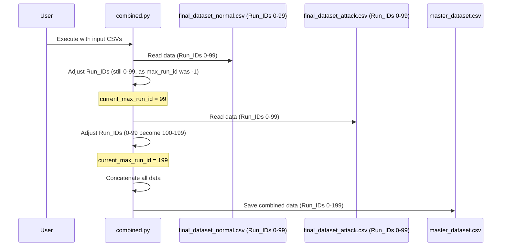

# Chapter 2: Experiment Aggregation & Dataset Construction

Welcome to Chapter 2! In [Chapter 1: Federated Learning Simulation & Data Extraction](01_federated_learning_simulation___data_extraction_.md), we saw how a single Federated Learning (FL) simulation can run and produce a summary file, like `all_layers_summary.csv`, packed with interesting measurements about the learning process. This file is like a detailed logbook from one research expedition.

But what if we conduct *many* expeditions? Perhaps we run the FL simulation 10 times under normal conditions, and then another 10 times simulating an attack. We'd end up with 20 separate "logbooks"! To get the full picture and build robust tools, we need to combine all this information.

This chapter is all about that: **Experiment Aggregation & Dataset Construction**. Think of it like a head librarian or a central archivist carefully collecting all the individual logbooks (our `all_layers_summary.csv` files) and organizing them into one giant, well-structured master archive (a single, large CSV dataset). This master dataset will be the foundation for training our anomaly detection models later on.

## What's the Goal? One Big, Tidy Table!

Imagine you've run several FL simulations:
*   Some were "normal" simulations where all clients behaved correctly.
*   Some were "attack" simulations where some clients tried to disrupt the learning.

Each simulation run gave you a CSV file with data like this (from Chapter 1):

**`run1_normal_summary.csv` (conceptual)**
| Round | Layer        | Mean_Variance | Number_of_outliers | Attack_Type |
|-------|--------------|---------------|--------------------|-------------|
| 0     | conv1.weight | 0.05          | 0                  | normal      |
| 1     | conv1.weight | 0.04          | 0                  | normal      |
| ...   | ...          | ...           | ...                | ...         |

**`run1_attack_summary.csv` (conceptual)**
| Round | Layer        | Mean_Variance | Number_of_outliers | Attack_Type |
|-------|--------------|---------------|--------------------|-------------|
| 0     | conv1.weight | 0.25          | 3                  | random      |
| 1     | conv1.weight | 0.22          | 2                  | random      |
| ...   | ...          | ...           | ...                | ...         |

If we have many such files, analyzing them one by one is inefficient. Our goal is to combine them into a single CSV file. Crucially, we need a way to know which rows came from which original simulation. For this, we introduce a **`Run_ID`**.

Our **final dataset** would look something like this:

| Run_ID | Round | Layer        | Mean_Variance | Number_of_outliers | Attack_Type |
|--------|-------|--------------|---------------|--------------------|-------------|
| 0      | 0     | conv1.weight | 0.05          | 0                  | normal      |
| 0      | 1     | conv1.weight | 0.04          | 0                  | normal      |
| 1      | 0     | conv1.weight | 0.25          | 3                  | random      |
| 1      | 1     | conv1.weight | 0.22          | 2                  | random      |
| ...    | ...   | ...          | ...           | ...                | ...         |

Here, `Run_ID = 0` might represent our first "normal" simulation, and `Run_ID = 1` our first "attack" simulation, and so on.

## The Two-Step Dance of Aggregation

To achieve this, we typically follow a two-step process, often managed by helper scripts:

1.  **Step 1: Collect Results from Multiple Runs of the *Same Type***
    *   We use a script (like `for_dataset/run_and_collect.py` or `for_dataset_random/run_and_collect.py`) to automatically run our primary simulation script (e.g., `main.py` from Chapter 1) many times.
    *   For each execution (a "run"), this script takes the resulting `all_layers_summary.csv`, adds a unique `Run_ID` to its data, and appends it to a collective CSV file for that *type* of experiment (e.g., `all_normal_runs.csv` or `all_attack_runs.csv`).

2.  **Step 2: Combine Collections from *Different Types* of Experiments**
    *   Now we might have several "collective" CSVs, for example:
        *   `all_normal_runs.csv` (containing data from, say, 100 normal simulations, with `Run_ID`s 0-99)
        *   `all_attack_runs.csv` (containing data from, say, 100 attack simulations, also with `Run_ID`s 0-99)
    *   We use another script (like `five_model_adversarial/combined.py` or `for_dataset_random/combined.py`) to merge these files into one grand `dataset.csv`. This script cleverly adjusts the `Run_ID`s to ensure they are unique across the *entire* final dataset (e.g., attack runs might get `Run_ID`s 100-199).

Let's look at these steps more closely.

### Step 1: Automating Runs and Adding `Run_ID` (e.g., using `run_and_collect.py`)

The `for_dataset/run_and_collect.py` script is a great example of how to automate running `main.py` (our "normal" simulation from Chapter 1) multiple times.

**What it does:**
1.  It decides how many times to run the simulation (e.g., `NUM_RUNS = 100`).
2.  It loops that many times. In each loop (say, for `run_id` from 0 to 99):
    a.  It runs `main.py` using Python's `subprocess` module. This `main.py` execution generates its own `summary_results_normal(10c10r)/all_layers_summary.csv`.
    b.  It reads this newly generated `all_layers_summary.csv` into a pandas DataFrame.
    c.  It adds a new column, let's call it `Run_ID` (the script uses `Run ID`), and fills it with the current `run_id`.
    d.  It appends this DataFrame to a growing CSV file, say `final_dataset_normal.csv`.
    e.  It cleans up the temporary directories created by `main.py` to prepare for the next run.

**A simplified peek into `for_dataset/run_and_collect.py`:**

```python
# In run_and_collect.py (simplified)
import subprocess
import pandas as pd
import os

NUM_RUNS = 5 # Let's say we do 5 runs for this example
FINAL_DATASET_FILE = 'all_my_normal_runs.csv' 
# ... (setup for summary_file path) ...

# Ensure the final dataset file is clear if it's the first run, or set header correctly
is_first_run = True 

for run_id in range(NUM_RUNS):
    print(f"--- Running experiment {run_id} ---")
    # 1. Execute main.py (which creates all_layers_summary.csv)
    subprocess.run(['python', 'main.py'], check=True) 
    
    # 2. Load the summary CSV produced by main.py
    # (Assuming summary_file_path points to 'summary_results_normal(...)/all_layers_summary.csv')
    df = pd.read_csv(summary_file_path) 
    
    # 3. Add the Run_ID
    df['Run_ID'] = run_id # In the actual script, it's 'Run ID'
    
    # 4. Append to our collective CSV
    df.to_csv(FINAL_DATASET_FILE, mode='a', index=False, header=is_first_run)
    is_first_run = False # Subsequent appends should not write the header
    
    # ... (cleanup temporary files/folders from main.py) ...
```
This script is super helpful! After it finishes, `all_my_normal_runs.csv` (or `final_dataset.csv` as in the original script) would contain the results from all `NUM_RUNS` executions, each batch of rows clearly marked with its `Run_ID`.

A similar script, `for_dataset_random/run_and_collect.py`, does the same for `main_random.py` to generate a collection of attack simulation results.

**Input:** `main.py` (or `main_random.py`), `NUM_RUNS`
**Output:** A CSV file (e.g., `final_dataset_normal.csv`) containing combined results from `NUM_RUNS` of the *same type* of experiment, with a `Run_ID` column.

### Step 2: Combining Different Collections (e.g., using `combined.py`)

Now we have a few "intermediate" datasets, for example:
*   `final_dataset_normal.csv` (from running `main.py` 100 times, `Run_ID`s 0-99)
*   `final_dataset_attack.csv` (from running `main_random.py` 100 times, `Run_ID`s 0-99)

Notice a problem? The `Run_ID`s are not unique *between* these two files! If we just stick them together, we won't know if `Run_ID = 5` refers to the 6th normal run or the 6th attack run.

This is where a script like `five_model_adversarial/combined.py` (or the other `combined.py` scripts) comes into play. Its job is to merge these intermediate datasets into one final, master dataset, ensuring `Run_ID`s are globally unique.

**What it does:**
1.  It identifies the CSV files to combine (e.g., `final_dataset_normal.csv`, `final_dataset_attack.csv`).
2.  It starts with an empty list to hold DataFrames and keeps track of the highest `Run_ID` encountered so far (let's call it `max_run_id`, initially -1).
3.  For each input CSV file:
    a.  It reads the CSV into a DataFrame.
    b.  It **adjusts** the `Run_ID`s in this DataFrame by adding `max_run_id + 1` to them. So, if `max_run_id` was 99 (from the normal runs), and the attack runs file also has `Run_ID`s 0-99, these will be shifted to 100-199.
    c.  It adds this modified DataFrame to the list.
    d.  It updates `max_run_id` to the new highest `Run_ID` from the DataFrame just processed.
4.  Finally, it concatenates all DataFrames in the list into one large DataFrame and saves it as the master `dataset.csv`.

**A simplified peek into a `combined.py` script (conceptually based on `five_model_adversarial/combined.py`):**

```python
# In combined.py (simplified)
import pandas as pd
import glob # To find files

# Files to combine (could be passed as arguments or found with glob)
files_to_combine = ['final_dataset_normal.csv', 'final_dataset_attack.csv']
OUTPUT_FILE = 'master_dataset.csv'

all_dataframes = []
current_max_run_id = -1

for filepath in files_to_combine:
    df = pd.read_csv(filepath)
    # Ensure column name consistency for Run_ID
    if 'Run ID' in df.columns and 'Run_ID' not in df.columns: # Handle 'Run ID' vs 'Run_ID'
        df.rename(columns={'Run ID': 'Run_ID'}, inplace=True)

    if not df.empty:
        # Adjust Run_ID to be globally unique
        df['Run_ID'] = df['Run_ID'] + current_max_run_id + 1
        all_dataframes.append(df)
        current_max_run_id = df['Run_ID'].max() # Update max for next file

# Combine all DataFrames
if all_dataframes:
    final_df = pd.concat(all_dataframes, ignore_index=True)
    final_df.to_csv(OUTPUT_FILE, index=False)
    print(f"Master dataset saved to {OUTPUT_FILE}")
else:
    print("No data to combine.")
```

**Visualizing the `combined.py` Process:**

Here's how `combined.py` takes multiple input files and merges them:



**Input:** Several "collective" CSV files (e.g., `final_dataset_normal.csv`, `final_dataset_attack.csv`), each already containing a `Run_ID` column (which might not be globally unique yet).
**Output:** A single, master `dataset.csv` where every row from every original experiment is present, and each original experiment has a globally unique `Run_ID`.

## Our Precious `Run_ID`

The `Run_ID` column is the star of this chapter. It acts like a unique passport stamp for each individual simulation run. Without it, once all the data is mixed together, we'd have no way of knowing which set of observations (like `Mean_Variance` over several rounds) came from the same original experiment. This `Run_ID` is essential for many types of analysis, especially when we want to see if patterns differ systematically between, say, normal runs and attack runs.

## Conclusion: Building Our Data Foundation

In this chapter, we've learned how to go from many individual experiment logbooks (`all_layers_summary.csv` files) to a single, comprehensive master dataset.
*   We saw how helper scripts like `run_and_collect.py` can automate running multiple simulations of the *same type* and assign an initial `Run_ID`.
*   We then explored how scripts like `combined.py` can merge these collections, intelligently adjusting `Run_ID`s to ensure they are globally unique in our final dataset.

This final, aggregated dataset is a rich source of information. Each row tells a story about a specific FL round within a specific simulation experiment, identified by its `Run_ID`.

With this well-structured dataset prepared, we are now ready to start shaping it for our ultimate goal: detecting anomalies. Our next step is to think about what specific characteristics or "features" we can calculate from this data to help our models learn. This brings us to [Feature Engineering for Anomaly Detection](03_feature_engineering_for_anomaly_detection_.md).

---

Generated by [AI Codebase Knowledge Builder](https://github.com/The-Pocket/Tutorial-Codebase-Knowledge)