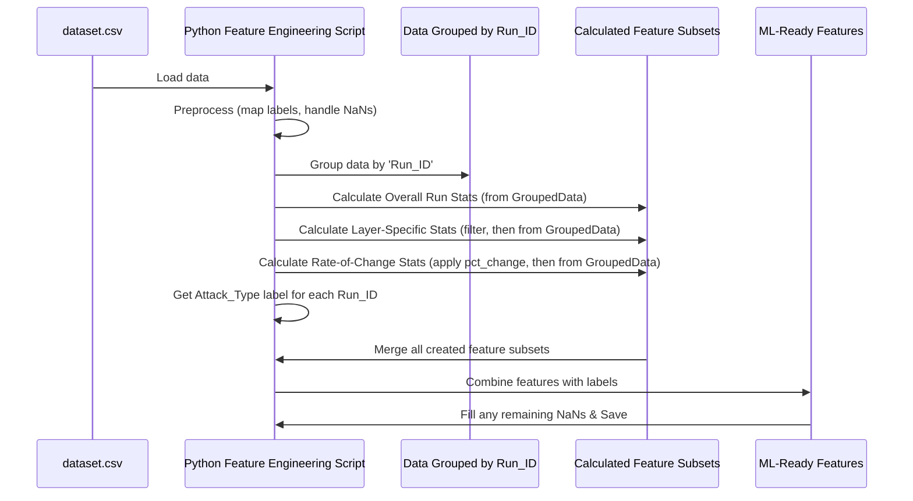

# Chapter 3: Feature Engineering for Anomaly Detection

Welcome to Chapter 3! In [Chapter 2: Experiment Aggregation & Dataset Construction](02_experiment_aggregation___dataset_construction_.md), we successfully combined the results from many individual Federated Learning simulations into one large `dataset.csv` file. This master dataset is rich with information, containing measurements like `Mean_Variance` and `Number_of_outliers` for each `Layer` in each `Round` of every `Run_ID`.

But, if we want to build a machine learning model to predict whether an *entire FL run* was normal or part of an attack, this level of detail is too granular. Imagine a doctor trying to assess a patient's overall health for the day. They wouldn't look at a printout of every single heartbeat! Instead, they'd look at summaries: average heart rate, heart rate variability, number of unusual spikes, etc. These summaries are what we call "features."

This chapter is all about **Feature Engineering**: transforming our detailed, raw statistical measurements from `dataset.csv` into a set of meaningful signals (features) that describe each FL run as a whole. These features will then be used by our machine learning models to learn how to distinguish between normal and anomalous FL runs.

## What are Features, and Why Do We Need Them?

Think of "features" as the key characteristics or attributes of something you want to analyze. If you're describing a car, features might be its color, engine size, number of doors, and top speed. In our case, we want to describe an entire FL run (identified by `Run_ID`).

Our `dataset.csv` currently looks something like this:

| Run_ID | Round | Layer        | Mean_Variance | Number_of_outliers | Attack_Type |
|--------|-------|--------------|---------------|--------------------|-------------|
| 0      | 0     | layer.0.fc1  | 0.05          | 0                  | normal      |
| 0      | 0     | layer.1.conv | 0.02          | 0                  | normal      |
| 0      | 1     | layer.0.fc1  | 0.04          | 0                  | normal      |
| ...    | ...   | ...          | ...           | ...                | ...         |
| 42     | 5     | layer.3.out  | 0.21          | 2                  | adversarial |
| ...    | ...   | ...          | ...           | ...                | ...         |

Each row gives us details about a specific layer at a specific round within a run. But to classify `Run_ID = 0` as "normal" or `Run_ID = 42` as "adversarial," a machine learning model typically needs a single row of data that summarizes the *entire run*.

**Feature engineering** is the process of:
1.  Grouping all the data for a single `Run_ID`.
2.  Calculating various summary statistics (our features) from this group.
3.  Creating a new table where each row represents one `Run_ID`, and the columns are these newly calculated features, plus the original `Attack_Type` label.

This new table is what our anomaly detection models will learn from.

## Crafting Our Features: Different Angles on the Data

We can create features that capture different aspects of an FL run's behavior:

1.  **Overall Run Statistics:** These describe the general behavior across all layers and rounds within a run.
    *   *Example Features:*
        *   The average `Mean_Variance` across all entries for a run.
        *   The standard deviation of `Mean_Variance` for a run.
        *   The average `Number_of_outliers` for a run.
        *   The maximum `Number_of_outliers` observed in any round/layer for a run.
        *   The total number of unique layers involved in the run.

2.  **Layer-Specific Statistics:** Sometimes, abnormal behavior is more pronounced in certain parts of the model (e.g., the final classification layer or specific intermediate layers).
    *   *Example Features:*
        *   Average `Mean_Variance` specifically for entries related to `layer.3` within a run.
        *   Standard deviation of `Mean_Variance` specifically for entries related to `layer.5` (a hypothetical final layer) within a run.

3.  **Rate of Change Statistics:** How metrics evolve over rounds can be a very telling sign. An attack might cause sudden spikes, stagnation, or erratic changes.
    *   *Example Features:*
        *   For a specific layer (e.g., `layer.3`), calculate the percentage change in `Mean_Variance` from one round to the next.
        *   Then, for each run, find the average or standard deviation of these percentage changes for that layer.

Let's see how we can use Python's pandas library to create some of these.

## From Raw Data to Actionable Features: A Pandas Walkthrough

Our starting point is the `dataset.csv` file. Our goal is to produce a new table where each row corresponds to a `Run_ID` and columns are the engineered features and the `Attack_Type`.

**1. Load Data and Basic Preparation**

First, we load our dataset. In our project (e.g., in `five_model_adversarial/main_adversarial_new_model.py`), we also map the `Attack_Type` column from text (like "normal", "adversarial") to numbers (e.g., 0 for normal, 1 for attack), as machine learning models prefer numbers. We also handle any missing values.

```python
import pandas as pd
import numpy as np

# Load the dataset
df = pd.read_csv('dataset.csv')

# Map 'Attack_Type' to numbers (0 for normal, 1 for attack)
# (Assuming 'adversarial' or 'random' are the attack types)
attack_map = {'normal': 0, 'adversarial': 1, 'random': 1}
df['Attack_Type'] = df['Attack_Type'].map(attack_map)

# Drop rows where Attack_Type might be missing after mapping
df.dropna(subset=['Attack_Type'], inplace=True)
df['Attack_Type'] = df['Attack_Type'].astype(int)

# Fill any missing numerical values with 0 (a common simple strategy)
numeric_cols = df.select_dtypes(include=np.number).columns
df[numeric_cols] = df[numeric_cols].fillna(0)
```
This prepares our data. Now, `Attack_Type` is 0 or 1, and we've made a first pass at handling missing data.

**2. Grouping by `Run_ID`**

The foundation of our feature engineering is to group data by `Run_ID`.

```python
# Group all rows belonging to the same experiment run
grouped_by_run = df.groupby('Run_ID')
```
`grouped_by_run` is now a special pandas object. You can think of it as a collection of mini-tables, one for each unique `Run_ID`.

**3. Calculating Overall Run Statistics**

Let's calculate some simple features that summarize `Mean_Variance` and `Number_of_outliers` across all rounds/layers for each `Run_ID`.

```python
# Calculate mean and standard deviation for specified columns per Run_ID
overall_features = grouped_by_run.agg(
    MV_mean_overall=('Mean_Variance', 'mean'),
    MV_std_overall=('Mean_Variance', 'std'),
    Outliers_mean_overall=('Number_of_outliers', 'mean'),
    Outliers_max_overall=('Number_of_outliers', 'max')
).reset_index() # reset_index() makes Run_ID a column again
```
Here, `agg()` lets us apply multiple functions (`mean`, `std`, `max`) to different columns. The result, `overall_features`, will have one row per `Run_ID` and columns like `Run_ID`, `MV_mean_overall`, `MV_std_overall`, etc.

**4. Calculating Layer-Specific Statistics**

Suppose we're interested in what happens specifically in layers containing `'layer.3'`.

```python
# Filter for rows containing 'layer.3' in the 'Layer' column
middle_layers_df = df[df['Layer'].str.contains('layer.3', na=False)]

# Group these filtered rows by Run_ID
grouped_middle_run = middle_layers_df.groupby('Run_ID')

# Calculate features for these middle layers
middle_layer_features = grouped_middle_run.agg(
    MV_mean_middle=('Mean_Variance', 'mean'),
    MV_std_middle=('Mean_Variance', 'std')
).reset_index()
```
This gives us features like `MV_mean_middle` (average `Mean_Variance` for `layer.3` components within each run).

**5. Calculating Rate of Change Statistics**

To see how `Mean_Variance` changes over rounds for, say, `middle_layers_df`:

```python
# Define a function to calculate percentage change within each group (Run_ID)
def calculate_change_rate(group):
    group = group.sort_values('Round') # CRITICAL: sort by Round first!
    group['MV_Change_Rate'] = group['Mean_Variance'].pct_change().fillna(0)
    return group

# Apply this to our middle layer data, grouped by Run_ID
middle_layers_with_change = middle_layers_df.groupby('Run_ID', group_keys=False).apply(calculate_change_rate)

# Now, aggregate these change rates per Run_ID
middle_change_features = middle_layers_with_change.groupby('Run_ID').agg(
    MV_Change_Rate_mean_middle=('MV_Change_Rate', 'mean'),
    MV_Change_Rate_std_middle=('MV_Change_Rate', 'std')
).reset_index()
```
The `pct_change()` function calculates the percentage difference from the previous row (which, after sorting by `Round`, is the previous round). We `fillna(0)` because the first round has no prior round to compare against.

**6. Combining All Features and Labels**

Now we merge these different feature sets into one table. We also need to get the `Attack_Type` label for each `Run_ID`.

```python
# Get the 'Attack_Type' for each Run_ID (it's the same for all rows in a group)
labels = grouped_by_run['Attack_Type'].first().reset_index()

# Start with one set of features and merge others
final_features_df = pd.merge(overall_features, middle_layer_features, on='Run_ID', how='left')
final_features_df = pd.merge(final_features_df, middle_change_features, on='Run_ID', how='left')

# Finally, merge the labels
final_ml_data = pd.merge(final_features_df, labels, on='Run_ID', how='left')

# Fill any NaNs that might have resulted from merges or calculations (e.g., if a run had no 'layer.3')
final_ml_data = final_ml_data.fillna(0)
```
`pd.merge` combines DataFrames based on a common column (`Run_ID`). `how='left'` ensures we keep all `Run_ID`s from the left DataFrame.

**Our Output: Ready for Machine Learning!**

The `final_ml_data` DataFrame now looks something like this:

| Run_ID | MV_mean_overall | MV_std_overall | ... | MV_Change_Rate_std_middle | Attack_Type |
|--------|-----------------|----------------|-----|---------------------------|-------------|
| 0      | 0.045           | 0.012          | ... | 0.05                      | 0           |
| 1      | 0.080           | 0.025          | ... | 0.15                      | 0           |
| ...    | ...             | ...            | ... | ...                       | ...         |
| 42     | 0.250           | 0.090          | ... | 0.85                      | 1           |

Each row is a summary of one FL run, perfect for feeding into an anomaly detection model! The `Attack_Type` (0 or 1) is what our model will try to predict.

## Under the Hood: The Feature Engineering Pipeline

The steps we just walked through manually are typically automated in a script. For example, in our project, files like `five_model_adversarial/main_adversarial_new_model.py` and `five_model_random/main_random_five_model.py` perform similar (though often more extensive) feature engineering.

Here's a conceptual view of the process:



**Why these features? A little intuition:**
*   **`Mean_Variance` Statistics:** Attacks might introduce instability (higher variance on average) or, conversely, stall learning (abnormally low variance). The mean, std, min, max of these `Mean_Variance` values across a run can capture these patterns.
*   **`Number_of_outliers` Statistics:** Malicious clients might have model weights that are drastically different from benign clients. This could lead to a higher count or average number of outliers detected over the rounds.
*   **`Mean_Variance_Change_Rate` Statistics:** Normal learning often shows a somewhat predictable pattern of change in variance. Attacks might disrupt this, causing very large or erratic changes, or perhaps a complete lack of change (stagnation). The statistics of these change rates (mean, std) can highlight such deviations.
*   **Layer Specificity:** Some attacks might be more visible in how they affect certain layers. For example, an attack on labels might more strongly impact the later layers of a neural network.

The exact features that work best can depend on the specific type of model, data, and attacks being considered. This is why feature engineering is often an iterative process of experimentation.

## Conclusion: Sharpening Our Signals

In this chapter, we've transformed the granular, per-round, per-layer data from `dataset.csv` into a concise and powerful set of features, where each row summarizes an entire FL run. This is a critical "signal processing" step that makes our data suitable for machine learning models. We've turned noisy sensor readings into clearer patterns.

With our engineered features ready, we can now move on to the exciting part: training models that can use these features to distinguish between normal FL operations and potential attacks.

Let's proceed to [Chapter 4: Anomaly Detection Model Training Framework](04_anomaly_detection_model_training_framework_.md) to see how we build and train these detectors!

---

Generated by [AI Codebase Knowledge Builder](https://github.com/The-Pocket/Tutorial-Codebase-Knowledge)