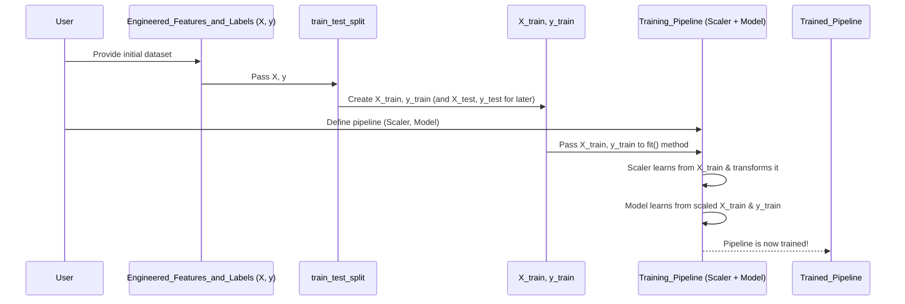

# Chapter 4: Anomaly Detection Model Training Framework

Welcome to Chapter 4! In [Chapter 3: Feature Engineering for Anomaly Detection](03_feature_engineering_for_anomaly_detection_.md), we learned how to transform our raw data into meaningful "features" – characteristics that describe each Federated Learning (FL) run. We now have a dataset where each row summarizes an entire FL experiment, and we know if that experiment was "normal" or involved an "attack."

But how do we use these features to automatically detect anomalies? We need to *train* a machine learning model. Think of it like teaching a security dog to sniff out suspicious packages. We show the dog many examples of normal packages and suspicious packages (our features and labels), and eventually, it learns to tell them apart.

This chapter is about the **Anomaly Detection Model Training Framework** – the "school" where our detection models learn. It's like an assembly line: our engineered features come in, and a trained "anomaly detector" (our machine learning model) comes out.

## What's the Goal? Building Smart Detectives!

Our main goal is to take the engineered features (like `MV_mean_overall`, `Outliers_max_overall` from Chapter 3) for many FL runs, along with their known `Attack_Type` (normal or attack), and use this information to train a model. Once trained, this model should be able to look at the features of a *new*, unseen FL run and predict whether it's normal or an attack.

This "training framework" is a systematic way to:
1.  Prepare our feature-engineered data for training.
2.  Choose different types of "detection machines" (classification models like RandomForest, SVM, XGBoost).
3.  Teach these machines using our data.

## The Assembly Line: Core Steps in Training a Model

Let's imagine our model training process as an assembly line.

**Input to the Assembly Line:** The dataset we created in Chapter 3, with features and the `Attack_Type` label for each `Run_ID`.

```
Input Data (Simplified from final_ml_data in Chapter 3):
| Run_ID | Feature1 | Feature2 | ... | Attack_Type |
|--------|----------|----------|-----|-------------|
| 0      | 0.045    | 0.012    | ... | 0 (normal)  |
| 1      | 0.250    | 0.090    | ... | 1 (attack)  |
| ...    | ...      | ...      | ... | ...         |
```

Here are the main stations on our assembly line:

### Step 1: Separating Features (X) and Labels (y)

First, we need to separate our data into two parts:
*   **Features (X):** These are the input characteristics our model will learn from (e.g., `MV_mean_overall`, `Outliers_max_overall`).
*   **Labels (y):** This is the "answer" we want the model to predict (e.g., `Attack_Type`, which is 0 for normal, 1 for attack).

Think of it like preparing flashcards for study: one side has the question (the features, X), and the other has the answer (the label, y).

```python
# Assume 'final_ml_data' is our DataFrame from Chapter 3
# X contains all feature columns
feature_columns = [col for col in final_ml_data.columns if col not in ['Run_ID', 'Attack_Type']]
X = final_ml_data[feature_columns]

# y contains the target variable, 'Attack_Type'
y = final_ml_data['Attack_Type']
```
Now `X` holds all our descriptive features, and `y` holds the corresponding labels (0 or 1).

### Step 2: Splitting the Data – Training and Testing

Imagine you're studying for an exam. You wouldn't use the exact same questions for practice as for the actual exam, right? Similarly, we split our dataset into two parts:
*   **Training Set (X_train, y_train):** This is the larger portion used to "teach" the model. The model sees both the features (X_train) and the answers (y_train).
*   **Testing Set (X_test, y_test):** This smaller portion is kept aside. After the model is trained, we use X_test to see how well it performs on data it has *never seen before*. We compare its predictions with y_test (the true answers).

This helps us understand if our model has truly learned or just memorized the training data. We use `train_test_split` from the scikit-learn library.

```python
from sklearn.model_selection import train_test_split

# Split data: 80% for training, 20% for testing
# random_state ensures the split is the same every time we run the code
# stratify=y ensures that training and testing sets have similar proportions of normal/attack runs
X_train, X_test, y_train, y_test = train_test_split(
    X, y, test_size=0.2, random_state=42, stratify=y
)
```
Now we have `X_train`, `y_train` for training, and `X_test`, `y_test` for evaluating our model later.

### Step 3: Building the Detection Machine – The Pipeline

Our "detection machines" often involve a couple of steps that work together. For example, many machine learning models work better if their input features are on a similar scale (e.g., all values roughly between -1 and 1, or all having a mean of 0 and standard deviation of 1). This is called **feature scaling**.

We can combine feature scaling and the actual learning model into a **Pipeline**. A pipeline is like a mini-assembly line within our main one, ensuring steps are performed in the correct order.

Let's choose a model type. A popular one is **RandomForestClassifier**. It's like having a committee of decision trees that vote to make a prediction.

```python
from sklearn.preprocessing import StandardScaler
from sklearn.ensemble import RandomForestClassifier
from sklearn.pipeline import Pipeline # In project code like main_adversarial_new_model.py, ImbPipeline from imblearn is used, which is similar

# 1. Define the scaler (pre-processor)
scaler = StandardScaler()

# 2. Define the classifier model
model = RandomForestClassifier(random_state=42) # random_state makes results reproducible

# 3. Create the pipeline: first scale, then classify
training_pipeline = Pipeline([
    ('scaler', scaler),        # Step 1: Standardize features
    ('classifier', model)      # Step 2: Train the RandomForest model
])
```
Our `training_pipeline` is now a blueprint for our detection machine, ready to be built (trained).

### Step 4: The Learning Phase – Training the Pipeline

This is where the magic happens! We "fit" our pipeline to the training data (`X_train`, `y_train`). The `fit` command tells the pipeline to:
1.  Learn the scaling parameters from `X_train` (using the `StandardScaler`).
2.  Transform `X_train` using these learned scaling parameters.
3.  Train the `RandomForestClassifier` on the scaled `X_train` and `y_train`.

```python
# Train the entire pipeline on the training data
training_pipeline.fit(X_train, y_train)

# The 'training_pipeline' is now "trained"! 
# It has learned from the data and is ready to make predictions.
```
After this step, `training_pipeline` is no longer just a blueprint; it's a fully trained anomaly detector! It has learned patterns from the training data to distinguish between normal and attack runs.

*(Note: In our project's scripts, like `five_model_adversarial/main_adversarial_new_model.py`, there's an additional step using SMOTE to handle imbalanced data before fitting the pipeline. This is an advanced technique to help models learn better when one class (e.g., "attack") is much rarer than another. For simplicity in this introduction, we're focusing on the core pipeline steps.)*

## What Happens "Under the Hood"?

When we call `training_pipeline.fit(X_train, y_train)`:

1.  **Data Flows In:** The `X_train` (features) and `y_train` (labels) are fed into the pipeline.
2.  **Scaling (`StandardScaler`):**
    *   The `StandardScaler` calculates the mean and standard deviation for each feature in `X_train`.
    *   It then transforms `X_train` so that each feature has a mean of 0 and a standard deviation of 1. These scaling parameters are saved within the `scaler` part of the pipeline.
3.  **Model Training (`RandomForestClassifier`):**
    *   The (now scaled) `X_train` and the original `y_train` are passed to the `RandomForestClassifier`.
    *   The RandomForest model builds many decision trees. Each tree learns simple rules from the data to try and predict the `Attack_Type`. For example, a tree might learn "IF `Mean_Variance` is high AND `Number_of_outliers` is high THEN it's likely an attack."
    *   The model adjusts its internal parameters (the structure of these trees) to best capture the relationship between the features and the labels in the training data.

Here's a simplified view:



## Our Project's Approach

In our project, scripts like `five_model_adversarial/main_adversarial_new_model.py` and `five_model_random/main_random_five_model.py` implement this training framework. They typically:
1.  Perform the [Feature Engineering for Anomaly Detection](03_feature_engineering_for_anomaly_detection_.md) to get `X` and `y`.
2.  Split the data into training and testing sets.
3.  Often use `SMOTE` from the `imblearn` library to handle class imbalance in `y_train` before training. This helps the model pay enough attention to the minority class (e.g., attacks).
4.  Define and train pipelines for several different models (RandomForest, LogisticRegression, SVM, GradientBoosting, XGBoost).

Here's a very simplified conceptual snippet inspired by those scripts, focusing on one model:

```python
# (Load data and feature engineering from Chapter 3 gives us X and y)
# X = data[feature_cols]
# y = data['Attack_Type']

# (Split data into X_train, X_test, y_train, y_test as shown before)

# (Optionally, handle imbalance - simplified for this chapter)
# from imblearn.over_sampling import SMOTE
# smote = SMOTE(random_state=42)
# X_train_resampled, y_train_resampled = smote.fit_resample(X_train, y_train)
# For simplicity, we'll use X_train, y_train directly here:
X_train_to_fit = X_train
y_train_to_fit = y_train


# Define the model and scaler
scaler = StandardScaler()
rf_model = RandomForestClassifier(random_state=42)

# Create the pipeline (using ImbPipeline from imblearn if SMOTE is used,
# or sklearn.pipeline.Pipeline otherwise)
from sklearn.pipeline import Pipeline # For this example
pipeline = Pipeline([
    ('scaler', scaler),
    ('classifier', rf_model)
])

# Train the pipeline
pipeline.fit(X_train_to_fit, y_train_to_fit)
print("Pipeline trained successfully!")
# The 'pipeline' object is now our trained model for RandomForest.
```
This creates one trained "detection machine." The project scripts actually build and evaluate several such machines.

## Conclusion: Our First Trained Detectives!

We've successfully walked through the "Anomaly Detection Model Training Framework"! We took our carefully engineered features, prepared them, and used them to "teach" a machine learning model (via a pipeline) how to distinguish between normal and anomalous FL behavior. Our model is now "trained" – it has learned patterns from the data.

Think of it as having built and calibrated our first set of anomaly detection machines on our assembly line. They are ready for initial testing!

But how good are these machines? And can we make them even better? In the next chapter, [Chapter 5: Modular Model Training & Hyperparameter Optimization](05_modular_model_training___hyperparameter_optimization_.md), we'll explore how to systematically train multiple types of models, "fine-tune" their settings (hyperparameters) to improve their performance, and manage this whole process in a more organized, modular way.

---

Generated by [AI Codebase Knowledge Builder](https://github.com/The-Pocket/Tutorial-Codebase-Knowledge)