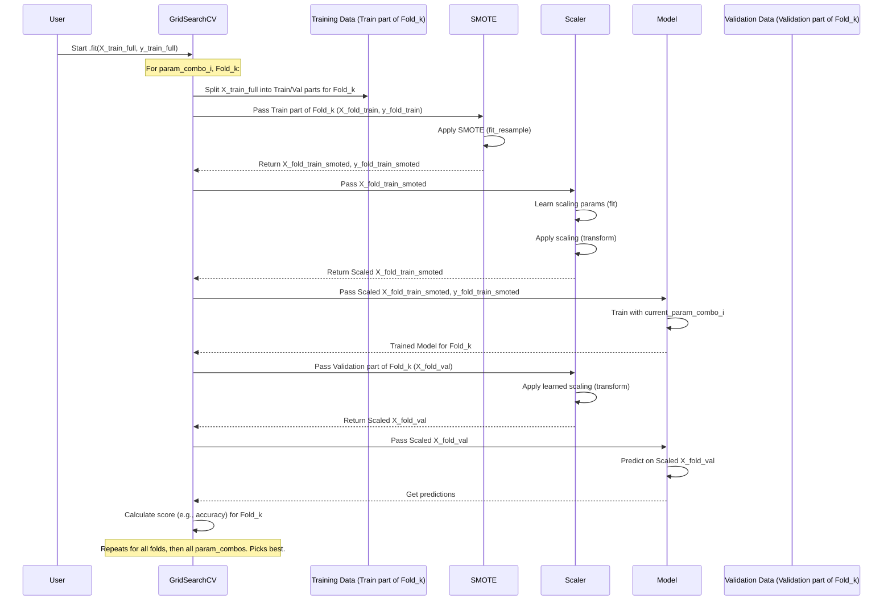

# Chapter 5: Modular Model Training & Hyperparameter Optimization

Welcome to Chapter 5! In [Chapter 4: Anomaly Detection Model Training Framework](04_anomaly_detection_model_training_framework_.md), we saw how to build a basic training pipeline for one anomaly detection model. We learned to prepare data, scale features, and train a classifier like RandomForest. That's a great start!

But what if we want to try out *several different types* of models (like RandomForest, Logistic Regression, SVM)? And for each model, how do we find its *absolute best settings* to get the peak performance on our data? This chapter is all about tackling these challenges in an organized and efficient way.

Imagine you're not just building one type of car engine, but many different types – some are V6s, some are electric, some are trusty four-cylinders. And for each engine, you want to fine-tune it perfectly.
*   **Modular Model Training:** Instead of one gigantic workshop (or script) trying to build every engine type, we'll create specialized "mini-workshops" (modules or functions), each dedicated to building and fine-tuning one specific type of engine (machine learning model).
*   **Hyperparameter Optimization:** For each engine, we'll experiment with different configurations (like fuel mixture, spark plug gap) to find the settings that give the best power and efficiency. This is like tuning the "knobs and dials" of our models to achieve the best performance.

This approach keeps our project tidy, makes it easier to experiment, and helps us squeeze the best possible performance out of our models.

## Key Concepts: The Building Blocks

Let's break down the important ideas for this chapter:

### 1. Modularity: Specialized Workshops for Models

When we train different types of models (e.g., RandomForest, Logistic Regression, SVM), the core steps are similar (prepare data, train, evaluate), but the specifics of the model and its "tunable knobs" differ.

Instead of having one enormous script that handles all model types with lots of `if/else` statements, we create **separate modules or functions** for each model type.
*   **What is it?** A module (like a Python file `random_forest_model.py`) or a function (like `train_random_forest(...)`) that contains all the logic needed to train and optimize *one specific type* of model.
*   **Analogy:** Think of a car factory. Instead of one giant assembly line trying to build a sports car, then a truck, then an SUV, you have specialized sections or even separate mini-factories, each an expert in building one type of vehicle.
*   **Why?**
    *   **Organization:** Keeps your code clean and easy to understand.
    *   **Reusability:** If you need to train a RandomForest model elsewhere, you can reuse your specialized module.
    *   **Maintainability:** If you need to update how SVMs are trained, you only touch the SVM module, not a giant script.

Our project uses this! For example, in the `five_model_random` directory, you'll find files like:
*   `random_forest_model.py`
*   `logistic_regression_model.py`
*   `svc_model.py`
*   ...and so on.

Each of these contains a function (e.g., `train_random_forest`) responsible for training that specific model type.

### 2. Hyperparameters: The Model's Tunable Knobs

Machine learning models have settings that we need to choose *before* training starts. These are called **hyperparameters**. They are not learned from the data directly; rather, they define *how* the model learns.

*   **What are they?** Settings that control the learning process or the structure of the model.
*   **Analogy:** Think of an engine. The number of cylinders, the type of fuel injection system, or the gear ratios are like hyperparameters. You set them when designing/building the engine. The engine's actual performance once it's running (what it learns from the road) is different.
*   **Examples:**
    *   For a `RandomForestClassifier`:
        *   `n_estimators`: How many decision trees to build in the forest.
        *   `max_depth`: The maximum depth each tree can grow.
    *   For an `SVC` (Support Vector Classifier):
        *   `C`: A penalty parameter for misclassifications.
        *   `kernel`: The type of kernel function to use (e.g., 'linear', 'rbf').
*   **Why are they important?** The right hyperparameters can dramatically improve a model's performance! Default settings are often okay, but rarely the best for your specific data.

### 3. Hyperparameter Optimization (Tuning): Finding the Sweet Spot

Since hyperparameters are so important, how do we find the best combination for our specific task and dataset? This process is called **hyperparameter optimization** or **tuning**.

*   **What is it?** Systematically trying out different combinations of hyperparameter values to find the set that results in the best model performance (e.g., highest accuracy).
*   **Analogy:** A race car engineer trying different engine settings (fuel mixture, ignition timing, turbo boost) on a dynamometer to find the combination that produces the most horsepower.
*   **How?** A common method is **Grid Search**.
    *   You define a "grid" of hyperparameter values you want to try. For example:
        *   `n_estimators`: [100, 200, 300]
        *   `max_depth`: [10, 20, None (no limit)]
    *   `GridSearchCV` (from scikit-learn) will then train and evaluate your model for *every possible combination* from this grid (e.g., (100, 10), (100, 20), (100, None), (200, 10), ...).
    *   It uses **cross-validation** (explained below) to evaluate each combination robustly.
    *   Finally, it tells you which combination performed best and gives you a model trained with those optimal settings.

### 4. SMOTE: Helping with Imbalanced Data

Often, in anomaly detection, "normal" runs are much more common than "attack" runs. This is called an **imbalanced dataset**. If we train a model on such data, it might become very good at predicting "normal" but terrible at spotting "attacks" simply because it hasn't seen enough attack examples.

**SMOTE (Synthetic Minority Over-sampling Technique)** is a popular way to address this.
*   **What is it?** It creates new, *synthetic* examples of the minority class (e.g., "attack" runs) based on the existing minority class examples. It doesn't just duplicate them; it creates new, plausible samples.
*   **Analogy:** If you only have a few photos of a rare bird, SMOTE would be like a skilled artist looking at those photos and drawing new, slightly different (but still realistic) pictures of that bird to give you more examples to study.
*   **How is it used?** SMOTE is typically applied *only to the training data* and often as part of a pipeline within each cross-validation fold during hyperparameter tuning. This prevents data leakage from the "synthetic" samples into the validation or test set. Our project uses `ImbPipeline` from the `imblearn` library, which integrates SMOTE nicely with scikit-learn pipelines.

## Putting It All Together: A Modular Training Function with Tuning

Let's see how these concepts come together in a modular function, for example, to train a RandomForest model. This is inspired by `five_model_random/random_forest_model.py`.

```python
# Simplified from five_model_random/random_forest_model.py
from sklearn.ensemble import RandomForestClassifier
from sklearn.model_selection import GridSearchCV, StratifiedKFold
from sklearn.preprocessing import StandardScaler
from imblearn.pipeline import Pipeline as ImbPipeline # For SMOTE
from imblearn.over_sampling import SMOTE
import joblib
import os

def train_random_forest_tuned(X_train, y_train, output_dir, model_filename="rf_model.joblib"):
    # 1. Define the pipeline steps
    scaler = StandardScaler()
    smote = SMOTE(random_state=42)
    rf_model = RandomForestClassifier(random_state=42)

    pipeline = ImbPipeline([
        ('scaler', scaler),       # Scale features
        ('smote', smote),         # Handle imbalance (only on training folds in CV)
        ('classifier', rf_model)  # The RandomForest model
    ])

    # 2. Define the grid of hyperparameters to search
    param_grid = {
        'classifier__n_estimators': [50, 100], # Try 50 and 100 trees
        'classifier__max_depth': [10, 20, None], # Try depths 10, 20, or no limit
        # Add more parameters like 'classifier__min_samples_split': [2, 5]
    }

    # 3. Setup GridSearchCV
    # StratifiedKFold helps maintain class proportions in folds
    cv_strategy = StratifiedKFold(n_splits=3, shuffle=True, random_state=42) # 3 folds for speed
    grid_search = GridSearchCV(
        estimator=pipeline,
        param_grid=param_grid,
        cv=cv_strategy,
        scoring='accuracy', # We want to maximize accuracy
        n_jobs=-1 # Use all available CPU cores
    )

    # 4. Perform the grid search (this does the training and tuning)
    print("Starting GridSearchCV for RandomForest...")
    grid_search.fit(X_train, y_train)
    print("GridSearchCV finished.")

    # 5. Get the best model found
    best_model = grid_search.best_estimator_ # This is the pipeline with best RF params
    print(f"Best RandomForest params: {grid_search.best_params_}")
    print(f"Best CV accuracy: {grid_search.best_score_:.4f}")

    # (Optional) Save the best model
    # model_path = os.path.join(output_dir, model_filename)
    # joblib.dump(best_model, model_path)
    # print(f"Saved best RandomForest model to {model_path}")

    return best_model
```

**Let's break down this `train_random_forest_tuned` function:**

1.  **Pipeline Definition:**
    *   We create an `ImbPipeline`. This is important because it ensures SMOTE is applied correctly *during cross-validation* within `GridSearchCV`. SMOTE will only "see" the training part of each fold, not the validation part, preventing overly optimistic results.
    *   The pipeline includes:
        *   `StandardScaler()`: To scale features.
        *   `SMOTE()`: To oversample the minority class.
        *   `RandomForestClassifier()`: Our actual model.

2.  **Hyperparameter Grid (`param_grid`):**
    *   This dictionary tells `GridSearchCV` which hyperparameters of the `RandomForestClassifier` (referenced by `classifier__<param_name>`) to try and what values to test for each.
    *   For `n_estimators`, it will try 50 and 100.
    *   For `max_depth`, it will try 10, 20, and `None` (no limit).
    *   `GridSearchCV` will test all combinations: (50 trees, depth 10), (50 trees, depth 20), ..., (100 trees, no depth limit).

3.  **`GridSearchCV` Setup:**
    *   `estimator=pipeline`: We tell it to tune our entire pipeline.
    *   `param_grid=param_grid`: The grid of parameters to search.
    *   `cv=cv_strategy`: The cross-validation strategy. `StratifiedKFold(n_splits=3)` means it will split the training data into 3 parts (folds). For each parameter combination, it trains on 2 folds and validates on the 3rd, rotating which fold is used for validation. Stratified means it tries to keep the percentage of normal/attack samples the same in each fold.
    *   `scoring='accuracy'`: The metric to evaluate performance. `GridSearchCV` will try to find parameters that maximize accuracy.
    *   `n_jobs=-1`: Use all available CPU cores to speed up the search, as each parameter combination can be tested in parallel.

4.  **Performing the Search (`grid_search.fit`):**
    *   This is the most computationally intensive step. `GridSearchCV` will:
        *   For each combination of parameters in `param_grid`:
            *   Perform 3-fold cross-validation:
                *   For each fold:
                    *   Take 2 folds as training data, 1 as validation.
                    *   Apply the scaler (fit on training part, transform both).
                    *   Apply SMOTE (fit_resample on training part only).
                    *   Train the `RandomForestClassifier` with the current parameter combination on the (scaled, SMOTE'd) training part.
                    *   Evaluate its accuracy on the (scaled) validation part.
                *   Average the accuracies from the 3 validation folds.
        *   Keep track of the parameter combination that gave the highest average cross-validation accuracy.

5.  **Best Model and Results:**
    *   `grid_search.best_estimator_`: This is the pipeline (with the `RandomForestClassifier` inside it configured with the best found hyperparameters) re-trained on the *entire* `X_train`, `y_train` data.
    *   `grid_search.best_params_`: A dictionary of the hyperparameters that yielded the best score.
    *   `grid_search.best_score_`: The mean cross-validation score achieved by `best_params_`.

**How a Main Script Uses These Modular Functions:**

A main script (like `five_model_random/main_random_five_model.py`) would then import and call this function, along with similar functions for other models:

```python
# In a main script, e.g., main_analysis.py
# (Assuming X_train, y_train, X_test, y_test are already prepared)

from random_forest_model import train_random_forest_tuned # If in separate file
# from logistic_regression_model import train_logistic_regression_tuned # ... and so on

output_directory = "trained_models"
# if not os.path.exists(output_directory): os.makedirs(output_directory) # Create dir

# Train and tune RandomForest
rf_tuned_model = train_random_forest_tuned(X_train, y_train, output_directory)

# Train and tune Logistic Regression (if you have a similar function)
# lr_tuned_model = train_logistic_regression_tuned(X_train, y_train, output_directory)

# ... and so on for other models ...

# Now you have rf_tuned_model (and others) ready for further evaluation on X_test, y_test
```
This keeps the main script clean. It just orchestrates calling the specialized "workshops" for each model.

## Under the Hood of `GridSearchCV`

Let's visualize what `GridSearchCV` does for one parameter combination during one fold of cross-validation (assuming SMOTE is in the pipeline):


After trying all combinations and all folds, `GridSearchCV` identifies the `best_params_`. It then retrains a new model using these `best_params_` on the *entire original `X_train`, `y_train`* (again, correctly applying pipeline steps like SMOTE and scaling to this full training set). This final refitted model is what `grid_search.best_estimator_` refers to.

## Conclusion: Building Better, Smarter Detectives

In this chapter, we've leveled up our model training game!
*   We learned about **modularity**: organizing our training code into specialized functions or modules for each model type (like having different workshops for different engines). This makes our code cleaner and easier to manage.
*   We explored **hyperparameters**: the crucial "tunable knobs" of our models.
*   We dived into **hyperparameter optimization** using `GridSearchCV`: a systematic way to find the best hyperparameter settings for each model, like fine-tuning an engine for peak performance.
*   We saw how **SMOTE** can be integrated into this process to help our models learn effectively from imbalanced datasets.

By adopting these practices, we can train a variety of models more efficiently and ensure that each model is performing at its best. Our "detectives" are now not only trained but also fine-tuned!

Now that we have these optimized models, how do we rigorously check how good they *really* are? And how do we compare them against each other? That's what we'll cover in the next chapter: [Chapter 6: Comprehensive Performance Evaluation & Reporting](06_comprehensive_performance_evaluation___reporting_.md).

---

Generated by [AI Codebase Knowledge Builder](https://github.com/The-Pocket/Tutorial-Codebase-Knowledge)