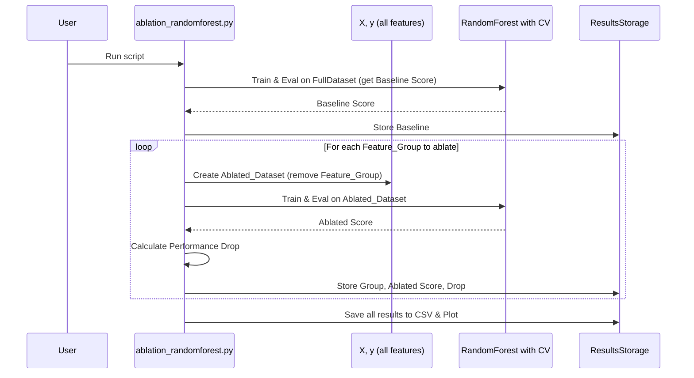
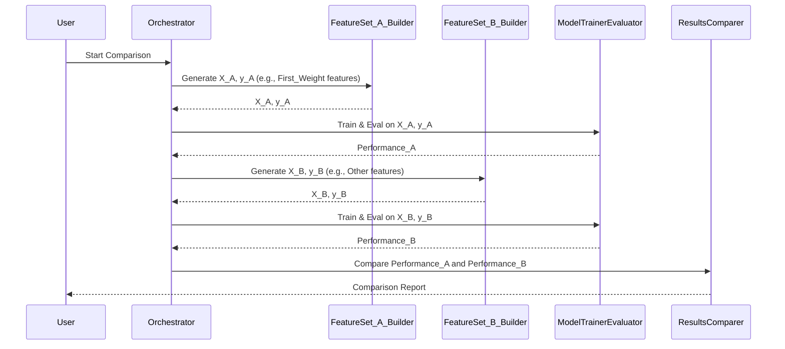

# Chapter 7: Ablation Study & Feature Set Comparison

Welcome to Chapter 7, our final chapter in this journey! In [Chapter 6: Comprehensive Performance Evaluation & Reporting](06_comprehensive_performance_evaluation___reporting_.md), we learned how to thoroughly test our trained models and report their performance. We now have a good idea of how well our models can detect anomalies.

But what if we want to dig deeper? In [Chapter 3: Feature Engineering for Anomaly Detection](03_feature_engineering_for_anomaly_detection_.md), we created many different features to describe our Federated Learning (FL) runs. Are all of them truly necessary? Which ones are the most powerful? Could we perhaps build a simpler, faster model using fewer features without losing too much accuracy? This chapter, "Ablation Study & Feature Set Comparison," helps us answer these questions.

## What's the Big Idea? Finding the Most Valuable Players!

Imagine you're a chef who has created a new, complex sauce with 20 ingredients (our features). The sauce tastes great (our model performs well), but you wonder:
*   Are all 20 ingredients essential?
*   What happens if I remove the pinch of saffron? Does the taste change a lot? (This is like an **ablation study**).
*   What if I try making one version of the sauce with only "sweet" ingredients and another with only "savory" ingredients? Which one is better on its own? (This is like **feature set comparison**).

Our goal is to understand which features or groups of features are most important for our model's performance. This can help us:
*   **Identify critical features:** Discover the key signals that help detect anomalies.
*   **Simplify models:** Potentially remove less important features, making our models faster to train and use, and easier to understand, without a big drop in performance.
*   **Gain insights:** Better understand what aspects of the FL process are indicative of normal or anomalous behavior.

## Key Concepts: The Tools for Our Investigation

Let's explore the two main techniques we'll discuss:

### 1. Ablation Study: Systematically Removing Parts

*   **What is it?** An ablation study involves systematically removing individual features (or small, related groups of features) from your model and observing how its performance changes.
*   **Analogy:** Think of a Jenga tower. You carefully remove one block at a time. If you remove a critical block, the tower (your model's performance) might wobble or fall. If you remove a non-critical block, the tower remains stable. Or, imagine a mechanic working on an engine. They might remove one component (like a sensor) to see how it affects the engine's operation.
*   **How it works:**
    1.  Train a model using *all* your features. This is your "baseline" performance.
    2.  Then, for each feature (or feature group) you want to test:
        a.  Remove that specific feature (or group) from your dataset.
        b.  Re-train your model using this "ablated" (reduced) set of features.
        c.  Evaluate the new model's performance.
    3.  Compare the performance of each ablated model to the baseline. A large drop in performance after removing a feature means that feature was important.

### 2. Feature Set Comparison: Trying Different Combinations

*   **What is it?** Feature set comparison involves training and evaluating models on different, distinct subsets of features. Instead of just removing one feature at a time, you define specific groups of features you're interested in comparing.
*   **Analogy:** Back to our chef. They might decide to test two different sauce bases: one using only tomato-based ingredients (Feature Set A) and another using only cream-based ingredients (Feature Set B). They then compare which base makes a better sauce overall.
*   **How it works:**
    1.  Define several distinct "feature sets." For example:
        *   Set A: Only features related to the `First_Weight` statistics.
        *   Set B: Only features related to `Number_of_outliers` statistics.
        *   Set C: All features *except* those related to `First_Weight`.
        *   Set D: Features identified as "most important" from a previous model (like we saw at the end of `main_random_five_model.py` in [Chapter 6](06_comprehensive_performance_evaluation___reporting_.md)).
    2.  For each feature set:
        a.  Create a version of your dataset containing only the features in that set.
        b.  Train a model using this specific feature set.
        c.  Evaluate its performance.
    3.  Compare the performance of models trained on these different feature sets. This helps you understand the collective contribution of different types of information.

## Using These Techniques: A Practical Look

Let's see conceptually how we might apply these techniques. We'll build upon the evaluation methods from [Chapter 6: Comprehensive Performance Evaluation & Reporting](06_comprehensive_performance_evaluation___reporting_.md).

### Example: Performing an Ablation Study

Suppose we have a Pandas DataFrame `X_train_full` with all our features and corresponding `y_train`. Let's say one group of features we're interested in are all statistics derived from "Mean_Variance" (e.g., `Mean_Variance_mean`, `Mean_Variance_std`).

**1. Establish a Baseline:**
First, train and evaluate your model with ALL features.

```python
# Assume 'model' is a scikit-learn model (e.g., RandomForestClassifier)
# Assume X_train_full, y_train, X_test_full, y_test are ready

# Train with all features
model.fit(X_train_full, y_train)
baseline_accuracy = model.score(X_test_full, y_test) # Get accuracy
print(f"Baseline Accuracy (all features): {baseline_accuracy:.4f}")
```
This gives us our starting point.

**2. Ablate a Feature Group (e.g., "Mean_Variance" features):**

```python
# Identify columns related to 'Mean_Variance'
mv_features_to_remove = [col for col in X_train_full.columns if 'Mean_Variance' in col]

# Create ablated datasets by dropping these features
X_train_ablated = X_train_full.drop(columns=mv_features_to_remove)
X_test_ablated = X_test_full.drop(columns=mv_features_to_remove)

# Re-train and evaluate
model.fit(X_train_ablated, y_train)
ablated_accuracy = model.score(X_test_ablated, y_test)
print(f"Accuracy (without Mean_Variance features): {ablated_accuracy:.4f}")

# Calculate performance drop
accuracy_drop = baseline_accuracy - ablated_accuracy
print(f"Accuracy drop: {accuracy_drop:.4f}")
```
If `accuracy_drop` is large, it suggests that the "Mean_Variance" related features were important. You would repeat this for other features or feature groups.

### Example: Feature Set Comparison

Let's say we want to compare using *only* "First_Weight" related features versus using *only* "Number_of_outliers" related features.

**1. Define Feature Sets:**

```python
# Assume X_train_full, y_train, X_test_full, y_test are ready
# Identify columns for Set A: 'First_Weight' features
fw_cols = [col for col in X_train_full.columns if 'First_Weight' in col]
X_train_set_A = X_train_full[fw_cols]
X_test_set_A = X_test_full[fw_cols]

# Identify columns for Set B: 'Number_of_outliers' features
outlier_cols = [col for col in X_train_full.columns if 'Number_of_outliers' in col]
X_train_set_B = X_train_full[outlier_cols]
X_test_set_B = X_test_full[outlier_cols]
```

**2. Train and Evaluate Model on Each Set:**

```python
# Assume 'model_A' and 'model_B' are fresh model instances
model_A.fit(X_train_set_A, y_train)
accuracy_A = model_A.score(X_test_set_A, y_test)
print(f"Accuracy (Set A - First_Weight features): {accuracy_A:.4f}")

model_B.fit(X_train_set_B, y_train)
accuracy_B = model_B.score(X_test_set_B, y_test)
print(f"Accuracy (Set B - Outlier features): {accuracy_B:.4f}")
```
By comparing `accuracy_A` and `accuracy_B` (and other metrics like AUC, F1-score), we can see which set of features, when used alone, provides better predictive power.

A practical example of feature set comparison is found at the end of `five_model_random/main_random_five_model.py`. After training on all features, it identifies "important features" (e.g., those with importance > 0.030) and then re-trains and re-evaluates all models using *only this subset*. This is a comparison between "all features" and "top N features."

## Under the Hood: How Our Project Approaches This

### Ablation Studies (`ablation_randomforest.py`)

The `five_model_random/ablation_randomforest.py` script provides a good example of an ablation study.

*   **What it does:** It focuses on a RandomForest model and tests the impact of removing predefined groups of features. These groups are typically defined by a combination of a layer name (e.g., `layer.0`, `layer.1`) and a statistic type (e.g., `Number_of_outliers`, `Weight_Std`). For example, it might remove all features like `layer.0_Number_of_outliers_mean`, `layer.0_Number_of_outliers_std`, etc., in one go.
*   **Process:**
    1.  **Baseline:** It first calculates the performance (Accuracy and ROC AUC) using all features with cross-validation.
    2.  **Iteration:** For each feature group to ablate:
        a.  It creates a temporary dataset by dropping all columns that start with the group's prefix (e.g., `layer.0_Number_of_outliers_`).
        b.  It trains and evaluates the RandomForest model on this ablated dataset using cross-validation.
        c.  It records the performance and calculates the drop compared to the baseline.
    3.  **Report:** Finally, it saves the results (including performance drops) to a CSV file and generates a plot to visualize the impact of removing each group.

Here's a simplified flow:


The `perform_rf_ablation_analysis` function in `five_model_random/ablation_randomforest.py` implements this logic. It uses `cross_val_score` for robust performance estimation.

```python
# Simplified concept from ablation_randomforest.py
# def perform_rf_ablation_analysis(X, y, groups_to_ablate, output_dir):
    # ... setup model (pipeline with SMOTE, Scaler, RF) ...
    # baseline_score = np.mean(cross_val_score(pipeline, X, y, ...))
    # results = [{'Feature_Group': 'Baseline', 'Score': baseline_score, 'Drop': 0}]

    # for group_name in groups_to_ablate:
        # features_to_drop = [col for col in X.columns if col.startswith(group_name)]
        # X_ablated = X.drop(columns=features_to_drop)
        # current_score = np.mean(cross_val_score(pipeline, X_ablated, y, ...))
        # score_drop = baseline_score - current_score
        # results.append({'Feature_Group': group_name, 'Score': current_score, 'Drop': score_drop})
    
    # ... save results as CSV and plot ...
    # return results_df
```
This script helps pinpoint which high-level feature categories contribute most to the model's success.

### Feature Set Comparison (e.g., `main_random_one_weight.py` and `compare_results.py`)

While our project doesn't have one single script named "feature set comparison," the idea is embedded in how scripts can be structured or modified.
For example, the `five_model_random/main_random_one_weight.py` script, as implied by its name, could be adapted to focus training on features derived only from the "First_Weight" if its feature calculation logic (the `calculate_layer_features` function) was modified to isolate or prioritize those.

A more direct example in the project is when `five_model_random/main_random_five_model.py` re-trains models using only "important features" (those with importance scores above a threshold from an initial model trained on all features).
1.  **Train with all features:** A set of models is trained using all engineered features. Feature importances are extracted (e.g., from RandomForest or XGBoost).
2.  **Define "important features" set:** A subset of features is selected based on a threshold (e.g., importance > 0.030).
3.  **Re-train with subset:** All models are re-trained and re-evaluated using *only* this "important features" subset.
4.  **Compare:** The performance of models using "all features" can then be compared to models using "important features." This is done in the `output_files/important_features_results/` directory.

The `five_model_random/compare_results.py` script is designed to load and compare pre-computed results from different training runs, potentially where each run used a different feature set (e.g., "first_weight_only_results.csv" vs "other_features_results.csv"). This implies a workflow where specialized training scripts are run first.

Conceptual flow for feature set comparison:



The `prepare_feature_sets` function in `five_model_random/main_random_one_weight.py` shows an example of defining feature sets:
```python
# Simplified concept from main_random_one_weight.py
# def prepare_feature_sets(data_with_all_features):
    # fw_cols = [c for c in data_with_all_features.columns if 'First_Weight' in c]
    # X_first_weight = data_with_all_features[fw_cols]
    
    # other_cols = [c for c in data_with_all_features.columns if 'First_Weight' not in c and c not in ['Run_ID', 'Attack_Type']]
    # X_other_features = data_with_all_features[other_cols]
    # return X_first_weight, X_other_features
```
Then, models would be trained on `X_first_weight` and `X_other_features` separately, and their results compared.

## Conclusion: Refining Our Understanding and Our Models

In this chapter, we've explored powerful techniques – **Ablation Studies** and **Feature Set Comparison** – to dissect our models and features.
*   We learned how **ablation studies** help us understand the importance of individual features or groups by seeing what happens when they're removed.
*   We saw how **feature set comparison** allows us to evaluate the collective power of different types of information by training models on distinct feature subsets.

These methods don't just satisfy curiosity; they lead to practical benefits: simpler, potentially more robust models, and deeper insights into the problem we're trying to solve. By understanding which features are the heavy lifters, we can build more efficient and interpretable anomaly detection systems for Federated Learning environments.

This concludes our tutorial series on `explanation`! We've journeyed from simulating Federated Learning and extracting raw data ([Chapter 1](01_federated_learning_simulation___data_extraction_.md)), through aggregating experiments ([Chapter 2](02_experiment_aggregation___dataset_construction_.md)), engineering insightful features ([Chapter 3](03_feature_engineering_for_anomaly_detection_.md)), building a model training framework ([Chapter 4](04_anomaly_detection_model_training_framework_.md)), optimizing our models ([Chapter 5](05_modular_model_training___hyperparameter_optimization_.md)), rigorously evaluating them ([Chapter 6](06_comprehensive_performance_evaluation___reporting_.md)), and finally, to understanding feature importance ([Chapter 7](07_ablation_study___feature_set_comparison_.md)).

You now have a foundational understanding of the key steps involved in analyzing data from FL systems to detect anomalies. We hope this journey has been enlightening and empowers you to explore further!

---

Generated by [AI Codebase Knowledge Builder](https://github.com/The-Pocket/Tutorial-Codebase-Knowledge)