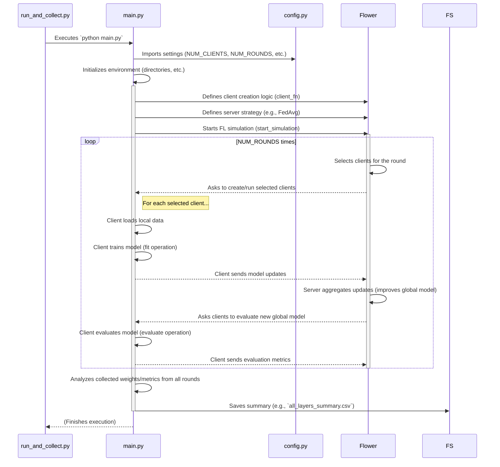

# Chapter 3: Federated Learning Simulation Core

Welcome to Chapter 3! In [Chapter 2: Project Configuration](02_project_configuration_.md), we discovered how our project uses `config.py` as a central "recipe book" to store all the settings for our experiments. These settings tell `run_and_collect.py` how to manage experiments and, crucially, they tell our main simulation script, `main.py`, what to do.

Now, let's step into the heart of the action: the **Federated Learning Simulation Core**. This is where the actual simulated learning happens, and it's primarily managed by our `main.py` script.

## The Engine Room: Simulating Collaborative Learning

Imagine a special kind of classroom:
*   There are many students (we call them **clients**).
*   Each student has their own unique, private textbook (their **local data**). They are not allowed to show their textbook to anyone else or even the teacher!
*   The teacher wants to create a master "lesson plan" (a **global model**) that works well for everyone.
*   So, each student studies their own textbook and tries to learn from it. They then create a small summary of *what they learned* (these are **model updates**) without revealing the contents of their textbook.
*   They send their summary to the teacher (the **server**).
*   The teacher collects all these summaries and combines them to create an improved, more general lesson plan.
*   This process repeats: students get the new lesson plan, study their private textbooks again, send updated summaries, and the teacher refines the lesson plan further.

This is the basic idea behind **Federated Learning (FL)**! Our `main.py` script is like the engine that runs this entire collaborative classroom simulation. It uses a powerful tool called the **Flower framework** to manage all the "students" and the "teacher" and their interactions.

**What problem does this solve?**

The Federated Learning Simulation Core (`main.py`) is responsible for:
1.  **Defining Client Behavior**: How does each "student" learn from their local textbook?
2.  **Simulating Model Training**: The actual process of "students" learning and the "teacher" updating the lesson plan.
3.  **Evaluating Performance**: How good is the global "lesson plan" after each round of learning?
4.  **Managing Communication**: How do "students" send their learning summaries to the "teacher," and how does the "teacher" send back the updated lesson plan?

Essentially, `main.py` brings the settings from `config.py` to life and simulates the entire federated learning process from start to finish for one complete experiment run.

## How `main.py` Works: A Bird's-Eye View

When `run_and_collect.py` (from [Chapter 1: Experiment Orchestration & Data Collection](01_experiment_orchestration___data_collection_.md)) decides to run an experiment, it essentially calls `python main.py`. Here's what typically happens inside `main.py`:

1.  **Wake Up & Read Instructions**: `main.py` starts. Its first job is to understand the current experiment's setup. It does this by importing settings from `config.py` (like `NUM_CLIENTS`, `NUM_ROUNDS`, `ATTACK_TYPE`, etc., as discussed in [Chapter 2: Project Configuration](02_project_configuration_.md)).
2.  **Prepare the "Classroom"**: It sets up necessary things, like creating folders where results will be saved (again, using paths from `config.py`).
3.  **Introduce the "Students" (Clients)**: For each simulated client, `main.py` defines:
    *   What private data they have (loading their "textbook").
    *   How they will learn (the training process on their data).
    *   How they will test the "lesson plan" (the evaluation process).
    This is often done by defining a special "Client" class.
4.  **Start the "Lesson" (Federated Learning with Flower)**: `main.py` then tells the Flower framework:
    *   "Here's how to create our students (clients)."
    *   "Here's how many students there are."
    *   "Here's how many rounds of learning we want to do."
    *   "Here's the 'teacher's' strategy for combining student summaries (e.g., averaging them)."
    Flower then takes over and orchestrates the rounds of learning.
5.  **The Learning Cycle (Repeated for `NUM_ROUNDS`)**:
    *   The Flower "server" (teacher) selects a group of "clients" (students).
    *   It sends the current "global model" (lesson plan) to these clients.
    *   Each selected client trains this model on its private data ("studies using their textbook and the lesson plan") and creates "model updates" (summaries of learning).
    *   These clients send their updates back to the server.
    *   The server aggregates these updates (combines the summaries) to improve the global model.
    *   The server might also ask clients to evaluate the current global model (test the lesson plan).
6.  **Collect Results**: During and after the simulation, `main.py` (with Flower's help) collects data like model accuracy, loss, and importantly for our project, the actual model weights (the "lesson plan" details) at different stages.
7.  **Save Summary Report**: Finally, `main.py` processes the collected data and saves a summary file (e.g., `all_layers_summary.csv` in the `SUMMARY_DIRECTORY` defined in `config.py`). This summary is what `run_and_collect.py` will later pick up.

Let's visualize this flow:



When `python main.py` runs (often triggered by `run_and_collect.py`), you'll typically see log messages in your terminal showing the progress: clients being created, training rounds starting and finishing, and evaluation results. At the end, it will indicate that it has saved its summary files.

## Peeking Inside `main.py`: Key Code Snippets (Highly Simplified)

Let's look at some conceptual, simplified snippets to understand how `main.py` does its job. The actual code in `create_dataset/main.py` is more detailed to handle real models, data, and optimizations.

**1. Using Configuration**

`main.py` starts by importing necessary settings from `config.py`.

```python
# main.py (Simplified)
import os
import flwr as fl # The Flower framework
# Import settings from our project's configuration
from config import (
    NUM_CLIENTS, NUM_ROUNDS, MODEL_NAME, DEVICE,
    SUMMARY_DIRECTORY, ATTACK_TYPE # And others
)

print(f"Starting simulation: {NUM_CLIENTS} clients, {NUM_ROUNDS} rounds.")
print(f"Using model: {MODEL_NAME} on device: {DEVICE}")
if ATTACK_TYPE != "none":
    print(f"Attack mode active: {ATTACK_TYPE}")

# Ensure output directories exist (names come from config.py)
os.makedirs(SUMMARY_DIRECTORY, exist_ok=True)
# ... create other necessary directories ...
```
This part is straightforward: it loads the "recipe" for the current experiment defined in `config.py` (as we learned in [Chapter 2: Project Configuration](02_project_configuration_.md)).

**2. Defining a "Student" (Client Behavior)**

We need to tell Flower how each client ("student") behaves. This is usually done by creating a class that inherits from `flwr.client.NumPyClient`.

```python
# main.py (Simplified Client definition)
class MyFlowerClient(fl.client.NumPyClient):
    def __init__(self, client_id, model, train_data, test_data):
        self.client_id = client_id
        self.model = model  # The client's local version of the model
        self.train_data = train_data # Client's private "textbook"
        self.test_data = test_data   # Data to test the "lesson plan"

    def get_parameters(self, config):
        # Get the model's current state (weights) as NumPy arrays
        # return [val.cpu().numpy() for _, val in self.model.state_dict().items()]
        print(f"Client {self.client_id}: Sending my parameters.")
        return [] # Simplified for example

    def set_parameters(self, parameters):
        # Update the model with new parameters from the server
        # params_dict = zip(self.model.state_dict().keys(), parameters)
        # ... self.model.load_state_dict(state_dict, strict=True) ...
        print(f"Client {self.client_id}: Received new parameters.")

    def fit(self, parameters, config):
        # Server asked me to train!
        self.set_parameters(parameters) # Get latest "lesson plan"
        # ... train self.model on self.train_data for a few steps ...
        print(f"Client {self.client_id}: Training on my local data.")
        num_examples = 100 # Placeholder
        return self.get_parameters(config), num_examples, {"loss": 0.1} # Send back updates

    def evaluate(self, parameters, config):
        # Server asked me to test!
        self.set_parameters(parameters) # Get latest "lesson plan"
        # ... evaluate self.model on self.test_data ...
        print(f"Client {self.client_id}: Evaluating the model.")
        loss, accuracy = 0.5, 0.9 # Placeholder values
        num_examples = 50   # Placeholder
        return float(loss), num_examples, {"accuracy": float(accuracy)}
```
*   `__init__`: Sets up the client with its ID, model, and its private data.
*   `get_parameters`: How the client gives its current model state (learned summary) to the server.
*   `set_parameters`: How the client updates its model with the new global state from the server (new lesson plan).
*   `fit`: This is where the client trains the model on its own data ("studies its textbook") and returns the updated model parameters (learning summary).
*   `evaluate`: This is where the client tests the performance of the model on its local test data ("checks how good the lesson plan is").

**3. Creating Clients When Flower Asks (`client_fn`)**

Flower needs a way to create these clients on demand. We provide a function, often called `client_fn` (client function), for this.

```python
# main.py (Simplified client_fn)
def client_fn(client_id_str: str): # Flower gives us a client ID string
    client_id = int(client_id_str)
    print(f"Creating client {client_id}...")
    # In a real scenario, you'd load a model and unique data for this client
    # model = AutoModelForSequenceClassification.from_pretrained(MODEL_NAME)
    # train_data, test_data = load_data_for_client(client_id) # Your data loading logic
    model, train_data, test_data = None, None, None # Simplified
    return MyFlowerClient(client_id, model, train_data, test_data).to_client()
```
When Flower needs to simulate a particular client (e.g., "client 0"), it calls `client_fn("0")`. This function is then responsible for setting up `MyFlowerClient` number 0 with its specific model and data.

**4. Starting the Federated Learning Simulation**

With the client behavior defined (`MyFlowerClient`) and a way to create them (`client_fn`), we can start the simulation using `fl.simulation.start_simulation`.

```python
# main.py (Simplified simulation start)

# Define the server's strategy (e.g., FedAvg averages client updates)
strategy = fl.server.strategy.FedAvg(
    min_fit_clients=NUM_CLIENTS,       # Wait for all clients to train
    min_available_clients=NUM_CLIENTS, # Ensure all clients are available
    # ... other strategy parameters ...
)

print("Starting Flower simulation...")
history = fl.simulation.start_simulation(
    client_fn=client_fn,                # How to create clients
    num_clients=NUM_CLIENTS,            # Total number of clients to simulate
    config=fl.server.ServerConfig(num_rounds=NUM_ROUNDS), # Number of learning rounds
    strategy=strategy,                  # The server's "teaching strategy"
    # client_resources={"num_cpus": 1} # Optional: resources per client
)
print("Flower simulation finished.")
```
This is the command that kicks off the entire FL process. Flower will now use your `client_fn` to create simulated clients and orchestrate `NUM_ROUNDS` of training (`fit`) and evaluation (`evaluate`) according to the `strategy` you provided. The `history` object will contain metrics from the simulation.

**5. Saving the Results**

After the simulation completes, `main.py` needs to save the collected data (like model layer statistics, which is a focus of this project) into a summary file that `run_and_collect.py` can use.

```python
# main.py (Simplified results saving)
import pandas as pd # For creating data tables (DataFrames)

# ... (imagine analysis_results is a list of dictionaries collected during simulation) ...
# Example: analysis_results = [
#    {"Round": 1, "Layer": "layer1.weight", "Mean_Variance": 0.05, ...},
#    {"Round": 1, "Layer": "layer2.weight", "Mean_Variance": 0.02, ...},
# ]
analysis_results = [{"Round": r, "Mean_Variance": 0.1 / (r+1)} for r in range(NUM_ROUNDS)] # Dummy data
summary_df = pd.DataFrame(analysis_results)

# Path comes from config.py
summary_file_path = os.path.join(SUMMARY_DIRECTORY, "all_layers_summary.csv")
summary_df.to_csv(summary_file_path, index=False)
print(f"Summary report saved to: {summary_file_path}")
```
This part takes all the important measurements gathered during the simulation, organizes them (often into a `pandas DataFrame`), and saves them to a CSV file. This CSV file is what `run_and_collect.py` from [Chapter 1: Experiment Orchestration & Data Collection](01_experiment_orchestration___data_collection_.md) will append to its main dataset.

## Conclusion

You've now explored the "Federated Learning Simulation Core," which is the `main.py` script in our project. This is where the magic of federated learning is simulated using the Flower framework. It acts like an engine room, taking the settings from `config.py`, simulating the collaborative learning process between multiple clients and a central server, and producing a detailed summary of one experiment run.

Key takeaways:
*   `main.py` simulates the FL process: clients learning on private data and a server aggregating their learning.
*   It relies on settings from `config.py` ([Chapter 2: Project Configuration](02_project_configuration_.md)).
*   It uses the Flower framework to define client behavior (`fit`, `evaluate`) and orchestrate the simulation.
*   Its output (a summary CSV file) is collected by `run_and_collect.py` ([Chapter 1: Experiment Orchestration & Data Collection](01_experiment_orchestration___data_collection_.md)).

But what if some of these "students" (clients) are not honest? What if they try to disrupt the learning process? That's where attack simulations come in, and we'll learn how to control them in the next chapter.

Next up: [Attack Simulation Control](04_attack_simulation_control_.md)

---

Generated by [AI Codebase Knowledge Builder](https://github.com/The-Pocket/Tutorial-Codebase-Knowledge)