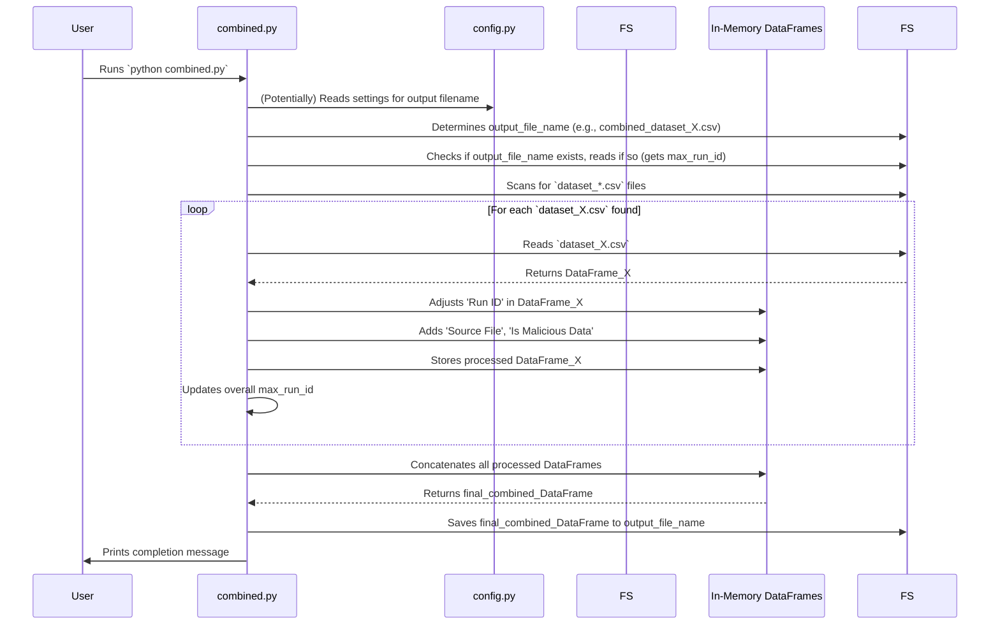

# Chapter 6: Dataset Aggregation

Welcome to Chapter 6! In the previous chapter, [Model Weight Handling & Analysis](05_model_weight_handling___analysis_.md), we saw how `main.py` (our [Federated Learning Simulation Core](03_federated_learning_simulation_core_.md)) meticulously collects and analyzes model weights during a single experiment run, saving a summary like `all_layers_summary.csv`. This summary is then picked up by `run_and_collect.py` from [Chapter 1: Experiment Orchestration & Data Collection](01_experiment_orchestration___data_collection_.md) and added to a growing dataset file for that particular series of runs (e.g., `final_dataset_none.csv` if we ran with no attacks, or `final_dataset_random_10pct.csv` if we ran with 10% random attackers).

But what if you run several *different series* of experiments?
*   Perhaps first you run 10 experiments with *no attackers*. This creates `final_dataset_none.csv`.
*   Then, you run another 10 experiments with *10% attackers*. This creates `final_dataset_random_10pct.csv`.
*   And then another 10 experiments with *20% attackers*, creating `final_dataset_random_20pct.csv`.

You now have multiple "manuscripts" (these `final_dataset_...csv` files), each with its own set of results. How do you combine all of them into one single, comprehensive "volume" for a grand, unified analysis? That's exactly what **Dataset Aggregation** does!

## The Librarian's Task: Consolidating Knowledge

Imagine a librarian who has received several separate manuscripts, each detailing parts of a larger story. The librarian's job is to carefully combine these into a single, well-organized book. Dataset Aggregation in our project acts like this librarian.

**What problem does this solve?**

After running various experiment series (potentially with different configurations like attack modes, leading to separate output `final_dataset_...csv` files), this component merges these individual dataset files into one larger, unified dataset.

A key challenge when combining is **consistency**. For example, each `final_dataset_...csv` file might have a `Run_ID` column that starts from 0 and goes up to, say, 9 (for 10 runs). If we just stick these files together, we'll have multiple "Run_ID 0", "Run_ID 1", etc., which is confusing!
Our "Dataset Aggregation" process ensures that when these files are merged, the `Run_ID`s are **re-indexed** so they become unique across the *entire combined dataset*. This makes large-scale analysis much easier, allowing you to compare results from different types of experiments side-by-side.

In our project, this task is handled by a script called `combined.py`.

## How to Use `combined.py`

The `combined.py` script is designed to be run after you have generated several output files from different series of experiments using `run_and_collect.py`.

Let's say you have performed the following:
1.  `python run_and_collect.py -mode none -runs 5` (generates, for example, `collected_data/final_dataset_none.csv`)
2.  `python run_and_collect.py -mode random_10pct -runs 5` (generates `collected_data/final_dataset_random_10pct.csv`)

Now, for `combined.py` to work with its default settings, you might rename these files or copy them into the main project directory with names like:
*   `dataset_none_runset1.csv` (from the first series)
*   `dataset_random10_runset2.csv` (from the second series)
(The script looks for files matching `dataset_*.csv` in the directory where `combined.py` is located.)

Then, you would simply run:
```bash
python combined.py
```

**What happens when you run this?**

1.  **Script Starts**: `combined.py` begins its work.
2.  **Output Filename Decided**: It determines a name for the new, combined dataset file. This name often includes a timestamp and information about the current attack configuration (read from `config.py`, see [Chapter 2: Project Configuration](02_project_configuration_.md)), for example, `combined_dataset_normal_20231027_153000.csv` or `combined_dataset_random_10pct_20231027_160000.csv`.
    ```
    Combining datasets into: combined_dataset_normal.csv
    ```
    *(Note: The exact name depends on your `config.py` when `combined.py` is run and if an existing combined file is being appended to).*
3.  **Finds Input Files**: It searches the current directory for files matching the pattern `dataset_*.csv`.
    ```
    Found 2 dataset files to combine.
    ```
4.  **Processes Each File**: For each file found:
    *   It prints which file it's processing: `Processing: dataset_none_runset1.csv`.
    *   It reads the CSV data.
    *   **Crucially, it re-indexes the `Run ID`**. If `dataset_none_runset1.csv` had `Run ID`s 0-4, and this is the first file being added to a new combined dataset, these might stay as 0-4. If `dataset_random10_runset2.csv` is processed next (also with `Run ID`s 0-4), its `Run ID`s will be shifted, for example, to 5-9, to ensure uniqueness.
    *   It adds a `Source File` column, so you know which original file each row came from.
    *   It adds an `Is Malicious Data` column (True/False) based on if the filename contains "random" or "malicious".
5.  **Combines & Saves**: After processing all input files, it merges them all into one large table (a pandas DataFrame) and saves it to the output file decided in step 2.
    ```
    Combined dataset saved to: combined_dataset_normal.csv
    Total samples in combined dataset: 200
    ```
    (Assuming each of the 2 input files had 100 rows, for example).

Now you have a single `combined_dataset_....csv` file ready for comprehensive analysis!

## Under the Hood: How `combined.py` Works

Let's walk through the steps `combined.py` takes internally.

**A Step-by-Step Walkthrough:**

1.  **Start & Setup**: The `combined.py` script begins.
2.  **Determine Output File**: It calls `get_output_filename()` to decide on the name for the final combined file. This function often uses settings from `config.py` (like `ATTACK_TYPE`) and the current date/time.
3.  **Initialize for Combining**: It prepares an empty list to hold data from each input file.
4.  **Check for Existing Combined File**: It looks if a combined file (with the name from step 2) already exists.
    *   If yes, it loads this existing file. The highest `Run ID` in this file is noted. This is important so new `Run ID`s can start from `max_run_id + 1`, allowing you to append to an already combined dataset.
    *   If no, the starting `max_run_id` is effectively -1 (so new `Run ID`s start from 0).
5.  **Scan for Input Files**: It uses `glob.glob('dataset_*.csv')` to find all files in the current directory that match this pattern. These are the individual "manuscripts" to be merged.
6.  **Loop Through Each Input File**: For every `dataset_*.csv` file found:
    *   **Read Data**: It reads the CSV file into a pandas DataFrame.
    *   **Re-index `Run ID`**: This is key! It takes the existing `Run ID` column from the current file (which might start from 0) and adds `max_run_id + 1` to every value. This makes all `Run ID`s unique across the combined dataset.
    *   **Add Metadata**: It adds a new column `Source File` indicating the name of the `dataset_*.csv` file this data came from. It also adds `Is Malicious Data` based on the filename.
    *   **Store DataFrame**: The processed DataFrame (with updated `Run ID`s and new columns) is added to the list from step 3.
    *   **Update `max_run_id`**: The `max_run_id` is updated to be the highest `Run ID` from the just-processed DataFrame.
7.  **Concatenate**: After looping through all input files, if any data was collected, it uses `pd.concat()` to join all the individual DataFrames in the list into one single, large DataFrame.
8.  **Save Final Dataset**: This large DataFrame is saved as a CSV file using the name determined in step 2.
9.  **Report Completion**: It prints a message indicating success and the total number of samples.

Here's a visual representation:



## Diving Deeper into `combined.py` Code

Let's look at key snippets from the `combined.py` script, which is quite straightforward.

**1. Getting the Output Filename (`get_output_filename`)**

This function determines what the final combined file will be called.

```python
# combined.py (snippet)
import time
from config import ENABLE_MALICIOUS_NODES, ATTACK_TYPE, MALICIOUS_NODE_RATIO

def get_output_filename():
    timestamp = time.strftime("%Y%m%d_%H%M%S")
    if ENABLE_MALICIOUS_NODES: # Reads from config.py
        return f'combined_dataset_{ATTACK_TYPE}_{int(MALICIOUS_NODE_RATIO*100)}pct_{timestamp}.csv'
    else:
        return f'combined_dataset_normal_{timestamp}.csv' # Added timestamp for uniqueness
```
This function uses variables like `ENABLE_MALICIOUS_NODES` (imported from `config.py`, as covered in [Chapter 2: Project Configuration](02_project_configuration_.md)) and the current time to create a descriptive filename. This helps keep combined datasets from different overall configurations separate.

*(Note: The provided `combined.py` in the prompt has a slight variation for the 'else' case filename. The principle of using config and timestamp remains.)*

**2. Finding and Processing Input Files (inside `combine_datasets`)**

The core logic resides in the `combine_datasets` function.

```python
# combined.py (snippet from combine_datasets)
import pandas as pd
import glob
import os

# ... (output_file and max_run_id initialization) ...

# Pattern to match dataset CSV files
csv_files = glob.glob('dataset_*.csv') # Finds e.g., dataset_none.csv, dataset_modeX.csv
print(f"Found {len(csv_files)} dataset files to combine.")

for file in csv_files:
    print(f"Processing: {file}")
    df = pd.read_csv(file)
    # ... (rest of the loop as shown next) ...
```
`glob.glob('dataset_*.csv')` is a handy way to get a list of all filenames in the current directory that start with "dataset_" and end with ".csv". The script then loops through each of these found files.

**3. Re-indexing `Run ID` and Adding Metadata (inside the loop)**

This is the heart of the aggregation logic for each file.

```python
# combined.py (snippet from loop in combine_datasets)
    # df = pd.read_csv(file) # Already done above

    # Adjust Run ID - ensure both are integers for addition
    df['Run ID'] = df['Run ID'].astype(int) + max_run_id + 1
    
    # Add file source info
    df['Source File'] = file
    
    if 'random' in file or 'malicious' in file: # Simple check based on filename
        df['Is Malicious Data'] = True
    else:
        df['Is Malicious Data'] = False
    
    dataframes.append(df) # Add the processed DataFrame to our list
    max_run_id = df['Run ID'].max() # Update for the next file
```
*   `df['Run ID'].astype(int) + max_run_id + 1`: This is the magic line! It takes the 'Run ID' column from the current file, converts its values to integers, and adds the `max_run_id` (from previously processed files or the existing combined file) plus one. This ensures all 'Run ID's are sequential and unique in the final combined dataset.
*   `df['Source File'] = file`: A new column is added to easily trace back which original file a row came from.
*   `df['Is Malicious Data']`: Another useful column based on a simple heuristic from the filename.
*   The DataFrame `df` (now modified) is added to a list, and `max_run_id` is updated.

**4. Combining and Saving (end of `combine_datasets`)**

After all files are processed, they are combined.

```python
# combined.py (snippet from end of combine_datasets)
if dataframes: # Check if any dataframes were actually processed
    combined_df = pd.concat(dataframes, ignore_index=True)
    combined_df.to_csv(output_file, index=False)
    print(f"Combined dataset saved to: {output_file}")
else:
    print("No dataset files found to combine.")
```
`pd.concat(dataframes, ignore_index=True)` takes the list of individual pandas DataFrames and stacks them one on top of the other into a single, massive DataFrame. `ignore_index=True` ensures the new combined DataFrame gets a clean, new index from 0 upwards. This `combined_df` is then saved.

## Conclusion

And that's how **Dataset Aggregation** works in our `create_dataset` project! You've learned that:
*   It addresses the need to combine results from multiple independent experiment series (e.g., runs with different attack modes).
*   The `combined.py` script acts as our "librarian," merging individual `dataset_*.csv` files.
*   A key feature is **re-indexing `Run ID`s** to ensure they are unique across the entire combined dataset.
*   It also adds helpful metadata like `Source File` and `Is Malicious Data` to the combined dataset.
*   The result is a single, large, unified CSV file that makes comprehensive analysis and comparison across different experimental setups much easier.

This chapter concludes our journey through the `create_dataset` project's main components. From orchestrating experiments and configuring them, to running the core federated simulation, controlling attacks, analyzing model weights, and finally, aggregating all the data, you now have a foundational understanding of how this project helps generate rich datasets for federated learning research. Happy experimenting!

---

Generated by [AI Codebase Knowledge Builder](https://github.com/The-Pocket/Tutorial-Codebase-Knowledge)