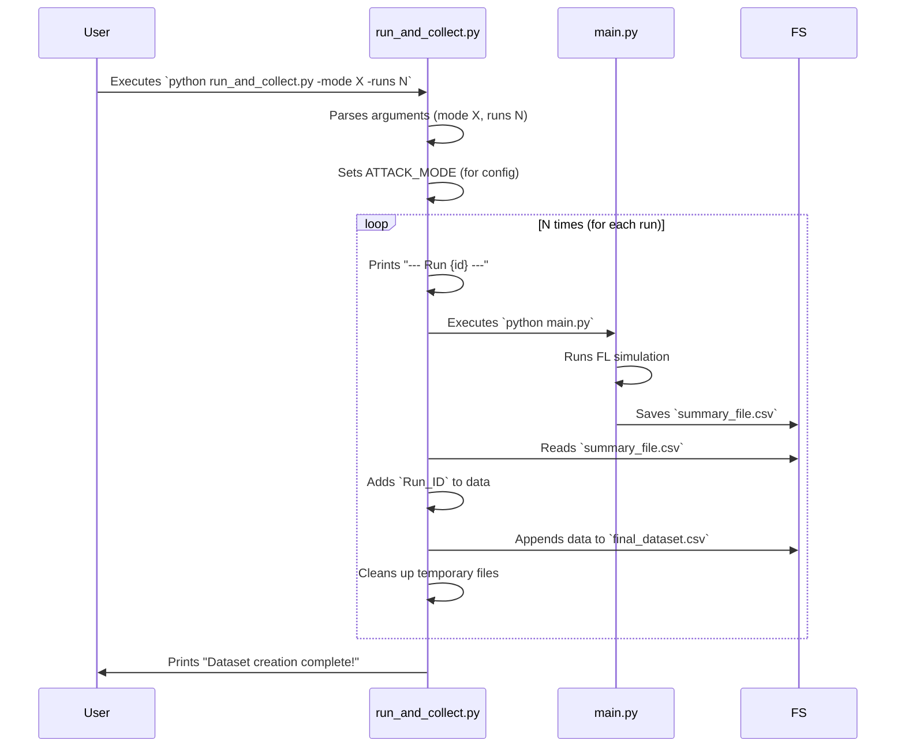

# Chapter 1: Experiment Orchestration & Data Collection

Welcome to the `create_dataset` project! This first chapter introduces a crucial part of any research or data generation process: how we manage and automate running experiments and gathering their results.

Imagine you're a scientist studying how a new plant fertilizer affects growth. You wouldn't just test it once, right? You'd want to test it many times, perhaps with slightly different conditions (more sunlight, less water, different soil types). Then, you'd carefully record the results of each test. "Experiment Orchestration & Data Collection" is like having a super-organized assistant who does all this for you automatically!

**What problem does this solve?**

In our project, we're running simulations of a concept called "federated learning" (we'll learn more about this later). We want to see how it behaves under various scenarios, like:
*   What if there are no "attackers" trying to disrupt the learning?
*   What if 10% of the participants are "attackers"?
*   What if we run the simulation for 50 rounds versus 100 rounds?

Manually running each of these scenarios, one by one, changing settings, and then copying results into a spreadsheet would be very time-consuming and prone to errors. Our "Experiment Orchestrator," the `run_and_collect.py` script, automates this entire process.

**Key Ideas:**

1.  **Automated Runs**: It can run our main simulation (handled by `main.py`) multiple times without you needing to click "run" each time.
2.  **Parameter Adjustment**: You can tell it to change specific settings for these runs right from the command line. For example, you can specify an "attack mode" or the "number of runs."
3.  **Result Aggregation**: After each simulation run, it collects the important summary data and adds it to a single, growing dataset file (usually a CSV file). This makes it easy to analyze all your results together later.

Let's see how you can use this!

## Using the Experiment Orchestrator

The main script for this task is `run_and_collect.py`. You'll interact with it using your computer's command line or terminal.

The most common things you'll want to control are:
*   `-mode`: The type of attack simulation you want to run (e.g., `none`, `random_10pct`).
*   `-runs`: The number of times you want the simulation to repeat.

**Example: Running a Simple Experiment Series**

Let's say you want to run the simulation 3 times, with no attacks. You would open your terminal, navigate to the project directory, and type:

```bash
python run_and_collect.py -mode none -runs 3
```

**What happens when you run this?**

1.  **Configuration Printed**: The script will first print some information about the settings it's using, like this (details might vary):
    ```
    Setting attack mode: none
    Using number of runs from command line: 3

    Running dataset collection with the following configuration:
    Number of runs: 3
    Enable malicious nodes: False
    Using CPU only
    Batch size: 64
    Output dataset file: collected_data/final_dataset.csv
    ```
2.  **Simulation Runs**: You'll then see messages indicating each run starting:
    ```
    --- Run 1 ---
    (Potentially more output from main.py simulation...)
    --- Run 2 ---
    (Output...)
    --- Run 3 ---
    (Output...)
    ```
3.  **Data Collection**: After each run, its summary results are quietly added to a file (e.g., `collected_data/final_dataset.csv`).
4.  **Completion**: Finally, you'll see a message like:
    ```
    Dataset creation complete!
    Output file: collected_data/final_dataset.csv
    Normal data collection complete.
    ```

Now, you'll have a CSV file (e.g., `final_dataset.csv` inside a `collected_data` folder) containing the combined results from all 3 runs!

If you run `python run_and_collect.py` without any arguments (like `-mode` or `-runs`), it will print a help message showing you the available options and then exit. This is handy if you forget the specific commands.

## Under the Hood: How `run_and_collect.py` Works

Let's peek behind the curtain to see the steps involved when you execute `run_and_collect.py`.

**A Step-by-Step Walkthrough:**

1.  **Start & Read Instructions**: The `run_and_collect.py` script begins.
2.  **Parse Arguments**: It first looks at the command-line arguments you provided (e.g., `-mode none`, `-runs 3`).
3.  **Prepare Environment**: If you specified an attack mode (like `-mode some_attack`), it sets this up in a way that other parts of the project, especially the [Project Configuration](02_project_configuration_.md), can see it. This is important because the configuration might change based on the attack mode.
4.  **Loop Through Runs**: It then starts a loop that will repeat for the number of runs you specified (e.g., 3 times).
5.  **Inside Each Loop Iteration (One Experiment Run)**:
    *   It calls the main simulation script, `main.py`. This `main.py` is the [Federated Learning Simulation Core](03_federated_learning_simulation_core_.md) that does the actual learning work.
    *   `main.py` runs the simulation based on the current settings (including any attack mode). When `main.py` finishes its job, it saves a small summary file of its results (e.g., `all_layers_summary.csv`).
    *   `run_and_collect.py` finds this summary file.
    *   It adds a special label to this summary, like `Run_ID`, so you know which run these results belong to.
    *   It then appends (adds) these labeled results to a main dataset file (often called `FINAL_DATASET_FILE` in the configuration).
    *   Finally, it cleans up any temporary files created during this specific run to keep things tidy.
6.  **All Runs Complete**: After the loop finishes all its iterations, `run_and_collect.py` prints a success message, telling you where the final combined dataset is saved.

Here's a visual representation:



## Diving Deeper into the Code

Let's look at simplified snippets from `run_and_collect.py` to understand key parts.

**1. Reading Your Instructions (Parsing Command-Line Arguments)**

When you type `python run_and_collect.py -mode none -runs 3`, the script needs to understand these instructions.

```python
# run_and_collect.py
import argparse
import os

def parse_command_line_args():
    parser = argparse.ArgumentParser() # Sets up to understand commands
    # Defines expected arguments like -mode and -runs
    parser.add_argument("-mode", type=str, help="Set attack mode")
    parser.add_argument("-runs", "--num_runs", type=int, help="Number of runs")
    args, _ = parser.parse_known_args() # Reads the actual commands you typed

    args_dict = {}
    if args.mode:
        # CRITICAL: Set as environment variable so config.py can use it
        os.environ["ATTACK_MODE"] = args.mode
        args_dict["mode"] = args.mode
    # ... (similar for num_runs) ...
    return args_dict

cli_args = parse_command_line_args() # Call the function
```
This code uses the `argparse` library to define what command-line options are available (`-mode`, `-runs`). When you run the script, `parse_known_args()` reads what you typed. Crucially, if you provide a `-mode`, `os.environ["ATTACK_MODE"] = args.mode` makes this mode available as an "environment variable." This is important because the [Project Configuration](02_project_configuration_.md) (which we'll discuss in the next chapter) reads this variable *before* it finalizes its settings.

**2. Deciding How Many Times to Run**

The script then determines the number of simulation runs.

```python
# run_and_collect.py
# cli_args comes from the parsing step above

if "num_runs" in cli_args:
    NUM_RUNS = cli_args["num_runs"]  # Use value from command line
else:
    NUM_RUNS = 2  # Default if not specified by user
print(f"Using number of runs: {NUM_RUNS}")
```
This is straightforward: if you used the `-runs` option, it uses your number. Otherwise, it defaults to a pre-set number (here, it's 2).

**3. The Main Orchestration Loop**

The `create_final_dataset()` function contains the main loop that manages the runs.

```python
# run_and_collect.py
# ... (other functions like run_main_and_collect, append_to_final_dataset, cleanup)

def create_final_dataset():
    # ... (prints configuration, ensures directories exist) ...
    header_for_csv = True # To write column names only once

    for run_id in range(NUM_RUNS): # Loop NUM_RUNS times
        summary_data_frame = run_main_and_collect(run_id) # Step A: Run & Collect

        if summary_data_frame is not None:
            # Step B: Add to main dataset
            append_to_final_dataset(summary_data_frame, header=header_for_csv)
            header_for_csv = False # Don't write header again

        cleanup() # Step C: Clean up temporary files
    # ... (prints completion message) ...
```
This loop iterates from `0` up to `NUM_RUNS - 1`. In each iteration:
*   **Step A**: It calls `run_main_and_collect(run_id)`. This function (shown next) executes one full simulation and returns its summary.
*   **Step B**: The collected `summary_data_frame` is passed to `append_to_final_dataset` to save it.
*   **Step C**: `cleanup()` removes temporary directories created by that specific run.

**4. Running a Single Simulation (`run_main_and_collect`)**

This function is responsible for executing one instance of `main.py` and retrieving its results.

```python
# run_and_collect.py
import subprocess # To run other scripts
import pandas as pd # To handle data
import os
# Assume SUMMARY_DIRECTORY and SUMMARY_FILE are defined in config
# from config import SUMMARY_DIRECTORY, SUMMARY_FILE

def run_main_and_collect(run_id):
    print(f"--- Run {run_id + 1} ---")
    # This command runs 'python main.py' as if you typed it in the terminal
    subprocess.run(["python", "main.py"], check=True)

    # After main.py runs, it saves results. Now, we load them.
    # summary_path = os.path.join(SUMMARY_DIRECTORY, SUMMARY_FILE) # e.g., 'summaries/all_layers_summary.csv'
    # if os.path.exists(summary_path):
    #     df = pd.read_csv(summary_path)
    #     df["Run_ID"] = run_id  # Add the run identifier
    #     return df
    # For simplicity in this example, let's pretend we got data:
    print(f"Simulated collecting summary for run {run_id + 1}")
    return pd.DataFrame({'accuracy': [0.9 - run_id*0.05], 'loss': [0.1 + run_id*0.02], 'Run_ID': [run_id]})
```
The most important line here is `subprocess.run(["python", "main.py"], check=True)`. This tells the operating system to execute `main.py`. The `check=True` part means if `main.py` encounters an error and exits, `run_and_collect.py` will also stop.
After `main.py` completes, this function would typically load the summary CSV file that `main.py` created (from `SUMMARY_DIRECTORY` using `SUMMARY_FILE` name, concepts from [Project Configuration](02_project_configuration_.md)). It then adds a `Run_ID` column to this data so we can track which run it came from.

**5. Adding Results to the Final Dataset (`append_to_final_dataset`)**

Once `run_main_and_collect` gets the summary data for a run, `append_to_final_dataset` adds it to our main collection file.

```python
# run_and_collect.py
# Assume FINAL_DATASET_FILE is defined in config
# from config import FINAL_DATASET_FILE

def append_to_final_dataset(df, header):
    # In the actual code, FINAL_DATASET_FILE comes from config.py
    dataset_filename_from_config = "collected_data/final_dataset.csv"
    try:
        # 'a' means append, 'index=False' avoids writing pandas index
        # 'header=header' writes column names only if header is True
        df.to_csv(dataset_filename_from_config, mode="a", index=False, header=header)
    except Exception as e:
        print(f"Error writing to dataset file: {e}")
```
This function takes the DataFrame `df` (containing one run's summary) and appends it to `FINAL_DATASET_FILE`. The `mode="a"` is key; it means "append" so new data is added to the end of the file, rather than overwriting it. The `header=header` argument ensures that the column titles are written only for the very first chunk of data.

## Conclusion

You've now seen how `run_and_collect.py` acts as an intelligent "research coordinator" for your federated learning simulations. It automates the repetitive task of running experiments multiple times, allows you to easily tweak parameters like attack modes for each set of runs, and diligently gathers all the results into a single, organized dataset. This automation is crucial for efficiently exploring different scenarios and building comprehensive datasets for analysis.

This script relies on various settings – like where to save files, default attack parameters, and more. How are all these settings managed? That's the topic of our next chapter!

Next up: [Project Configuration](02_project_configuration_.md)

---

Generated by [AI Codebase Knowledge Builder](https://github.com/The-Pocket/Tutorial-Codebase-Knowledge)