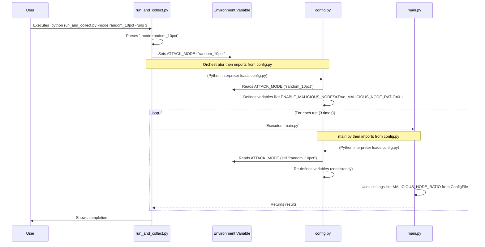

# Chapter 2: Project Configuration

In [Chapter 1: Experiment Orchestration & Data Collection](01_experiment_orchestration___data_collection_.md), we saw how `run_and_collect.py` helps us run our simulations many times and gather results. But how does `run_and_collect.py`, or the main simulation itself (`main.py`), know what settings to use for each experiment? For instance, how does it know whether to include "attackers," or where to save the output files? That's where Project Configuration comes in!

Imagine you're baking many different types of cakes. For each cake, you need a specific recipe: different ingredients, baking times, and temperatures. Our Project Configuration system is like the master recipe book for our entire `create_dataset` project.

**What problem does this solve?**

This system acts as the central control panel. It defines all the settings and parameters for our simulations. This could be:
*   The number of participants in our simulated learning activity.
*   The rules for how "attackers" behave, if they are present.
*   The names and locations of folders where results should be saved.

By having one central place for all these settings, we ensure that all parts of our project are using the *same* consistent parameters for a given experiment. This is super important for making sure our experiments are **reproducible** (we can run them again and get the same kind of results) and for easily trying out **different setups** (e.g., an experiment with 10% attackers vs. one with 20%).

## The Heart of Configuration: `config.py`

The main player in our Project Configuration is a file named `config.py`. This isn't a script you run directly. Instead, other scripts in the project, like `main.py` (our [Federated Learning Simulation Core](03_federated_learning_simulation_core_.md)) and `run_and_collect.py` (our [Experiment Orchestration & Data Collection](01_experiment_orchestration___data_collection_.md) tool), read settings *from* this `config.py` file.

Think of `config.py` as a shared notepad where all the important experimental details are written down. When another script needs to know, say, how many learning rounds to run, it just looks up "NUM_ROUNDS" on this notepad.

**Key Ideas:**

1.  **Centralized Settings**: All major parameters are defined as variables within `config.py`.
2.  **Consistency**: Because everyone reads from the same "notepad" (`config.py`), all parts of an experiment use the same settings.
3.  **Modifiability**: You can change the behavior of your experiments by changing values in `config.py`.
4.  **Dynamic Adjustments**: As we saw in Chapter 1, tools like `run_and_collect.py` can even influence some settings in `config.py` before an experiment starts, often by using something called "environment variables."

## A Peek Inside `config.py`

Let's look at simplified examples of what you might find in `config.py`.

**1. Basic Simulation Parameters**

These are fundamental settings for how the simulation runs.

```python
# config.py (Simplified)

NUM_CLIENTS = 10  # How many participants (clients) in the learning
NUM_ROUNDS = 2    # How many cycles of learning to perform
```
This is very straightforward. If `main.py` needs to know how many clients to simulate, it will import `NUM_CLIENTS` from this `config.py` file.

**2. Defining Attack Scenarios**

Our project can simulate different "attack" scenarios. `config.py` defines what these scenarios mean.

```python
# config.py (Simplified)

ATTACK_MODES = {
    "none": {"enable": False, "type": "normal", "node_ratio": 0.0},
    "random_10pct": {"enable": True, "type": "random", "node_ratio": 0.1},
    # ... potentially more predefined attack scenarios ...
}
```
Here, `ATTACK_MODES` is a dictionary. Each key (like `"none"` or `"random_10pct"`) represents an attack setup, and its value is another dictionary detailing specifics like whether attacks are enabled (`"enable": True/False`) and the proportion of attackers (`"node_ratio"`).

**3. Selecting the Current Attack Mode**

Remember from Chapter 1 how `run_and_collect.py` could take a `-mode` argument (e.g., `-mode random_10pct`)? `config.py` is designed to react to this!

```python
# config.py (Simplified)
import os # Needed to read special "environment variables"

# Default attack mode if not specified otherwise
_current_attack_mode_name = "none"

# Check if `run_and_collect.py` set an ATTACK_MODE environment variable
if "ATTACK_MODE" in os.environ:
    _current_attack_mode_name = os.environ["ATTACK_MODE"]

# Get the settings for the chosen attack mode
CURRENT_ATTACK_SETTINGS = ATTACK_MODES[_current_attack_mode_name]

# Set actual variables based on the chosen mode
ENABLE_MALICIOUS_NODES = CURRENT_ATTACK_SETTINGS["enable"]
MALICIOUS_NODE_RATIO = CURRENT_ATTACK_SETTINGS["node_ratio"]
ATTACK_TYPE = CURRENT_ATTACK_SETTINGS["type"]
```
This is a bit more advanced, but very powerful.
*   It first sets a default attack mode (`"none"`).
*   Then, it checks if an "environment variable" named `ATTACK_MODE` was set (this is what `run_and_collect.py` does when you use the `-mode` option).
*   Based on this `_current_attack_mode_name`, it looks up the detailed settings from our `ATTACK_MODES` dictionary.
*   Finally, it sets up variables like `ENABLE_MALICIOUS_NODES` and `MALICIOUS_NODE_RATIO` that other parts of the project will use.

This allows `run_and_collect.py` to tell `config.py` (and thus the rest of the project) which attack scenario to use for a particular set of experiments!

**4. Specifying Output Locations**

`config.py` also defines where various output files and summaries should be saved.

```python
# config.py (Simplified)
import os

# This would use _current_attack_mode_name or similar to make unique folder names
BASE_OUTPUT_PREFIX = f"results_{_current_attack_mode_name}"

# Directory where main.py saves its temporary summary
SUMMARY_DIRECTORY = f"{BASE_OUTPUT_PREFIX}_summary"
os.makedirs(SUMMARY_DIRECTORY, exist_ok=True) # Create folder if it's not there

# Final compiled dataset file by run_and_collect.py
COLLECTED_DATA_DIR = "collected_data"
os.makedirs(COLLECTED_DATA_DIR, exist_ok=True)
FINAL_DATASET_FILE = os.path.join(COLLECTED_DATA_DIR, f"final_dataset_{_current_attack_mode_name}.csv")
```
Here, `config.py` defines directory and file names. Notice how `_current_attack_mode_name` (which we determined earlier) might be used in directory or file names. This helps keep results from different experiment setups (e.g., "no attack" vs. "10% attack") neatly separated. The `os.makedirs(..., exist_ok=True)` lines ensure these folders are created if they don't already exist.

## How It All Fits Together: The Flow of Configuration

Let's visualize how `run_and_collect.py` (our orchestrator from Chapter 1) and `config.py` work together with `main.py` (the simulation core).



**Step-by-Step Breakdown:**

1.  **User Command**: You tell `run_and_collect.py` to run with a specific mode (e.g., `random_10pct`).
2.  **Orchestrator Sets Mode**: `run_and_collect.py` takes your `-mode` input and sets an "environment variable" called `ATTACK_MODE`. Think of this like a sticky note it puts up for other programs to see.
3.  **Configuration is Read**: When `run_and_collect.py` (or later, `main.py`) needs its settings, Python loads `config.py`.
4.  **`config.py` Adapts**: Inside `config.py`, the code reads the `ATTACK_MODE` sticky note. Based on what it says, `config.py` sets up other important variables (like `ENABLE_MALICIOUS_NODES`, `MALICIOUS_NODE_RATIO`, output file paths, etc.).
5.  **Simulation Uses Settings**: When `main.py` runs the actual simulation, it imports these variables directly from `config.py`. So, it automatically knows whether to include attackers, what their ratio should be, and where to save its specific summary files, all based on what was configured.

## How `main.py` Uses the Configuration

The [Federated Learning Simulation Core](03_federated_learning_simulation_core_.md) (our `main.py` script) simply imports the necessary variables from `config.py`.

Here's a highly simplified idea of how `main.py` might use these settings:

```python
# main.py (Very Simplified Example)
from config import NUM_CLIENTS, ENABLE_MALICIOUS_NODES, MALICIOUS_NODE_RATIO, SUMMARY_DIRECTORY, SUMMARY_FILE
import os

def run_simulation():
    print(f"Starting simulation for {NUM_CLIENTS} clients.")

    if ENABLE_MALICIOUS_NODES:
        print(f"Attackers are active! Type: {ATTACK_TYPE}, Ratio: {MALICIOUS_NODE_RATIO}")
        # ... simulation logic for attacks ...
    else:
        print("Running a normal simulation (no attackers).")
        # ... simulation logic without attacks ...

    # ... after simulation ...
    results = "some_simulation_results" # Placeholder for actual results
    output_path = os.path.join(SUMMARY_DIRECTORY, SUMMARY_FILE)
    print(f"Saving summary to: {output_path}")
    # save_results(results, output_path)
```
In this snippet:
*   `from config import ...`: `main.py` explicitly states which settings it needs from `config.py`.
*   It then uses these variables like `NUM_CLIENTS` or `ENABLE_MALICIOUS_NODES` to control its behavior.
*   It also uses `SUMMARY_DIRECTORY` and `SUMMARY_FILE` from `config.py` to know where to save its output.

This way, `main.py` doesn't need to have settings hardcoded inside it. It just asks `config.py`!

## Conclusion

You've now learned about the "Project Configuration" system, primarily centered around the `config.py` file. It's our project's recipe book, ensuring that all experiments, whether controlled manually or by `run_and_collect.py`, use consistent and well-defined settings. This system allows us to:

*   Keep all important parameters in one place.
*   Ensure reproducible experiments.
*   Easily vary experimental setups by changing `config.py` or by using tools like `run_and_collect.py` to influence `config.py` dynamically.

This configuration is what the actual simulation engine, `main.py`, relies on to perform its tasks. In the next chapter, we'll dive into what that simulation engine actually does.

Next up: [Federated Learning Simulation Core](03_federated_learning_simulation_core_.md)

---

Generated by [AI Codebase Knowledge Builder](https://github.com/The-Pocket/Tutorial-Codebase-Knowledge)