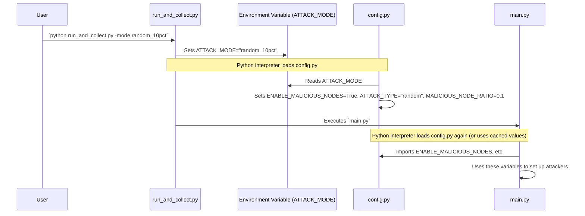

# Chapter 4: Attack Simulation Control

In the [Federated Learning Simulation Core](03_federated_learning_simulation_core_.md) (Chapter 3), we saw how `main.py` simulates a collaborative learning process, like students learning together under a teacher's guidance. But what if some "students" aren't playing fair? What if they try to disrupt the learning? This chapter is all about how we can simulate these "bad actors" to test how strong our learning system is.

## Why Simulate Attacks? The "Game Challenge" Analogy

Imagine you're designing a new cooperative game. You'd want to test it thoroughly, right? You might:
*   Play it normally to see if the basic rules work.
*   Introduce "challenge levels" where things get harder.
*   Even add "rogue players" who try to sabotage the game for others.

Simulating attacks in our federated learning project is very similar. We want to understand how our "collaborative classroom" (the federated learning system) performs when malicious participants (or "attackers") are present. This helps us build more **secure** and **robust** systems that can withstand real-world threats. "Attack Simulation Control" is like the control panel for setting up these game challenges.

**What problem does this solve?**

This system allows us to:
1.  **Activate or Deactivate Attacks**: We can choose to run simulations with or without any attackers.
2.  **Choose the Attack Type**: We can specify *how* the attackers try to cause trouble (e.g., by sending corrupted data).
3.  **Set the Attacker Proportion**: We can decide what percentage of our learning participants are malicious (e.g., 10% of students are troublemakers).

By controlling these settings, we can systematically study the impact of different kinds of attacks and different numbers of attackers on the learning process.

## Controlling the "Bad Guys": Parameters and Settings

The main way we control attack simulations is through settings in our [Project Configuration](02_project_configuration_.md) file, `config.py`. Remember, `config.py` is our project's "master recipe book."

Here are the key "dials" we can turn for attack simulation:

1.  **Enable/Disable Attacks (`ENABLE_MALICIOUS_NODES`)**: This is like a main switch. Is it `True`? Then attacks are active. Is it `False`? Then everyone behaves nicely.

2.  **Type of Attack (`ATTACK_TYPE`)**: If attacks are enabled, what kind of mischief are they up to? For instance, an `ATTACK_TYPE` of `"random"` might mean attackers are sending somewhat random or corrupted information instead of helpful learning updates.

3.  **Proportion of Attackers (`MALICIOUS_NODE_RATIO`)**: This setting determines what fraction of the clients are malicious. If `NUM_CLIENTS` is 10 and `MALICIOUS_NODE_RATIO` is 0.1 (which means 10%), then 1 client will be an attacker.

4.  **Extent of Data Corruption (`MALICIOUS_DATA_RATIO`)**: If the attack involves corrupting data, this ratio might control how much of a malicious client's data is actually bad.

## How It's Configured: A Look Inside `config.py`

Let's revisit how these settings are managed, primarily within `config.py`.

In [Chapter 1: Experiment Orchestration & Data Collection](01_experiment_orchestration___data_collection_.md), we saw that `run_and_collect.py` can use a `-mode` argument, like `python run_and_collect.py -mode random_10pct`. This `-mode` argument is key to controlling attack simulations for a series of experiments.

**1. Predefined Attack Scenarios in `config.py`**

`config.py` defines a dictionary called `ATTACK_MODES`. Each entry in this dictionary is a complete recipe for an attack scenario.

```python
# config.py (Simplified Snippet)

ATTACK_MODES = {
    "none": {  # No attack
        "enable": False, "type": "normal",
        "node_ratio": 0.0, "data_ratio": 0.0
    },
    "random_10pct": { # 10% random attackers
        "enable": True, "type": "random",
        "node_ratio": 0.1, "data_ratio": 0.1
    },
    "random_20pct": { # 20% random attackers
        "enable": True, "type": "random",
        "node_ratio": 0.2, "data_ratio": 0.2
    }
    # ... other modes like "custom", "random_30pct" ...
}
```
This snippet shows three scenarios:
*   `"none"`: Attacks are off.
*   `"random_10pct"`: Attacks are on, the type is "random", and 10% of clients are attackers, with 10% of their data potentially being malicious.
*   `"random_20pct"`: Similar, but with 20% attackers.

**2. Selecting the Current Attack Scenario**

When `run_and_collect.py` sets the `ATTACK_MODE` environment variable (e.g., to `"random_10pct"`), `config.py` picks it up:

```python
# config.py (Simplified Snippet)
import os

_current_attack_mode_name = "none" # Default

# Check if run_and_collect.py set an ATTACK_MODE
if "ATTACK_MODE" in os.environ:
    _current_attack_mode_name = os.environ["ATTACK_MODE"]

# Get the settings for the chosen attack mode
_current_attack_settings = ATTACK_MODES[_current_attack_mode_name]

# Set global variables that main.py will use
ENABLE_MALICIOUS_NODES = _current_attack_settings["enable"]
ATTACK_TYPE = _current_attack_settings["type"]
MALICIOUS_NODE_RATIO = _current_attack_settings["node_ratio"]
MALICIOUS_DATA_RATIO = _current_attack_settings["data_ratio"]
```
This powerful mechanism means:
*   `run_and_collect.py` tells `config.py` which attack scenario to use.
*   `config.py` then sets up easy-to-use variables like `ENABLE_MALICIOUS_NODES`, `ATTACK_TYPE`, and `MALICIOUS_NODE_RATIO`.
*   Our main simulation script, `main.py`, can then simply import and use these variables.

## The Flow of Attack Control

Let's visualize how a user's choice of attack mode flows through the system to influence the simulation:



1.  **You Choose**: You tell `run_and_collect.py` you want the `"random_10pct"` attack mode.
2.  **Orchestrator Acts**: `run_and_collect.py` sets a system-wide note (environment variable) `ATTACK_MODE="random_10pct"`.
3.  **Config Adapts**: When `config.py` is loaded, it reads this note and configures itself for the "random_10pct" scenario (e.g., `ENABLE_MALICIOUS_NODES` becomes `True`).
4.  **Simulation Obeys**: When `main.py` (our [Federated Learning Simulation Core](03_federated_learning_simulation_core_.md)) runs, it imports these settings from `config.py` and knows to include attackers according to the specified type and ratio.

## How `main.py` Uses These Attack Settings (Conceptual)

So, `config.py` provides the "rules" for the attack. How does `main.py` actually *use* these rules? Let's think conceptually.

**1. Checking if Attacks are Active**

`main.py` will likely have logic that branches based on `ENABLE_MALICIOUS_NODES`.

```python
# main.py (Conceptual Snippet)
from config import NUM_CLIENTS, ENABLE_MALICIOUS_NODES, MALICIOUS_NODE_RATIO, ATTACK_TYPE

def setup_simulation_environment():
    print(f"Total clients: {NUM_CLIENTS}")
    if ENABLE_MALICIOUS_NODES:
        num_attackers = int(NUM_CLIENTS * MALICIOUS_NODE_RATIO)
        print(f"Attackers ENABLED: {num_attackers} clients will be malicious.")
        print(f"Attack Type: {ATTACK_TYPE}")
        # ... logic to mark specific clients as attackers ...
    else:
        print("Attackers DISABLED. All clients are benign.")
    # ... rest of setup ...

setup_simulation_environment()
```
This shows that `main.py` can read `ENABLE_MALICIOUS_NODES`. If it's true, it can calculate how many clients should be attackers using `MALICIOUS_NODE_RATIO` and then, perhaps during client creation, flag certain clients as "malicious."

**2. Clients Behaving Maliciously**

Inside the `FlowerClient` class (which we touched upon in [Chapter 3: Federated Learning Simulation Core](03_federated_learning_simulation_core_.md)), if a client instance knows it's supposed to be malicious, its behavior in the `fit` method (where it prepares its learning update) might change.

```python
# main.py - MyFlowerClient class (Conceptual Snippet)

class MyFlowerClient(fl.client.NumPyClient):
    def __init__(self, client_id, ..., is_malicious, attack_type, malicious_data_ratio):
        self.client_id = client_id
        # ... other initializations ...
        self.is_malicious = is_malicious
        self.attack_type = attack_type
        self.malicious_data_ratio = malicious_data_ratio

    def fit(self, parameters, config):
        # ... normal training setup ...
        if self.is_malicious:
            print(f"Client {self.client_id} is MALICIOUS, type: {self.attack_type}!")
            # ... implement malicious behavior ...
            # e.g., if self.attack_type == "random":
            #   corrupt_some_data(self.train_data, self.malicious_data_ratio)
            #   model_updates = generate_random_updates() instead of real ones
        else:
            # ... normal training ...
            # model_updates = train_normally()
            pass

        # return model_updates, num_examples, metrics
        return self.get_parameters(config), 100, {} # Placeholder
```
This is a simplified idea. A client marked as `is_malicious` could, for example:
*   If `attack_type` is `"random"`, it might alter its training data based on `malicious_data_ratio` before training, or it might generate completely random model updates instead of genuine ones.
*   Other attack types could involve different strategies (e.g., trying to make the model forget, or pushing it towards a wrong answer).

The actual project code in `main.py` has a function `configure_malicious_settings()` which uses the variables from `config.py`. The client creation process (`client_fn`) would then be responsible for passing these attack parameters to the individual client instances if they are chosen to be malicious.

The specific details of *how* an attack (like "random data corruption") is implemented can be quite complex. For this chapter, the main takeaway is that `config.py` provides the *control mechanism* to turn these attacks on/off and set their parameters, which `main.py` then uses to orchestrate the behavior within the simulation.

## Conclusion

You've now learned about "Attack Simulation Control"! This crucial feature allows us to configure and run federated learning experiments with simulated attackers. We saw:

*   Why simulating attacks is important: to test the security and robustness of our FL systems.
*   The key parameters we can control: enabling attacks, attack type, and the proportion of attackers.
*   How these parameters are defined in `config.py` through `ATTACK_MODES` and selected using the `ATTACK_MODE` environment variable (often set by `run_and_collect.py`).
*   How `main.py` conceptually uses these settings from `config.py` to make some clients behave maliciously during the simulation.

This control over attack scenarios is vital for research. By observing how the system behaves under different attack conditions (e.g., how model accuracy changes, or how model weights are affected), we can gain insights into its vulnerabilities and develop defenses. The next chapter will focus on exactly that: looking at the model weights.

Next up: [Model Weight Handling & Analysis](05_model_weight_handling___analysis_.md)

---

Generated by [AI Codebase Knowledge Builder](https://github.com/The-Pocket/Tutorial-Codebase-Knowledge)