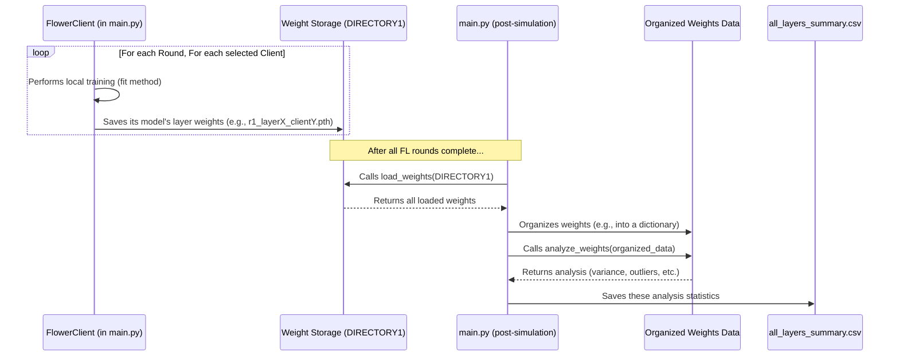

# Chapter 5: Model Weight Handling & Analysis

Welcome to Chapter 5! In [Chapter 4: Attack Simulation Control](04_attack_simulation_control_.md), we learned how to set up our experiments to include "bad actors" or attackers. This allows us to study how resilient our federated learning system is. But how do we actually measure the *impact* of these attackers, or even just understand how different (honest) participants are learning? A big part of that involves looking at the "model weights."

## What are Model Weights? The Brain of the Model

Imagine you're teaching a robot to recognize cats in pictures. You show it thousands of pictures, telling it "this is a cat" or "this is not a cat." The robot tries to learn the patterns – pointy ears, whiskers, furry texture, etc.

Inside the robot's "brain" (our machine learning model), these learned patterns are stored as a collection of numbers. These numbers are called **model weights**. They are like the settings or knobs that the model tunes during learning. When the model "learns," it's adjusting these weights to make better predictions.

In our federated learning setup:
*   Each client (like a "student" in our classroom analogy from [Chapter 3: Federated Learning Simulation Core](03_federated_learning_simulation_core_.md)) trains a model on its own private data. This means each client develops its own set of model weights based on what it has learned.
*   These individual client weights are then sent (or their updates are sent) to a central server, which combines them to create a better global model.

**Why Inspect These Weights? The Quality Control Analogy**

"Model Weight Handling & Analysis" is like being a quality control inspector in a factory.
*   **During federated learning (the "production line")**: After each client trains its model (makes its "part"), we save a copy of its model weights.
*   **After learning is done (end of the production line)**: We gather all these saved weights.
*   **Analysis (the "inspection")**: We then load these weights and perform checks. For example:
    *   **Variance**: How different are the weights for the same part of the model coming from different clients? If one client's weights are wildly different, why?
    *   **Outliers**: Are there any clients whose weights are statistical outliers, far off from everyone else? This could indicate that the client learned something very different, or it might be an attacker trying to sabotage the learning!

This "inspection" helps us understand:
*   How diverse the learning is across clients.
*   If any client is behaving unusually (which is super important for studying attacks).
*   The overall health and progress of the learning process.

## Key Steps in Model Weight Handling & Analysis

Our `main.py` script, which runs the [Federated Learning Simulation Core](03_federated_learning_simulation_core_.md), takes care of these steps.

### Part 1: Saving Model Weights (The "Collection" Phase)

Every time a client finishes its local training in a federated learning round, we want to save its learned model weights.

*   **When?** Inside the `fit` method of our `IMDBClient` (defined in `main.py`), after the local model has been trained for that round.
*   **What?** The model weights are essentially a dictionary where keys are layer names (like `distilbert.embeddings.LayerNorm.weight`) and values are the actual numerical weights for that layer. We save these, often layer by layer.
*   **Where?** These weights are saved as files (usually `.pth` files, which are PyTorch's way of saving model data) into a specific directory. In our project, this is often a directory specified in `config.py` (e.g., `DIRECTORY1`). Each file is named to indicate the round, layer, and
    client ID (e.g., `r1_distilbert.embeddings.LayerNorm.weight_client0.pth`).

Here's a conceptual idea of how a client might save its weights:

```python
# Simplified snippet from IMDBClient.fit() in main.py
# Assume self.model is the client's Keras model
# Assume self.cid is the client ID
# Assume current_round is the federated learning round number

# After local training...
model_weights = self.model.state_dict() # Get all weights as a dictionary
for layer_name, weight_tensor in model_weights.items():
    if ".weight" in layer_name: # We are often interested in the main 'weight' tensors
        # In the actual code, a function like save_weight_efficiently is used
        # save_weight_efficiently(weight_tensor, layer_name, self.cid)
        print(f"Client {self.cid}: Would save {layer_name} for round {current_round}")
```
This snippet shows that after training, the client gets its model's `state_dict` (a dictionary of layer names to weight tensors). It then iterates through these and (conceptually) saves each important weight tensor. The actual project uses a helper function like `save_weight_efficiently` from `main.py` for this.

### Part 2: Loading Model Weights (The "Gathering" Phase)

After the entire federated learning simulation (all `NUM_ROUNDS`) is complete, `main.py` needs to gather all the weights that were saved by all clients across all rounds.

*   **When?** This happens in `main.py` after the `fl.simulation.start_simulation(...)` call finishes.
*   **How?** A function, like `load_weights` in our `main.py`, reads all the `.pth` files from the directory where they were saved (e.g., `DIRECTORY1` from `config.py`).
*   **Result?** This function typically organizes the loaded weights into a Python dictionary. This dictionary might look something like this:
    `weights_dict[layer_name][round_number] = [weight_array_client0, weight_array_client1, ...]`.

Here's a simplified idea of `load_weights`:

```python
# Simplified concept of load_weights() in main.py
import os
import glob
# import torch # For loading .pth files

def load_saved_weights(directory_path):
    weights_collection = {} # To store all loaded weights
    # Example filepath: "r1_layer.name_client0.pth"
    for filepath in glob.glob(os.path.join(directory_path, "*.pth")):
        filename = os.path.basename(filepath)
        # ... code to parse round_number, layer_name, client_id from filename ...
        # round_num, layer, client_id = parse_filename(filename)
        # loaded_weight = torch.load(filepath).cpu().numpy() # Load and convert to NumPy
        
        # Store it (this is highly simplified)
        # if layer not in weights_collection: weights_collection[layer] = {}
        # if round_num not in weights_collection[layer]: weights_collection[layer][round_num] = []
        # weights_collection[layer][round_num].append(loaded_weight)
        print(f"Would load weights from: {filename}")
    return weights_collection
```
This function scans the specified directory for all `.pth` files. For each file, it extracts information like the round number, layer name, and client ID from the filename, loads the weight data, and stores it systematically.

### Part 3: Analyzing Model Weights (The "Inspection" Phase)

Once all the weights are loaded and organized, `main.py` performs the analysis.

*   **When?** Right after `load_weights` finishes.
*   **What's analyzed?** For each layer and each round, it looks at the collection of weights from *all* clients that participated in that round. It typically calculates:
    *   **Variance**: How much do the weights from different clients vary for this specific layer and round? High variance might mean clients are learning very different things, or an attacker is skewing the weights.
    *   **Outliers**: Are there any individual client weights that are statistically very far from the average of other clients? This is a key way to spot potentially malicious behavior.
    *   Other statistics like mean, median, min, max of the weights.
*   **How?** A function like `analyze_weights` in `main.py` takes the `weights_collection` from the previous step and computes these statistics.
*   **Why do this?** This analysis gives us quantitative data on model behavior. For example, if we run an experiment with attackers ([Chapter 4: Attack Simulation Control](04_attack_simulation_control_.md)), we expect to see higher variance or more outliers in the weights compared to an experiment with no attackers.

Here's a conceptual snippet for `analyze_weights`:

```python
# Simplified concept of analyze_weights() in main.py
# import numpy as np # For numerical operations
# from scipy import stats # For statistics like z-score (for outliers)

def inspect_loaded_weights(weights_collection):
    analysis_summary_list = []
    for layer_name, rounds_data in weights_collection.items():
        for round_number, list_of_client_weights in rounds_data.items():
            # client_weights_array = np.array(list_of_client_weights)
            # variance_across_clients = np.var(client_weights_array, axis=0)
            # mean_variance = np.mean(variance_across_clients)
            
            # z_scores = np.abs(stats.zscore(client_weights_array, axis=0))
            # num_outliers = (z_scores > 3).sum() # Count values > 3 std devs from mean

            # analysis_summary_list.append({
            #     "Layer": layer_name, "Round": round_number,
            #     "Mean_Variance": mean_variance, "Outliers": num_outliers, ...
            # })
            print(f"Would analyze {layer_name} for round {round_number}")
    return analysis_summary_list
```
This function iterates through each layer and round. For the list of client weights, it calculates statistics. The results (like `mean_variance` and `num_outliers`) are then compiled. This list of summaries is eventually saved as part of the `all_layers_summary.csv` file, which `run_and_collect.py` ([Chapter 1: Experiment Orchestration & Data Collection](01_experiment_orchestration___data_collection_.md)) picks up.

## Under the Hood: A Step-by-Step Example

Let's visualize the journey of a model weight from a client to the final analysis.



**Breakdown of the Diagram:**

1.  **Training & Saving (Client & FS_Weights)**: During federated learning rounds, each client trains. After training, the `fit` method in the `IMDBClient` (part of `main.py`) saves the weights of its model's layers to files in a designated directory (e.g., `DIRECTORY1` from `config.py`).
2.  **Loading (Analyzer & FS_Weights)**: Once `main.py` finishes all federated learning rounds, it calls its internal `load_weights` function. This function goes to `DIRECTORY1`, finds all the saved `.pth` weight files, and loads their contents.
3.  **Organizing (Analyzer & AnalysisResults)**: The loaded weights are then organized into a structured format, typically a Python dictionary, making them easy to access for analysis.
4.  **Analyzing (Analyzer & AnalysisResults)**: `main.py` then calls its `analyze_weights` function. This function takes the organized weights, and for each layer and round, computes statistics like variance across clients and identifies outliers.
5.  **Saving Summary (Analyzer & SummaryCSV)**: The results from `analyze_weights` (e.g., mean variance for layer X at round Y, number of outliers detected) are then formatted and saved into the `all_layers_summary.csv` file. This file is one of the key outputs of `main.py`.

## Diving Deeper into the Code (Simplified Snippets from `main.py`)

The actual `main.py` in the `create_dataset` project has functions that do exactly these tasks. Let's look at simplified versions.

**1. Saving Weights (`save_weight_efficiently`)**

This function is called from the client's `fit` method to save a specific layer's weight.

```python
# main.py (Simplified save_weight_efficiently)
import os
# import torch # For saving tensors

# Assume DIRECTORY1 is defined in config.py (e.g., "results_P0_S0_A0/weights")
# from config import DIRECTORY1

def save_one_weight(weight_tensor, layer_name, client_id, current_round):
    # Filename like: r1_layer.name_client0.pth
    filename = f"r{current_round}_{layer_name}_client{client_id}.pth"
    filepath = os.path.join(DIRECTORY1, filename) # DIRECTORY1 from config
    # torch.save(weight_tensor.cpu(), filepath) # Save to CPU to avoid GPU issues
    print(f"SAVED: {filepath}")

# # Example usage (conceptual, from client's fit method):
# current_round_num = 1 # Example
# save_one_weight(my_layer_weight_tensor, "layer_abc.weight", "client7", current_round_num)
```
This function constructs a unique filename based on the round, layer name, and client ID, then saves the tensor to that file in the `DIRECTORY1` specified by our [Project Configuration](02_project_configuration_.md).

**2. Loading Weights (`load_weights`)**

This function is called in `main.py` after the FL simulation to collect all saved weights.

```python
# main.py (Simplified load_weights)
import glob
# import torch

# Assume DIRECTORY1 is defined in config.py
# from config import DIRECTORY1

def load_all_saved_weights():
    weights_dict = {} # To hold all data: weights_dict[layer][round] = [w_c1, w_c2]
    search_pattern = os.path.join(DIRECTORY1, "*.pth") # Look for all .pth files
    for filepath in glob.glob(search_pattern):
        filename = os.path.basename(filepath)
        # parts = filename.split("_") # E.g. "r1", "layer.name", client"0".pth
        # round_num = int(filename.split("_")[0][1:])
        # layer_name = "_".join(filename.split("_")[1:-1])
        # client_id_part = filename.split("_")[-1] # e.g. "client0.pth"
        
        # weight_data = torch.load(filepath).cpu().numpy() # Load & convert
        # ... (logic to store weight_data in weights_dict correctly) ...
        print(f"LOADED: {filename} for analysis")
    return weights_dict
```
It scans `DIRECTORY1`, parses filenames to get metadata (round, layer, client), loads the tensor, converts it to a NumPy array (common for analysis), and organizes everything into a dictionary.

**3. Analyzing Weights (`analyze_weights`)**

This function takes the dictionary of loaded weights and computes statistics.

```python
# main.py (Simplified analyze_weights)
# import numpy as np
# from scipy import stats

def analyze_the_weights(loaded_weights_dict):
    analysis_results_list = []
    for layer_name, rounds_data in loaded_weights_dict.items():
        for round_num, client_weights_list_for_round in rounds_data.items():
            # client_weights_np_array = np.array(client_weights_list_for_round)
            
            # Calculate variance (simplified)
            # mean_variance_for_layer_round = np.mean(np.var(client_weights_np_array, axis=0))
            
            # Detect outliers (simplified)
            # z_scores = np.abs(stats.zscore(client_weights_np_array, axis=0))
            # num_outliers_for_layer_round = (z_scores > 3).sum()
            
            # Dummy values for example
            mean_variance_for_layer_round = 0.05 
            num_outliers_for_layer_round = 1

            analysis_results_list.append({
                "Round": round_num, "Layer": layer_name,
                "Mean_Variance": mean_variance_for_layer_round,
                "Outliers": num_outliers_for_layer_round,
                # ... other stats like min, max, mean weight could be added ...
            })
            print(f"ANALYZED: {layer_name} for round {round_num}")
    return analysis_results_list
```
For each layer and round, it converts the list of client weights into a NumPy array to easily perform calculations like variance (how spread out the weights are) and Z-score (to find outliers). These results are collected into a list of dictionaries.

## Conclusion

You've now seen how "Model Weight Handling & Analysis" works in our `create_dataset` project. It's like a detailed inspection process for the "parts" (model weights) produced by our "learning factory."
*   We learned that **model weights** are the learned parameters of a machine learning model.
*   During federated learning, `main.py` ensures that **weights from each client are saved** after their local training.
*   After all learning rounds, `main.py` **loads these saved weights**.
*   Then, it **analyzes them** to calculate metrics like variance and detect outliers, helping us understand client learning diversity and the potential impact of attacks.
*   These analysis results are crucial for our dataset, as they provide deep insights into the federated learning process under various conditions.

The analysis performed here (e.g., mean variance per layer, number of outliers) produces a rich set of data for each experimental run. But remember, our `run_and_collect.py` script from [Chapter 1: Experiment Orchestration & Data Collection](01_experiment_orchestration___data_collection_.md) performs multiple such runs. How are all these per-run summaries brought together into one final, big dataset? That's what we'll explore in the next chapter!

Next up: [Dataset Aggregation](06_dataset_aggregation_.md)

---

Generated by [AI Codebase Knowledge Builder](https://github.com/The-Pocket/Tutorial-Codebase-Knowledge)