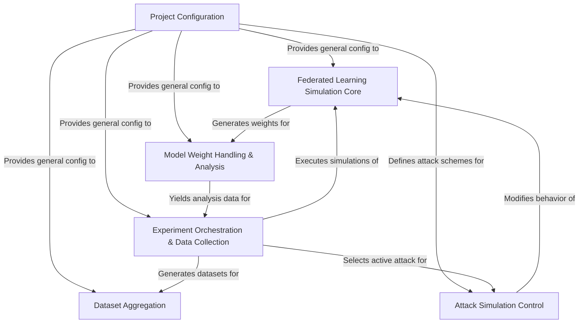

# Tutorial: create_dataset

This project simulates *Federated Learning* environments to study the **impact of cyber-attacks**.
It allows users to run many experiments with different settings, such as varying *attack types* or *malicious participant ratios*.
The system then **collects data** from these simulations, including *model weight characteristics*, and aggregates it into a final dataset for analysis.
The main goal is to **create comprehensive datasets** for researching FL security and robustness.

**Source Repository:** [None](None)

## Chapters

1. [Experiment Orchestration & Data Collection
](01_experiment_orchestration___data_collection_.md)
2. [Project Configuration
](02_project_configuration_.md)
3. [Federated Learning Simulation Core
](03_federated_learning_simulation_core_.md)
4. [Attack Simulation Control
](04_attack_simulation_control_.md)
5. [Model Weight Handling & Analysis
](05_model_weight_handling___analysis_.md)
6. [Dataset Aggregation
](06_dataset_aggregation_.md)

---

Generated by [AI Codebase Knowledge Builder](https://github.com/The-Pocket/Tutorial-Codebase-Knowledge)