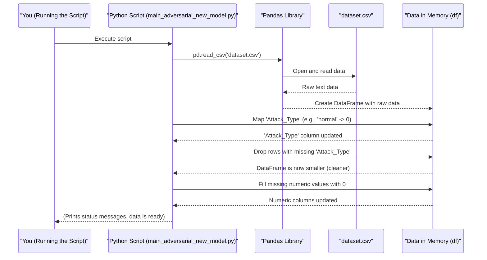

# Chapter 1: Data Ingestion and Preprocessing

Welcome to your first step in the `five_model_adversarial` project! Imagine you're a chef about to cook a delicious meal. Before you can even think about spices or cooking times, you need your ingredients, right? And you wouldn't just throw raw, unwashed vegetables into a pot. You'd first gather them, wash them, and chop them up.

In the world of data science and machine learning, **Data Ingestion and Preprocessing** is exactly that: getting our raw ingredients (data) and preparing them for the main "cooking" process (training our models).

**What problem does this solve?**

Our project aims to distinguish between "normal" and "adversarial" (potentially malicious) activities, perhaps in a computer network or system. The raw data we have might come from logs or monitoring tools, stored in a file (like a CSV - Comma Separated Values file). This raw data is often messy:
*   It might have missing pieces of information.
*   It might have information in a format that computers don't easily understand (like text instead of numbers).

If we feed this messy data directly to our machine learning models (our "chefs"), they'll get confused and won't perform well – just like a meal made with dirty, uncut vegetables wouldn't taste good!

So, this first stage is all about:
1.  **Ingestion:** Loading the data from its source (our `dataset.csv` file).
2.  **Preprocessing:** Cleaning and transforming this data into a usable format.

Think of this chapter as your guide to becoming a good "kitchen assistant" for our data.

## Key Steps in Our Kitchen (Data Preparation)

We'll focus on a few key tasks:

1.  **Loading the Ingredients (Data):** We'll use a popular Python library called `pandas` to read our `dataset.csv` file into a structure called a DataFrame. Think of a DataFrame like a smart spreadsheet.
2.  **Understanding the 'Attack_Type':** Our main goal is to predict if an activity is 'normal' or 'adversarial'. This information is in a column named 'Attack_Type'. Computers prefer numbers, so we'll change 'normal' to `0` and 'adversarial' to `1`.
3.  **Washing the Vegetables (Handling Missing 'Attack_Type'):** What if some rows don't have an 'Attack_Type' specified? Or if our conversion to numbers failed for some reason? These rows are not very useful for training our model to predict the attack type, so we'll remove them.
4.  **Chopping Other Vegetables (Handling Missing Numbers):** Other columns in our dataset might contain numbers (like measurements or counts). If some of these are missing, we can't just remove the whole row, as we might lose valuable information. A simple strategy is to fill these missing numeric spots with a default value, like `0`.

Let's see how this looks in code.

## Getting Our Hands Dirty: Preparing the Data

All the code snippets below are simplified versions of what you'll find in `main_adversarial_new_model.py`.

### 1. Loading the Data

First, we need to load our dataset. We use `pandas` for this.

```python
import pandas as pd

# Load the dataset from a CSV file
df = pd.read_csv('dataset.csv', low_memory=False)

print("Data loaded successfully!")
# Output (general idea):
# Data loaded successfully!
# (Behind the scenes, 'df' now holds all data from dataset.csv)
```
This code snippet tells Python to use the `pandas` library (which we import as `pd` for shorthand) to read the file named `dataset.csv`. The `low_memory=False` part helps pandas handle large files with mixed data types more efficiently. The data is now stored in a variable called `df`, our DataFrame.

### 2. Mapping 'Attack_Type' to Numbers

Our 'Attack_Type' column contains text: 'normal' or 'adversarial'. Let's convert this to numbers: `0` for 'normal' and `1` for 'adversarial'.

```python
# 'df' is our DataFrame from the previous step

# Convert 'Attack_Type' text to numbers
df['Attack_Type'] = df['Attack_Type'].map({'normal': 0, 'adversarial': 1})

print("Attack_Type mapped to numbers.")
# Output (general idea):
# Attack_Type mapped to numbers.
# (In 'df', the 'Attack_Type' column now has 0s and 1s instead of text)
```
Here, `df['Attack_Type']` refers to the 'Attack_Type' column. The `.map()` function goes through each entry in this column. If it sees 'normal', it replaces it with `0`; if 'adversarial', with `1`.

### 3. Handling Missing 'Attack_Type' Values

After mapping, some entries in 'Attack_Type' might have become `NaN` (Not a Number). This can happen if the original CSV had an 'Attack_Type' that wasn't 'normal' or 'adversarial', or if it was blank. Since 'Attack_Type' is what we want to predict (our target), rows without this information aren't useful for training. So, we remove them.

```python
# 'df' is our DataFrame after mapping

# Check for missing values in 'Attack_Type' before cleaning
missing_before = df['Attack_Type'].isnull().sum()
print(f"Missing Attack_Type values BEFORE cleaning: {missing_before}")

# Remove rows where 'Attack_Type' is missing
df = df.dropna(subset=['Attack_Type'])

# Check again after cleaning
missing_after = df['Attack_Type'].isnull().sum()
print(f"Missing Attack_Type values AFTER cleaning: {missing_after}")
# Output (example):
# Missing Attack_Type values BEFORE cleaning: 5
# Missing Attack_Type values AFTER cleaning: 0
```
`df['Attack_Type'].isnull()` creates a list of True/False (True if missing, False if not). `.sum()` then counts the Trues.
`df.dropna(subset=['Attack_Type'])` tells pandas to drop (delete) any row where the 'Attack_Type' column has a missing value. We assign the result back to `df`, effectively updating our DataFrame.

### 4. Filling Missing Numeric Values

Our dataset might have other columns with numbers. If some of these numbers are missing, we'll fill them with `0`. This is a common, simple way to handle missing numerical data.

```python
import numpy as np # We need numpy for 'np.number'

# 'df' is our DataFrame after handling missing Attack_Type

# Identify all columns that contain numbers
numeric_cols = df.select_dtypes(include=[np.number]).columns.tolist()

# Fill missing values in these numeric columns with 0
df[numeric_cols] = df[numeric_cols].fillna(0)

print("Missing numeric values filled with 0.")
# Output (general idea):
# Missing numeric values filled with 0.
# (Any blank cells in numeric columns of 'df' are now filled with 0)
```
`df.select_dtypes(include=[np.number])` selects only the columns that have numerical data. `.columns.tolist()` gets their names as a list.
Then, `df[numeric_cols].fillna(0)` takes these numeric columns and fills any `NaN` (missing) values with `0`.

And that's it for the basic preparation! Our "ingredients" are now much cleaner and in a better format.

## Under the Hood: What's Really Happening?

Let's visualize the data journey with a simplified diagram.



Let's break down the code logic from `main_adversarial_new_model.py` for these steps:

1.  **Loading Data (`pd.read_csv`):**
    *   File: `main_adversarial_new_model.py`
    *   Pandas opens `dataset.csv`.
    *   It reads the file line by line. The first line is usually assumed to be column headers.
    *   It tries to determine the data type of each column (number, text, etc.).
    *   It stores all this data in a structured table in memory, called a DataFrame.

    ```python
    # File: main_adversarial_new_model.py
    # Relevant part:
    import pandas as pd
    df = pd.read_csv('dataset.csv', low_memory=False)
    ```

2.  **Mapping 'Attack_Type' (`.map()`):**
    *   File: `main_adversarial_new_model.py`
    *   The script takes the 'Attack_Type' column.
    *   For each value in this column:
        *   If the value is 'normal', it's replaced by `0`.
        *   If the value is 'adversarial', it's replaced by `1`.
        *   If it's anything else (or already blank), it becomes `NaN` (Not a Number), which pandas uses to represent missing data.

    ```python
    # File: main_adversarial_new_model.py
    # Relevant part:
    df['Attack_Type'] = df['Attack_Type'].map({'normal': 0, 'adversarial': 1})
    ```

3.  **Dropping Rows with Missing 'Attack_Type' (`.dropna()`):**
    *   File: `main_adversarial_new_model.py`
    *   The script looks specifically at the 'Attack_Type' column.
    *   If any row has a `NaN` value in this column, that entire row is deleted from the DataFrame.
    *   This ensures that every remaining row has a valid `0` or `1` for 'Attack_Type'.

    ```python
    # File: main_adversarial_new_model.py
    # Relevant part:
    df = df.dropna(subset=['Attack_Type'])
    ```

4.  **Filling Missing Numeric Values (`.fillna()`):**
    *   File: `main_adversarial_new_model.py`
    *   First, it identifies all columns that are supposed to contain numbers (`select_dtypes`).
    *   Then, for each of these numeric columns, it scans for any `NaN` values.
    *   Every `NaN` found in these numeric columns is replaced with `0`.

    ```python
    # File: main_adversarial_new_model.py
    # Relevant part:
    import numpy as np # For np.number
    numeric_cols = df.select_dtypes(include=[np.number]).columns.tolist()
    df[numeric_cols] = df[numeric_cols].fillna(0)
    ```

This whole process ensures our dataset is clean, complete (in the sense of no missing target values or problematic NaNs in features), and in a numerically friendly format for the next stages.

## Conclusion

Congratulations! You've just learned about the crucial first step in any machine learning project: **Data Ingestion and Preprocessing**. You saw how we load data from a file, clean it up by handling missing values, and transform it by converting text labels into numbers. This is like a kitchen assistant meticulously preparing ingredients so the chef (our machine learning model) can work their magic.

Our data is now much tidier. But is it the *most* informative it can be? Often, we can create even more helpful "ingredients" from the ones we have. This process is called Feature Engineering, and it's exactly what we'll explore in the next chapter.

Ready to move on? Let's go to [Chapter 2: Feature Engineering](02_feature_engineering_.md).

---

Generated by [AI Codebase Knowledge Builder](https://github.com/The-Pocket/Tutorial-Codebase-Knowledge)