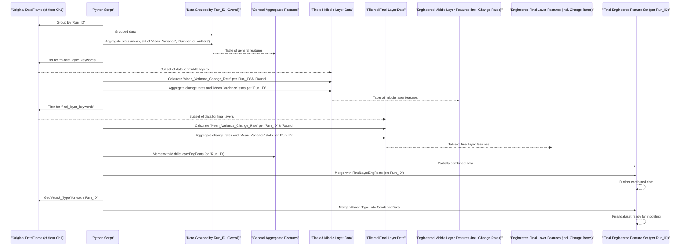

# Chapter 2: Feature Engineering

Welcome back! In [Chapter 1: Data Ingestion and Preprocessing](01_data_ingestion_and_preprocessing_.md), we gathered our raw data, cleaned it up, and got it into a basic usable format, much like a chef preparing raw ingredients. Now, imagine you're an inventor. You have some basic parts (our current data features), but to build a truly effective machine (our predictive model), you might need to design some new, specialized tools or combine existing parts in clever ways. This is exactly what **Feature Engineering** is all about!

**What problem does this solve?**

Our goal is to build a model that can tell the difference between 'normal' and 'adversarial' activities. The initial features we have from our dataset (like 'Mean_Variance' or 'Number_of_outliers' recorded at different 'Round's and 'Layer's for each 'Run_ID') are good, but they might not be the *most* informative on their own.

For example, just looking at a single 'Mean_Variance' reading at one point in time might not tell us much. But what if we knew:
*   The *average* 'Mean_Variance' across all readings for a specific 'Run_ID'?
*   How much the 'Mean_Variance' *changed* from one 'Round' to the next for a 'Run_ID'?
*   The *maximum* 'Number_of_outliers' observed during a 'Run_ID'?

These kinds of derived information are new "features" that we "engineer." They can provide a richer, more summarized view of the data, potentially making it much easier for our model to find patterns and make accurate predictions.

In this chapter, we'll explore how our project `five_model_adversarial` creates these new, more powerful features. We'll be crafting new tools from our existing data to help our model work more efficiently!

## Key Ideas in Our Invention Lab (Feature Engineering)

1.  **Summarizing Behavior (Aggregating Statistics):** For each `Run_ID` (which represents a complete experimental run), we have multiple readings for features like 'Mean_Variance' and 'Number_of_outliers' (across different 'Round's or 'Layer's). We'll calculate summary statistics like the average (mean), standard deviation (std), minimum (min), maximum (max), and median for these features over the entire `Run_ID`. This gives us a condensed overview of what happened during that run.
2.  **Tracking Changes (Calculating Change Rates):** Sometimes, *how* a value changes is more important than the value itself. We'll focus on the 'Mean_Variance' feature, especially in specific network layers (which we'll call 'middle_layers_df' and 'final_layers_df' based on data from the 'Layer' column). For each `Run_ID`, we'll calculate the 'Mean_Variance_Change_Rate' – how much this value changed from one 'Round' to the next. Rapid or unusual changes could be significant.
3.  **Putting It All Together (Merging Features):** Once we've created these new summary statistics and change rates, we'll combine them all into a single, comprehensive dataset for each `Run_ID`. Each row in this new dataset will represent one `Run_ID`, and the columns will be our shiny new engineered features, plus the original 'Attack_Type' label.

## Crafting Our New Tools: Step-by-Step

Let's look at simplified examples of how these features are created. The actual code in `main_adversarial_new_model.py` handles more details, but the core logic is similar.

### 1. Summarizing Behavior: Aggregated Statistics

Imagine our `df` (from Chapter 1) has data like this for 'Mean_Variance':

| Run_ID | Round | Mean_Variance | ...other_columns... |
| :----- | :---- | :------------ | :------------------ |
| 1      | 1     | 10            | ...                 |
| 1      | 2     | 12            | ...                 |
| 1      | 3     | 11            | ...                 |
| 2      | 1     | 20            | ...                 |
| 2      | 2     | 22            | ...                 |

We want to find the average 'Mean_Variance' for `Run_ID` 1 (which is (10+12+11)/3 = 11) and for `Run_ID` 2 (which is (20+22)/2 = 21).

```python
import pandas as pd

# Assume 'df' is our preprocessed DataFrame from Chapter 1
# For simplicity, let's create a small example:
data = {'Run_ID': [1, 1, 1, 2, 2],
        'Mean_Variance': [10, 12, 11, 20, 22],
        'Number_of_outliers': [0, 1, 0, 2, 3]}
df_example = pd.DataFrame(data)

# Group by 'Run_ID' and calculate mean for 'Mean_Variance'
mean_variance_features = df_example.groupby('Run_ID')['Mean_Variance'].mean().reset_index()
mean_variance_features = mean_variance_features.rename(columns={'Mean_Variance': 'Mean_Variance_mean'})

print("Mean Variance per Run_ID:")
print(mean_variance_features)
# Output:
# Mean Variance per Run_ID:
#    Run_ID  Mean_Variance_mean
# 0       1                11.0
# 1       2                21.0
```
In the actual script, we use `.agg()` to calculate multiple statistics (mean, std, min, max, median) for both 'Mean_Variance' and 'Number_of_outliers' at once. The column names are also made more descriptive (e.g., `Mean_Variance_mean`, `Mean_Variance_std`).

### 2. Tracking Changes: Calculating 'Mean_Variance_Change_Rate'

Now, let's focus on how 'Mean_Variance' changes between 'Round's for specific layers. Our script first filters data for 'middle_layers_df' and 'final_layers_df'. Let's take a simplified `middle_layers_df`:

| Run_ID | Round | Mean_Variance |
| :----- | :---- | :------------ |
| 1      | 1     | 100           |
| 1      | 2     | 110           | <--- From 100 to 110 is a +10% change
| 1      | 3     | 99            | <--- From 110 to 99 is a -10% change

The "percentage change" (pct_change) is a common way to measure this.
Rate for Round 2 = (110 - 100) / 100 = 0.10
Rate for Round 3 = (99 - 110) / 110 = -0.10

```python
# Simplified example for change rate within one Run_ID for middle layers
middle_data = {'Run_ID': [1, 1, 1], 'Round': [1, 2, 3], 'Mean_Variance': [100, 110, 99]}
middle_df_example = pd.DataFrame(middle_data)

# Sort by Round (important for correct change calculation)
middle_df_example = middle_df_example.sort_values('Round')

# Calculate percentage change within each Run_ID group
# In the real script, this is done within a .groupby('Run_ID').apply(...)
middle_df_example['MV_Change_Rate'] = middle_df_example['Mean_Variance'].pct_change()

print("\nMean Variance Change Rate (Middle Layer Example):")
print(middle_df_example)
# Output:
# Mean Variance Change Rate (Middle Layer Example):
#    Run_ID  Round  Mean_Variance  MV_Change_Rate
# 0       1      1            100             NaN  <-- No previous value for first round
# 1       1      2            110            0.10
# 2       1      3             99           -0.10
```
The `pct_change()` function in pandas does this calculation for us. The first value in each group will be `NaN` (Not a Number) because there's no previous round to compare to.
After calculating these per-round change rates, the script then *aggregates* these change rates for each `Run_ID` (e.g., calculates the mean change rate, std of change rates, etc. for `Run_ID` 1).

### 3. Putting It All Together: Merging Features

After creating general aggregated features, middle layer features (including aggregated change rates), and final layer features, we need to combine them. We want one row per `Run_ID` that contains all these new insights.

```python
# Simplified example of merging
# Suppose we have:
general_features = pd.DataFrame({
    'Run_ID': [1, 2],
    'Mean_Variance_avg_overall': [11.0, 21.0]
})
middle_layer_change_rate_features = pd.DataFrame({
    'Run_ID': [1, 2],
    'Middle_MV_Change_Rate_mean': [0.0, 0.05] # Example values
})

# Merge them on 'Run_ID'
merged_features = pd.merge(general_features, middle_layer_change_rate_features, on='Run_ID', how='left')

print("\nMerged Features:")
print(merged_features)
# Output:
# Merged Features:
#    Run_ID  Mean_Variance_avg_overall  Middle_MV_Change_Rate_mean
# 0       1                       11.0                        0.00
# 1       2                       21.0                        0.05
```
The script uses `pd.merge()` multiple times to combine all general features, middle layer features, and final layer features. It also merges the 'Attack_Type' (0 for normal, 1 for adversarial) for each `Run_ID` back into this combined feature set, because that's what we want our model to predict!

## Under the Hood: The Feature Factory

Let's visualize the process of creating and combining these features:



Let's peek at simplified versions of the code logic from `main_adversarial_new_model.py`:

1.  **Calculating General Aggregated Features:**
    The script groups the main DataFrame `df` by 'Run_ID' and then uses the `.agg()` method to calculate several statistics for 'Mean_Variance' and 'Number_of_outliers'.

    ```python
    # File: main_adversarial_new_model.py (simplified snippet)
    # grouped = df.groupby('Run_ID')
    # features = grouped.agg({
    #     'Mean_Variance': ['mean', 'std', 'min', 'max', 'median'],
    #     'Number_of_outliers': ['mean', 'std', 'min', 'max', 'median']
    # }).reset_index()
    # # Column names are then flattened, e.g., 'Mean_Variance_mean'
    ```
    This creates new columns like `Mean_Variance_mean`, `Mean_Variance_std`, `Number_of_outliers_max`, etc., summarizing each `Run_ID`.

2.  **Filtering Layer-Specific Data:**
    Before calculating change rates, the data is filtered for specific layers.

    ```python
    # File: main_adversarial_new_model.py (simplified snippet)
    # middle_layer_keywords = ['layer.3'] # Example keyword
    # middle_layers_df = df[df['Layer'].str.contains('|'.join(middle_layer_keywords), na=False)]
    # # final_layers_df is created similarly
    ```

3.  **Calculating Change Rate and Aggregating Layer Features:**
    A function `calculate_change_rate` is defined to compute `pct_change()` on 'Mean_Variance' after sorting by 'Round'. This function is applied to each `Run_ID` group within `middle_layers_df` and `final_layers_df`.

    ```python
    # File: main_adversarial_new_model.py (conceptual for calculate_change_rate)
    # def calculate_change_rate(group):
    #     group = group.sort_values('Round')
    #     group['Mean_Variance_Change_Rate'] = group['Mean_Variance'].pct_change()
    #     return group
    #
    # # Applied like this (simplified):
    # middle_layers_df = middle_layers_df.groupby('Run_ID').apply(calculate_change_rate)
    ```
    After the change rates are calculated for each round, these rates (and the 'Mean_Variance' values for these layers) are *then* aggregated (mean, std, min, max, median) per `Run_ID`, similar to the general features. This results in features like `Middle_Mean_Variance_Change_Rate_mean`.

4.  **Merging All Features:**
    Finally, all these newly created feature DataFrames (general, middle layer, final layer) are merged together using `pd.merge()` based on the common `Run_ID` column. The 'Attack_Type' for each `Run_ID` is also merged in.

    ```python
    # File: main_adversarial_new_model.py (simplified snippet)
    # # features = pd.merge(features, middle_features, on='Run_ID', how='left')
    # # features = pd.merge(features, final_features, on='Run_ID', how='left')
    #
    # # Get Attack_Type for each Run_ID
    # attack_type_labels = df.groupby('Run_ID')['Attack_Type'].first().reset_index()
    #
    # # Merge labels into the final feature set
    # data = pd.merge(features, attack_type_labels, on='Run_ID')
    ```
    The `how='left'` ensures that we keep all `Run_ID`s from the `features` DataFrame and add information from `middle_features` and `final_features` where available. Any `Run_ID` not present in the layer-specific dataframes would get `NaN` values for those layer-specific features, which are then typically filled (e.g., with 0 or a mean value, though our script handles NaNs by filling numeric columns with 0 globally in the preprocessing step).

This entire process transforms our data from many rows per `Run_ID` (each representing a specific 'Round' or 'Layer' reading) into a single row per `Run_ID`, where each column is a potentially powerful engineered feature.

## Conclusion

Great job! You've now seen how we can be inventors with our data, taking the basic "parts" (raw features) and crafting new, more insightful "tools" (engineered features). This process of **Feature Engineering** is often one of the most impactful steps in building a successful machine learning model. By summarizing behaviors with statistics and tracking dynamic changes, we provide our model with a much richer understanding of each `Run_ID`.

Our data is now not just clean, but also enriched with these smarter features. However, some of these features are specific to certain 'Layers' of a network. How does activity in different layers contribute to distinguishing normal from adversarial behavior? We'll dive into this in the next chapter on [Layer-Specific Analysis](03_layer_specific_analysis_.md).

---

Generated by [AI Codebase Knowledge Builder](https://github.com/The-Pocket/Tutorial-Codebase-Knowledge)