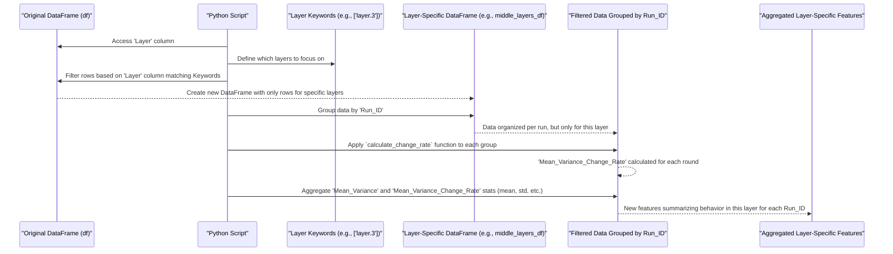

# Chapter 3: Layer-Specific Analysis

Welcome! In [Chapter 2: Feature Engineering](02_feature_engineering_.md), we learned how to create powerful new features from our existing data, like calculating overall statistics and rates of change for each `Run_ID`. Think of that as getting a general overview of an entire "crime scene" (our system).

Now, we're going to put on our detective hats and zoom in. What if specific "rooms" (layers in our system) hold unique clues? **Layer-Specific Analysis** is about focusing our investigation on these particular areas to uncover insights that might be missed when looking at the whole picture.

**What problem does this solve?**

Imagine our system is like a multi-story building (a "house"). An "event" (normal or adversarial activity) occurs. A good detective wouldn't just look at the front door. They'd investigate specific rooms – perhaps the activity is concentrated in the server room (a "middle layer") or near the exit points (a "final layer").

In our project, data is tagged with a 'Layer' (e.g., 'layer.1', 'layer.3', 'layer.5'). Some layers might be more critical or behave differently during an adversarial attack. By analyzing data *specifically from these layers*, we can create features that capture these localized behaviors. The key idea is that changes (like the `Mean_Variance_Change_Rate`) within specific, important layers might be strong indicators of whether an activity is normal or adversarial.

This chapter focuses on how we:
1.  Identify important layers (our "rooms of interest").
2.  Filter the data to look only at these layers.
3.  Calculate specific metrics, like the rate of change of 'Mean_Variance', *within these filtered subsets*.

This helps our model learn patterns that are unique to how different parts of the system respond to events.

## Our Detective's Toolkit: Focusing on Specific Layers

The main steps in our layer-specific analysis involve:

1.  **Identifying Key Layers (Choosing the Rooms):** We first decide which layers are most interesting. In our script, these are defined by keywords. For example, we might designate 'layer.3' as a "middle layer" and 'layer.5' as a "final layer."
    ```python
    # Keywords to identify specific types of layers
    middle_layer_keywords = ['layer.3']
    final_layer_keywords = ['layer.5']
    ```
    This is like our detective deciding to focus on the "server room" and the "main exit hallway."

2.  **Isolating Evidence (Filtering Data by Layer):** Once we've chosen our layers, we filter our main dataset (`df`) to create new, smaller datasets containing only the information from these specific layers.
    ```python
    # Assume 'df' is our preprocessed DataFrame from Chapter 1
    # Filter for middle layers
    middle_layers_df = df[df['Layer'].str.contains('|'.join(middle_layer_keywords), na=False)]

    # Filter for final layers
    final_layers_df = df[df['Layer'].str.contains('|'.join(final_layer_keywords), na=False)]

    print(f"Data points in all layers: {len(df)}")
    print(f"Data points in middle layers: {len(middle_layers_df)}")
    # Output (example numbers):
    # Data points in all layers: 10000
    # Data points in middle layers: 2000
    ```
    `df['Layer'].str.contains('|'.join(keywords))` checks each entry in the 'Layer' column. If it contains any of our specified keywords (e.g., 'layer.3'), that row is included in `middle_layers_df`. This gives us separate "evidence bags" for each type of room.

3.  **Analyzing Room-Specific Clues (Calculating Change Rates):** For each of these layer-specific datasets (`middle_layers_df`, `final_layers_df`), we then calculate the `Mean_Variance_Change_Rate`. This tells us how 'Mean_Variance' is changing over 'Round's *specifically within these layers* for each `Run_ID`.
    We use a helper function, `calculate_change_rate`, which you might remember from our general feature engineering. Now, it's applied to our filtered data.
    ```python
    # Simplified version of the calculate_change_rate function
    def calculate_change_rate(group):
        group = group.sort_values('Round') # Sort by Round first!
        # Calculate percentage change in 'Mean_Variance'
        group['Mean_Variance_Change_Rate'] = group['Mean_Variance'].pct_change()
        return group

    # Apply this to our layer-specific data for each Run_ID
    # (The actual script selects specific columns after apply)
    middle_layers_df_with_rates = middle_layers_df.groupby('Run_ID').apply(calculate_change_rate)

    print("Middle layer data with change rates (example for one Run_ID):")
    # print(middle_layers_df_with_rates[middle_layers_df_with_rates['Run_ID'] == 'some_run_id'].head())
    # Output (conceptual for a Run_ID):
    # Middle layer data with change rates (example for one Run_ID):
    #   Run_ID  Round  Layer    Mean_Variance  Mean_Variance_Change_Rate
    # 0 run_X   1      layer.3  100.0          NaN
    # 1 run_X   2      layer.3  110.0          0.10
    # 2 run_X   3      layer.3  105.0         -0.045
    ```
    Here, for each `Run_ID`, we look only at its data from the middle layers. We sort by 'Round' and then calculate how `Mean_Variance` changed from one round to the next *within that specific layer and run*.

4.  **Summarizing Layer-Specific Findings:** After calculating the per-round change rates for each layer, we need to summarize these findings per `Run_ID`. Just like in [Chapter 2: Feature Engineering](02_feature_engineering_.md), we aggregate these `Mean_Variance_Change_Rate` values (e.g., calculate their mean, standard deviation, min, max, median) for each `Run_ID`.
    ```python
    # Aggregate the change rates (and Mean_Variance itself) for middle layers
    middle_features = middle_layers_df_with_rates.groupby('Run_ID').agg({
        'Mean_Variance': ['mean', 'std'], # Mean of Mean_Variance in this layer
        'Mean_Variance_Change_Rate': ['mean', 'std'] # Mean of Change Rates in this layer
    }).reset_index()

    # Rename columns to be specific, e.g., 'Middle_Mean_Variance_Change_Rate_mean'
    # (Actual script has more aggregations and better column naming)
    print("\nAggregated middle layer features for Run_IDs:")
    # print(middle_features.head())
    # Output (conceptual):
    # Aggregated middle layer features for Run_IDs:
    #   Run_ID  Middle_Mean_Variance_mean Middle_Mean_Variance_Change_Rate_mean ...
    # 0 run_X   105.0                     0.0275                              ...
    # 1 run_Y   ...                       ...                                 ...
    ```
    This creates new features like `Middle_Mean_Variance_Change_Rate_mean` or `Final_Mean_Variance_std`. These features are then merged with the general features we created in Chapter 2 to form a comprehensive dataset for model training.

By doing this, we're telling our model: "Not only should you look at overall trends, but also pay special attention to how things are changing in these specific layers."

## Under the Hood: How the Script Focuses Its Investigation

Let's visualize the specialized process for one type of layer (e.g., middle layers):



Let's trace the key code segments from `main_adversarial_new_model.py` responsible for this focused analysis:

1.  **Defining Layer Keywords and Filtering:**
    The script hardcodes keywords to identify the layers of interest.
    ```python
    # File: main_adversarial_new_model.py
    # Relevant part:
    middle_layer_keywords = ['layer.3']
    final_layer_keywords = ['layer.5']

    middle_layers_df = df[df['Layer'].str.contains('|'.join(middle_layer_keywords), na=False)]
    final_layers_df = df[df['Layer'].str.contains('|'.join(final_layer_keywords), na=False)]
    ```
    This uses pandas' string methods to check if the 'Layer' column entry contains any of the defined keywords. `na=False` ensures that rows with missing 'Layer' information don't cause errors and are excluded.

2.  **Calculating Layer-Specific Change Rates:**
    The `calculate_change_rate` function (defined once) is then applied specifically to these filtered DataFrames, grouped by `Run_ID`.
    ```python
    # File: main_adversarial_new_model.py
    # Relevant part of applying the function:
    # (calculate_change_rate function is defined elsewhere in the script)

    # Apply to middle layers data (simplified, actual code selects columns)
    middle_layers_df = middle_layers_df.groupby(['Run_ID'], group_keys=False).apply(calculate_change_rate)
    # Similar application for final_layers_df
    final_layers_df = final_layers_df.groupby(['Run_ID'], group_keys=False).apply(calculate_change_rate)
    ```
    The `.groupby('Run_ID').apply(calculate_change_rate)` ensures that the percentage change is calculated correctly within each `Run_ID`'s sequence of 'Round's *for that specific layer*.

3.  **Aggregating Features from Layer-Specific Data:**
    After the change rates are computed for each round within specific layers, these rates (and the original 'Mean_Variance' values for these layers) are aggregated per `Run_ID`.
    ```python
    # File: main_adversarial_new_model.py
    # Relevant part for middle layer features:
    middle_features = middle_layers_df.groupby('Run_ID').agg({
        'Mean_Variance': ['mean', 'std', 'min', 'max', 'median'],
        'Mean_Variance_Change_Rate': ['mean', 'std', 'min', 'max', 'median']
    }).reset_index()
    # Column names are then made descriptive, e.g., 'Middle_Mean_Variance_Change_Rate_mean'
    ```
    This step creates the actual features (like `Middle_Mean_Variance_Change_Rate_mean`) that will be fed to the model. A similar aggregation is done for `final_features` using `final_layers_df`. These layer-specific feature sets are then merged with the general features (as shown in [Chapter 2: Feature Engineering](02_feature_engineering_.md)) to build the final dataset for modeling.

This specialized analysis allows the model to learn if, for example, a spike in the change rate of `Mean_Variance` within 'layer.3' is a particularly strong signal of an adversarial event, even if the overall system change rate isn't as dramatic.

## Conclusion

You've now learned how our detective work gets more focused! **Layer-Specific Analysis** allows us to zoom in on particular parts of our system (specific layers) and extract features that describe their unique behavior. By identifying key layers, filtering data for these layers, and then calculating metrics like `Mean_Variance_Change_Rate` within them, we generate richer, more targeted clues for our machine learning models.

These layer-specific features, combined with the general features from the previous chapter, give our models a more nuanced view of the data. With our data ingestion, preprocessing, and feature engineering (both general and layer-specific) complete, our dataset is now well-prepared. The next step is to use this data to actually train our predictive models!

Ready to see how these features are used to teach our models? Let's proceed to [Chapter 4: Model Training Workflow](04_model_training_workflow_.md).

---

Generated by [AI Codebase Knowledge Builder](https://github.com/The-Pocket/Tutorial-Codebase-Knowledge)