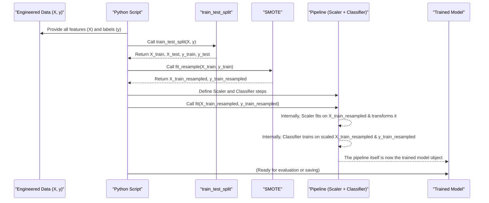

# Chapter 4: Model Training Workflow

Welcome back! In [Chapter 3: Layer-Specific Analysis](03_layer_specific_analysis_.md), we fine-tuned our detective skills by creating features that focused on specific "rooms" or layers within our system. We now have a rich set of engineered features, both general and layer-specific, ready to go. Think of these features as meticulously prepared ingredients. Now, it's finally time for the main event: cooking the meal! In machine learning, "cooking" means training our models.

This chapter introduces the **Model Training Workflow**. This is like a master plan for our kitchen or, even better, a factory assembly line. We'll take our prepared data (ingredients) and guide it through several essential processing stages to produce fully trained machine learning models (the finished dishes), which can then predict whether an activity is 'normal' or 'adversarial'.

**What problem does this solve?**

Having great features is crucial, but how do we actually teach a machine learning model to learn from them? We can't just dump all our data into a model and hope for the best. We need a structured process. This workflow addresses several key challenges:

1.  **Fair Evaluation:** How do we know if our model is genuinely learning or just memorizing the data? We need a way to test it on data it hasn't seen before.
2.  **Data Imbalance:** What if we have many examples of 'normal' activity but very few 'adversarial' ones? Models can become biased towards the majority class.
3.  **Consistent Preprocessing:** Models often require data to be in a specific format (e.g., all numbers on a similar scale). This needs to be applied consistently.
4.  **Training Multiple "Chefs":** Different models (like RandomForest, LogisticRegression, SVM, etc.) have different strengths. Our workflow will train several of them so we can later compare and choose the best one.

Our "factory assembly line" for training looks like this:
Raw Materials (Engineered Data) -> Stage 1: Splitting into Train/Test -> Stage 2: Handling Imbalance (SMOTE on Train data) -> Stage 3: Scaling -> Stage 4: Classifier Training -> Final Product (Trained Model).

Let's explore each stage!

## Key Stages in Our Model Training Factory

Our model training workflow involves a sequence of crucial steps:

### 1. Splitting the Data: Study Time vs. Exam Time

Before we train any model, we need to divide our meticulously engineered dataset into two parts:

*   **Training Set:** This is the larger portion of the data (e.g., 80%) that we'll use to teach our model. Think of it as the "study material" for the model.
*   **Testing Set:** This is the smaller portion (e.g., 20%) that we keep aside. The model will *never* see this data during training. We use it at the very end to evaluate how well our model performs on new, unseen data – like an "exam paper."

This split is vital to avoid "overfitting," where a model learns the training data too well (memorizes it) but fails to generalize to new situations.

```python
from sklearn.model_selection import train_test_split

# Assume 'X' contains our features and 'y' contains the labels ('Attack_Type')
# feature_cols = [col for col in data.columns if col not in ['Run_ID', 'Attack_Type']]
# X = data[feature_cols]
# y = data['Attack_Type']

# Split data into 80% training and 20% testing
# stratify=y ensures that both train and test sets have similar proportions of 'normal' and 'adversarial' cases
X_train, X_test, y_train, y_test = train_test_split(
    X, y, test_size=0.2, random_state=42, stratify=y
)

print(f"Size of training features: {X_train.shape}")
print(f"Size of testing features: {X_test.shape}")
# Output (example):
# Size of training features: (800, 25)  <- 800 samples, 25 features
# Size of testing features: (200, 25)   <- 200 samples, 25 features
```
Here, `X` represents our table of features, and `y` is the column with the 'Attack_Type' (0 or 1). `test_size=0.2` means 20% goes to the test set. `random_state=42` ensures we get the same split every time we run the code, making our experiments reproducible. `stratify=y` is important for classification problems to maintain the original proportion of target labels in both training and testing splits.

### 2. Handling Class Imbalance: Leveling the Playing Field with SMOTE

Often, datasets have an unequal number of samples for different classes. For instance, we might have many 'normal' activity logs but very few 'adversarial' ones. This is called **class imbalance**. If we train a model on such imbalanced data, it might become very good at predicting the majority class ('normal') but perform poorly on the minority class ('adversarial'), which is often the one we care most about!

**SMOTE (Synthetic Minority Over-sampling Technique)** is a clever way to address this. It works *only on the training data* (never the test data!) by:
1.  Looking at the minority class samples.
2.  Creating new, *synthetic* samples that are similar to the existing minority samples but not exact copies.

This effectively "boosts" the number of minority class samples in our training set, helping the model pay more attention to them.

```python
from imblearn.over_sampling import SMOTE

# Initialize SMOTE
smote = SMOTE(random_state=42)

# Apply SMOTE ONLY to the training data
X_train_resampled, y_train_resampled = smote.fit_resample(X_train, y_train)

print(f"Original training labels distribution: {y_train.value_counts()}")
print(f"Resampled training labels distribution: {y_train_resampled.value_counts()}")
# Output (example):
# Original training labels distribution: 
# 0    700  <- Normal
# 1    100  <- Adversarial
# Name: Attack_Type, dtype: int64
# Resampled training labels distribution: 
# 0    700
# 1    700
# Name: Attack_Type, dtype: int64
```
After applying SMOTE, our `X_train_resampled` and `y_train_resampled` will have a more balanced representation of classes, ready for the next stage. Remember, `X_test` and `y_test` are untouched by SMOTE.

### 3. Building the Training Pipeline: Scaler + Classifier

Now that our training data is split and balanced, we prepare it for the actual model. This usually involves two steps, often combined into a "pipeline":

*   **A. Scaling Features:** Many machine learning algorithms perform better when all numerical input features are on a similar scale. For example, if one feature ranges from 0 to 1 and another from 0 to 10,000, the algorithm might incorrectly give more importance to the latter. **StandardScaler** is a common technique that transforms features to have zero mean and unit variance (like converting all measurements to a standard unit). We fit the scaler *only* on the training data and use that *same* fitted scaler to transform both the training and test data.

*   **B. The Classifier:** This is the actual machine learning algorithm we want to train (e.g., RandomForest, Logistic Regression). It will learn patterns from the scaled, (resampled) training data.

We use a **Pipeline** to chain these steps. It ensures that data flows correctly through scaling and then into the classifier. Our project uses `ImbPipeline` from the `imblearn` library, which is designed to work well with techniques like SMOTE (even though in our specific script, SMOTE is applied *before* this pipeline).

```python
from sklearn.preprocessing import StandardScaler
from sklearn.ensemble import RandomForestClassifier
from imblearn.pipeline import Pipeline as ImbPipeline # Renamed to avoid conflict

# Define the pipeline steps
# For this example, SMOTE has already been applied to X_train and y_train
# So the pipeline only includes scaling and the classifier.
pipeline_steps = [
    ('scaler', StandardScaler()),  # Step 1: Scale the data
    ('classifier', RandomForestClassifier(random_state=42)) # Step 2: The model
]

# Create the pipeline
model_pipeline = ImbPipeline(pipeline_steps)

print("Pipeline created successfully!")
# Output:
# Pipeline created successfully!
```
This `model_pipeline` is now a single object that will first scale the data and then feed it to the `RandomForestClassifier`.

### 4. Training Diverse Models

Our project doesn't just train one type of model. It trains five different ones:
*   **RandomForestClassifier:** Builds multiple decision trees and combines their outputs.
*   **LogisticRegression:** A linear model that predicts probabilities.
*   **SVC (Support Vector Classifier):** Finds a hyperplane that best separates classes.
*   **GradientBoostingClassifier:** Builds trees sequentially, where each tree tries to correct the errors of the previous one.
*   **XGBClassifier (XGBoost):** An optimized and powerful version of gradient boosting.

The workflow (splitting, SMOTE on train data, pipeline with scaling + classifier) is applied to each of these. This allows us to see which type of "chef" (model) performs best on our specific "ingredients" (data).

The actual training happens when we call the `.fit()` method on our pipeline using the SMOTE-resampled training data:
```python
# 'model_pipeline' is our pipeline from the previous step
# 'X_train_resampled' and 'y_train_resampled' are from the SMOTE step

# Train the model
model_pipeline.fit(X_train_resampled, y_train_resampled)

print("Model training complete for one model!")
# Output:
# Model training complete for one model!
```
After this step, `model_pipeline` contains a trained model.

## Under the Hood: The Assembly Line in Action

Let's visualize the complete process for training one model:



Let's look at the key code elements from `main_adversarial_new_model.py` that implement this workflow:

1.  **Splitting Data:**
    This is done using `sklearn.model_selection.train_test_split`.
    ```python
    # File: main_adversarial_new_model.py (Relevant part)
    # X and y are defined earlier based on 'data' DataFrame
    X_train, X_test, y_train, y_test = train_test_split(
        X, y, test_size=0.2, random_state=42, stratify=y
    )
    ```

2.  **Applying SMOTE:**
    SMOTE is applied to the training set `X_train`, `y_train`.
    ```python
    # File: main_adversarial_new_model.py (Relevant part)
    from imblearn.over_sampling import SMOTE
    smote = SMOTE(random_state=42)
    X_train_resampled, y_train_resampled = smote.fit_resample(X_train, y_train)
    ```

3.  **Defining Models and Pipelines:**
    The script defines a dictionary of models. Then, in a loop, it creates a pipeline for each.
    ```python
    # File: main_adversarial_new_model.py (Simplified logic)
    from sklearn.preprocessing import StandardScaler
    from imblearn.pipeline import Pipeline as ImbPipeline
    from sklearn.ensemble import RandomForestClassifier # Example model

    models = {
        'RandomForest': RandomForestClassifier(random_state=42),
        # ... other models like LogisticRegression, SVM, etc.
    }

    # Inside a loop for each model_name, model_instance in models.items():
    # current_model = model_instance # e.g., RandomForestClassifier()
    pipeline = ImbPipeline([
        ('scaler', StandardScaler()),
        ('classifier', current_model) # 'current_model' changes in each iteration
    ])
    ```

4.  **Training the Pipeline:**
    The `.fit()` method is called on the pipeline with the *resampled* training data. (In the actual script, this happens within a `GridSearchCV` process, which we'll cover in [Chapter 5: Hyperparameter Optimization (GridSearchCV)](05_hyperparameter_optimization__gridsearchcv_.md)). For now, let's focus on the core fitting idea:
    ```python
    # Conceptual fitting for one pipeline (in reality, it's part of GridSearchCV)
    # Assume 'pipeline' is defined as above for a specific model
    # Assume 'X_train_resampled' and 'y_train_resampled' are available

    # pipeline.fit(X_train_resampled, y_train_resampled)
    # print(f"Pipeline for {model_name} fitted.")
    ```
    This general workflow is repeated for each of the five models in our project. The `pipeline.fit()` call tells the scaler to learn the scaling parameters from `X_train_resampled` and transform it, and then tells the classifier to learn from this scaled data and `y_train_resampled`.

## Conclusion

Fantastic! You've now grasped the **Model Training Workflow**, our systematic approach to preparing data and training multiple machine learning models. We've seen how crucial it is to:
*   Split data into training and testing sets for fair evaluation.
*   Address class imbalance using SMOTE on the training data.
*   Use a pipeline to consistently apply scaling and then train the classifier.

This "assembly line" ensures that each model (RandomForest, LogisticRegression, SVM, GradientBoosting, XGBoost) is trained robustly. We now have trained models, but are they the *best possible version* of themselves? Just like a chef can tweak recipe amounts or cooking times, we can tune our models' internal settings (hyperparameters) to improve their performance. That's exactly what we'll explore in the next chapter!

Ready to fine-tune our models? Let's head to [Chapter 5: Hyperparameter Optimization (GridSearchCV)](05_hyperparameter_optimization__gridsearchcv_.md).

---

Generated by [AI Codebase Knowledge Builder](https://github.com/The-Pocket/Tutorial-Codebase-Knowledge)