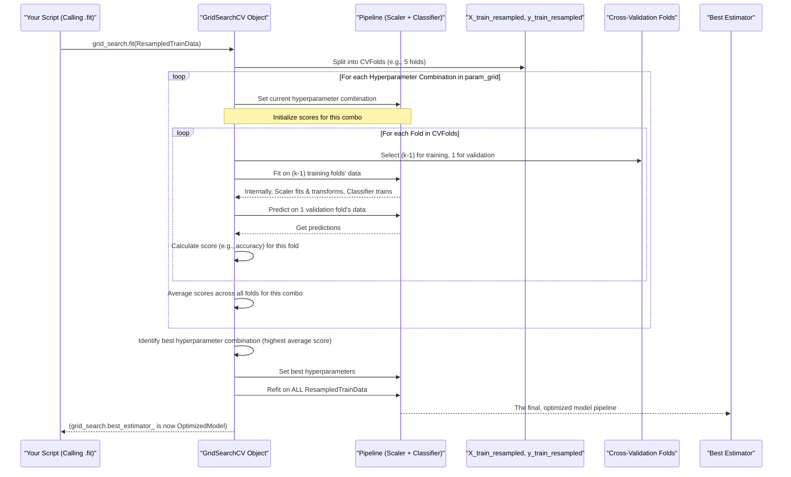

# Chapter 5: Hyperparameter Optimization (GridSearchCV)

Welcome to Chapter 5! In [Chapter 4: Model Training Workflow](04_model_training_workflow_.md), we set up an "assembly line" to train several different types of machine learning models. We prepared our data, handled imbalances, and fed it through a pipeline of scaling and classification. Our models are now trained! But, are they performing at their absolute best?

Imagine you're a sound engineer. You've recorded a song, but now you need to fine-tune all the knobs and sliders on the mixing console – the bass, treble, volume for each instrument – to get that perfect, crisp sound. That's what **Hyperparameter Optimization** is all about for our models. We're going to meticulously adjust their "settings" to find the combination that gives us the best performance.

**What problem does this solve?**

Each machine learning model (like RandomForest or SVM) has its own set of internal "settings" that we, the data scientists, need to choose *before* training begins. These settings are called **hyperparameters**. For example:
*   For a RandomForest model, how many decision trees should it build (`n_estimators`)? How deep can each tree grow (`max_depth`)?
*   For an SVM model, what should the `C` parameter (which controls the trade-off between a smooth decision boundary and classifying training points correctly) be?

Choosing the right hyperparameters can significantly impact how well a model learns and predicts. If we pick poorly, our model might be like a song that's too quiet or has too much bass – not very effective!

**GridSearchCV** is our tool for this fine-tuning. It's like an automated sound engineer that systematically tries out many different combinations of these "knobs" (hyperparameters) and uses a robust method (cross-validation) to figure out which combination gives the "best sound" (highest model performance) on our training data.

## Key Concepts: The Knobs and Dials of Our Models

Let's break down the main ideas:

1.  **What are Hyperparameters?**
    These are the settings of a model that are not learned from the data itself, but are set by us beforehand. Think of them as the instructions you give to a chef *before* they start cooking: "Use 2 cups of flour, bake for 30 minutes at 350 degrees." Changing these instructions can change the final dish.
    *   Examples: `n_estimators` in RandomForest, `C` and `kernel` in SVM, `learning_rate` in GradientBoosting.

2.  **What is a "Grid" in Grid Search?**
    Imagine you have two hyperparameters to tune for a RandomForest model:
    *   `n_estimators`: You want to try values `[100, 200]`.
    *   `max_depth`: You want to try values `[10, 20, 30]`.
    You can visualize this as a grid:

    |                  | `max_depth=10` | `max_depth=20` | `max_depth=30` |
    | :--------------- | :------------- | :------------- | :------------- |
    | `n_estimators=100` | Combo 1        | Combo 2        | Combo 3        |
    | `n_estimators=200` | Combo 4        | Combo 5        | Combo 6        |

    GridSearchCV will try all 2 x 3 = 6 combinations of these hyperparameters. We define this "grid" of values to search.

3.  **What is Cross-Validation (CV)?**
    For each combination of hyperparameters (each "Combo" in our grid), how do we judge if it's good? We can't just use the score on the entire training set, as the model might just memorize it for that specific setting.
    This is where cross-validation comes in. As we learned, our main training data (`X_train_resampled`, `y_train_resampled`) is further split:
    *   It's divided into, say, 5 equal parts (or "folds").
    *   The model (with the current hyperparameter combo) is trained on 4 of these folds.
    *   It's then tested on the 1 remaining fold (the "validation fold").
    *   This process is repeated 5 times, with each fold getting a turn to be the validation fold.
    *   The average performance score (e.g., accuracy) across these 5 validation folds is the final score for that hyperparameter combination. This gives a more reliable estimate of how well the model will perform on unseen data.

4.  **GridSearchCV in Action:**
    `GridSearchCV` combines these ideas:
    *   It takes our model (or pipeline).
    *   It takes the grid of hyperparameters we want to test.
    *   For every combination in the grid, it performs cross-validation on the training data.
    *   It keeps track of the combination that resulted in the best average cross-validation score.
    *   Finally, it retrains a new model on the *entire* training set using these "best" found hyperparameters. This final model is considered the optimized one.

## Tuning our Models: An Example with RandomForest

Let's see how we might use `GridSearchCV` with a RandomForest model, assuming we're using the pipeline from [Chapter 4: Model Training Workflow](04_model_training_workflow_.md). Remember, our training data (`X_train_resampled`, `y_train_resampled`) has already been processed by SMOTE.

### 1. Define the Parameter Grid

First, we define which hyperparameters we want to tune and what values to try for them. For a pipeline containing a classifier, hyperparameter names are prefixed with `classifier__`.

```python
# Assume 'model' is a RandomForestClassifier instance
# Our pipeline from Chapter 4 looks like:
# pipeline = ImbPipeline([('scaler', StandardScaler()), ('classifier', model)])

# Define the grid of hyperparameters for RandomForest
param_grid_rf = {
    'classifier__n_estimators': [100, 200],  # Number of trees
    'classifier__max_depth': [10, 20, None], # Max depth of trees (None means no limit)
    'classifier__min_samples_split': [2, 5]  # Min samples to split a node
}
# This grid specifies 2 * 3 * 2 = 12 combinations to try.
```
This dictionary tells `GridSearchCV`: "For the `classifier` step in my pipeline (which is RandomForest), try `n_estimators` as 100 then 200, `max_depth` as 10, 20, or None, and `min_samples_split` as 2 then 5."

### 2. Set up GridSearchCV

Next, we create a `GridSearchCV` object. We give it:
*   The pipeline we want to tune (which includes the scaler and the classifier).
*   The `param_grid` we just defined.
*   `cv`: The cross-validation strategy (e.g., 5-fold StratifiedKFold).
*   `scoring`: The metric to evaluate performance (e.g., 'accuracy').

```python
from sklearn.model_selection import GridSearchCV, StratifiedKFold
from imblearn.pipeline import Pipeline as ImbPipeline
from sklearn.preprocessing import StandardScaler
from sklearn.ensemble import RandomForestClassifier

# Create a RandomForestClassifier instance (as an example)
rf_model = RandomForestClassifier(random_state=42)

# Create the pipeline (scaler + classifier)
pipeline = ImbPipeline([
    ('scaler', StandardScaler()),
    ('classifier', rf_model)
])

# Define the cross-validation strategy
cv_strategy = StratifiedKFold(n_splits=5, shuffle=True, random_state=42)

# Initialize GridSearchCV
grid_search = GridSearchCV(
    estimator=pipeline, # Our pipeline with RandomForest
    param_grid=param_grid_rf, # The parameter grid
    cv=cv_strategy,           # Cross-validation folds
    scoring='accuracy',       # Metric to optimize
    n_jobs=-1                 # Use all available CPU cores to speed up
)
print("GridSearchCV object created.")
# Output:
# GridSearchCV object created.
```

### 3. Run the Search (Fit GridSearchCV)

Now, we "fit" the `GridSearchCV` object to our resampled training data. This starts the whole process of trying all combinations and cross-validating them. This step can take a while, especially with large grids or datasets!

```python
# Assume X_train_resampled, y_train_resampled are ready from Chapter 4
# (SMOTE has already been applied to get these)

# Start the hyperparameter search
# grid_search.fit(X_train_resampled, y_train_resampled) # This line runs the search

print("GridSearchCV fitting process would start here...")
# If actually run, this would take time and print nothing until done.
# Then, grid_search would contain the results.
```
After fitting, `grid_search` will have found the best combination.

### 4. Get the Best Results

Once `GridSearchCV` has finished its search, we can access:
*   `grid_search.best_params_`: A dictionary of the hyperparameter values that gave the best cross-validation score.
*   `grid_search.best_score_`: The best average cross-validation score achieved.
*   `grid_search.best_estimator_`: The pipeline (already retrained on the full `X_train_resampled`, `y_train_resampled`) with these best parameters. This is our optimized model!

```python
# After fitting (imagine it's done):
# print(f"Best Parameters found: {grid_search.best_params_}")
# print(f"Best Cross-Validation Accuracy: {grid_search.best_score_:.4f}")

# optimized_model = grid_search.best_estimator_
# print("Optimized model is ready!")

# Example Output (if it had run and found these):
# Best Parameters found: {'classifier__max_depth': 20, 'classifier__min_samples_split': 2, 'classifier__n_estimators': 200}
# Best Cross-Validation Accuracy: 0.9350
# Optimized model is ready!
```
This `optimized_model` is now the best version of our RandomForest (within the grid we searched) and is ready for final evaluation on the `X_test`, `y_test` data. Our project `five_model_adversarial` does this for all five model types.

## Under the Hood: GridSearchCV's Systematic Search

Let's visualize how `GridSearchCV` works internally when you call `.fit()`:



In simpler terms:
1.  `GridSearchCV` gets the model pipeline, the parameter grid, and the resampled training data.
2.  It takes the first combination of hyperparameters from the grid (e.g., `n_estimators=100`, `max_depth=10`).
3.  It performs cross-validation using these settings on the resampled training data:
    *   The pipeline's scaler is fit on a portion of the CV training fold and transforms it.
    *   The pipeline's classifier (with the current hyperparameters) is trained on this scaled data.
    *   The trained model is evaluated on the CV validation fold (which is also scaled).
    *   This is repeated for all CV folds.
4.  An average score for this first combination is calculated.
5.  Steps 2-4 are repeated for *every other combination* in the parameter grid.
6.  `GridSearchCV` compares all the average scores and finds the hyperparameter combination that gave the best one.
7.  Finally, it takes this winning combination and retrains the *entire pipeline* on *all* of the `X_train_resampled` and `y_train_resampled` data. This newly trained pipeline is stored as `grid_search.best_estimator_`.

### Code Implementation in `five_model_adversarial`

In `main_adversarial_new_model.py`, this process is encapsulated within the loop that iterates through different model types.

1.  **Preparing Data for GridSearchCV:**
    The training data `X_train`, `y_train` is first resampled using SMOTE to handle class imbalance. This `X_train_resampled`, `y_train_resampled` is then fed into `GridSearchCV`.
    ```python
    # File: main_adversarial_new_model.py (Simplified)
    # X_train, y_train are original training splits
    smote = SMOTE(random_state=42)
    X_train_resampled, y_train_resampled = smote.fit_resample(X_train, y_train)
    # This X_train_resampled, y_train_resampled is used by GridSearchCV.
    ```

2.  **Defining Model-Specific Parameter Grids:**
    For each model (RandomForest, LogisticRegression, etc.), a specific `param_grid` is defined.
    ```python
    # File: main_adversarial_new_model.py (Inside the model loop, for RandomForest)
    # if model_name == 'RandomForest':
    #     param_grid = {
    #         'classifier__n_estimators': [100, 200, 300],
    #         'classifier__max_depth': [None, 10, 20, 30],
    #         # ... other hyperparameters for RandomForest ...
    #     }
    ```

3.  **Setting up and Running GridSearchCV:**
    The `Pipeline` (scaler + classifier) and `GridSearchCV` are initialized, and then `fit` is called.
    ```python
    # File: main_adversarial_new_model.py (Inside the model loop)
    # 'model' is the current classifier instance (e.g., RandomForestClassifier())
    pipeline = ImbPipeline([
        ('scaler', StandardScaler()),
        ('classifier', model) # 'model' has default hyperparameters initially
    ])

    # 'cv' is a StratifiedKFold instance
    cv_strategy = StratifiedKFold(n_splits=5, shuffle=True, random_state=42)

    grid_search_cv_object = GridSearchCV(
        pipeline,           # The pipeline to tune
        param_grid,         # Specific grid for this model type
        cv=cv_strategy,
        scoring='accuracy',
        n_jobs=-1           # Use all CPU cores
    )
    
    # grid_search_cv_object.fit(X_train_resampled, y_train_resampled)
    # The results (best_params_, best_estimator_) are then stored.
    ```
This ensures that for each of the five models we're testing, we're not just training them with default settings, but actively searching for a better-performing set of hyperparameters.

## Conclusion

Well done! You've now learned how to fine-tune your machine learning models like a professional sound engineer, using **Hyperparameter Optimization with GridSearchCV**. We explored:
*   What hyperparameters are (the model's adjustable settings).
*   How `GridSearchCV` systematically tries different combinations of these settings.
*   The crucial role of cross-validation in reliably evaluating each combination.
*   How to define a parameter grid and use `GridSearchCV` to find the `best_params_` and `best_estimator_`.

By applying this process, we ensure that each of our models from [Chapter 4: Model Training Workflow](04_model_training_workflow_.md) is given the best chance to perform well. We now have the *optimized versions* of our five candidate models. But how do they truly stack up against each other, especially on unseen test data? And which one is the overall champion?

That's what we'll dive into next in [Chapter 6: Comprehensive Model Evaluation and Comparison](06_comprehensive_model_evaluation_and_comparison_.md).

---

Generated by [AI Codebase Knowledge Builder](https://github.com/The-Pocket/Tutorial-Codebase-Knowledge)