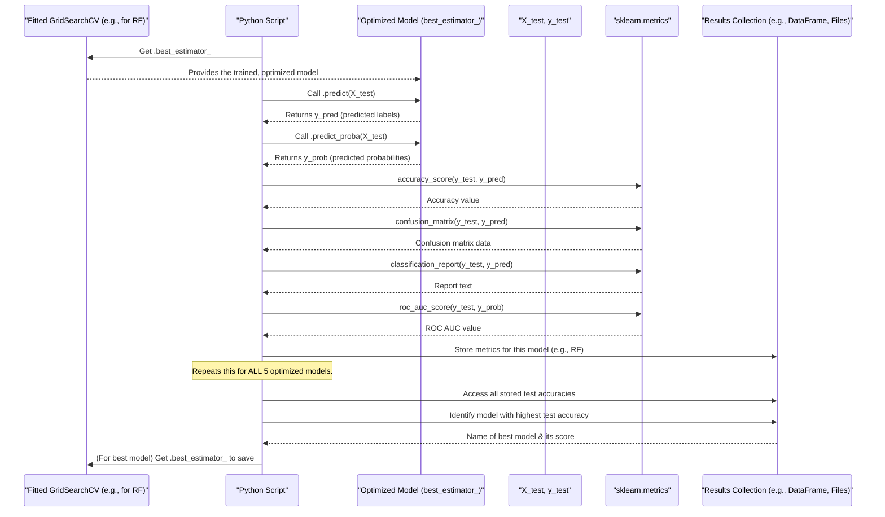

# Chapter 6: Comprehensive Model Evaluation and Comparison

Whew! In [Chapter 5: Hyperparameter Optimization (GridSearchCV)](05_hyperparameter_optimization__gridsearchcv_.md), we meticulously tuned our machine learning models, like sound engineers perfecting a song by adjusting all the knobs and sliders. We used `GridSearchCV` to find the best internal settings (hyperparameters) for each of our five models (RandomForest, LogisticRegression, SVM, GradientBoosting, and XGBoost), training them on our `X_train_resampled` data. Each model is now the `best_estimator_` from its tuning process.

But how do we know which model is truly the "best" overall? And how well do they actually perform on data they've *never seen before*? It's time for the final showdown!

**What problem does this solve?**

Imagine a multi-event sports competition, like a decathlon. We have several athletes (our optimized models) who have trained hard. Now, they must compete on a new, unfamiliar field (our unseen test data). We need to:
1.  **Fairly judge** each athlete's performance across various events (evaluation metrics).
2.  **Compare their scores** to see who performs well in what areas.
3.  **Declare an overall champion** – the model that is most reliable and accurate for our task of distinguishing 'normal' from 'adversarial' activities.

This chapter is all about that final judging process. We'll take our optimized models and put them to the ultimate test using the `X_test` and `y_test` data we carefully set aside way back in [Chapter 4: Model Training Workflow](04_model_training_workflow_.md).

## Key Concepts: The "Events" in Our Model Decathlon

To judge our models thoroughly, we use several standard "events" or metrics. Each tells us something different about a model's performance on the test data.

### 1. The Test Set: The Real Challenge (`X_test`, `y_test`)

Remember, `X_test` (the features) and `y_test` (the true labels: 0 for normal, 1 for adversarial) were hidden from our models during training and hyperparameter tuning. Evaluating on this unseen data gives us the most realistic idea of how our models will perform in the real world on new data.

### 2. Accuracy: The Basic Score

This is the most straightforward metric. It answers: "Out of all the predictions the model made on the test data, what fraction did it get right?"

```python
from sklearn.metrics import accuracy_score

# y_test_true: The actual true labels from our test set
# y_test_predicted: The predictions made by our model on X_test
# accuracy = accuracy_score(y_test_true, y_test_predicted)
# Example: if accuracy is 0.95, it means the model was correct 95% of the time.
```
While simple, accuracy alone might not tell the whole story, especially if one class (e.g., 'normal') is much more common than the other ('adversarial').

### 3. Confusion Matrix: Understanding the Mistakes

A confusion matrix gives us a table showing what kind of correct and incorrect predictions our model made. It helps us see *where* the model is getting confused. For a binary problem (normal vs. adversarial):

|                   | Predicted: Normal (0) | Predicted: Adversarial (1) |
| :---------------- | :-------------------- | :------------------------- |
| **Actual: Normal (0)** | True Negatives (TN)   | False Positives (FP)       |
| **Actual: Adversarial (1)** | False Negatives (FN)  | True Positives (TP)        |

*   **True Positives (TP):** Adversarial correctly identified as adversarial. (Good!)
*   **True Negatives (TN):** Normal correctly identified as normal. (Good!)
*   **False Positives (FP):** Normal *incorrectly* identified as adversarial. (Type I Error - "false alarm")
*   **False Negatives (FN):** Adversarial *incorrectly* identified as normal. (Type II Error - "missed detection" - often very bad!)

```python
from sklearn.metrics import confusion_matrix, ConfusionMatrixDisplay
import matplotlib.pyplot as plt # For displaying

# cm = confusion_matrix(y_test_true, y_test_predicted)
# disp = ConfusionMatrixDisplay(confusion_matrix=cm)
# disp.plot()
# plt.show() # This would show the matrix plot
```
This helps us understand, for example, if our model is missing too many actual threats (high FN) or crying wolf too often (high FP).

### 4. Classification Report: Detailed Performance Breakdown

This report provides key metrics for each class ('normal' and 'adversarial') individually:
*   **Precision:** Out of all the times the model predicted a class (e.g., "adversarial"), how many times was it actually correct?
    *   Precision (Adversarial) = TP / (TP + FP)
*   **Recall (Sensitivity):** Out of all the actual instances of a class (e.g., "adversarial"), how many did the model correctly identify?
    *   Recall (Adversarial) = TP / (TP + FN)
*   **F1-score:** A balanced measure that combines precision and recall (harmonic mean). It's useful when you care about both false positives and false negatives.
    *   F1-score = 2 * (Precision * Recall) / (Precision + Recall)
*   **Support:** The number of actual occurrences of the class in the test data.

```python
from sklearn.metrics import classification_report

# report = classification_report(y_test_true, y_test_predicted, target_names=['normal', 'adversarial'])
# print(report)
# Output (example structure):
#                  precision    recall  f1-score   support
#
#        normal       0.98      0.99      0.98       150
#   adversarial       0.90      0.85      0.87        50
#
#      accuracy                           0.95       200
#     macro avg       0.94      0.92      0.93       200
#  weighted avg       0.96      0.95      0.95       200
```
This report is very handy for seeing how well the model performs on each specific class, which is crucial if one class is more important to get right than the other.

### 5. ROC AUC Score: Overall Distinguishing Ability

The **Receiver Operating Characteristic (ROC) Curve** is a graph showing how well a model can distinguish between the two classes (normal vs. adversarial) at various decision thresholds.
The **Area Under the Curve (AUC)** for this graph gives us a single number (between 0 and 1) that summarizes this ability.
*   An AUC of 1.0 means a perfect classifier.
*   An AUC of 0.5 means the model is no better than random guessing.
*   Higher AUC is better.

This metric is particularly useful when classes are imbalanced.

```python
from sklearn.metrics import roc_auc_score, roc_curve, auc
# For roc_auc_score, we often need the probability scores for the positive class
# y_test_probabilities = model.predict_proba(X_test)[:, 1] # Probabilities for class '1' (adversarial)

# roc_auc = roc_auc_score(y_test_true, y_test_probabilities)
# print(f"ROC AUC Score: {roc_auc:.4f}")
# Output (example):
# ROC AUC Score: 0.9750
```
Our script also plots the ROC curve itself, which visually shows the trade-off between True Positive Rate (Recall) and False Positive Rate.

## The Big Event: Evaluating Our Optimized Models

In our `five_model_adversarial` project, after each of the five model types has been optimized using `GridSearchCV` (as covered in [Chapter 5: Hyperparameter Optimization (GridSearchCV)](05_hyperparameter_optimization__gridsearchcv_.md)), its best version (`best_estimator_`) is taken and its performance is measured on the held-out `X_test` and `y_test`.

Here's the general process for *each* of the five optimized models:

1.  **Get the Optimized Model:** This is the `best_estimator_` attribute from the `GridSearchCV` object for that model type.
    ```python
    # Suppose 'grid_search_rf' is the fitted GridSearchCV object for RandomForest
    # optimized_rf_model = grid_search_rf.best_estimator_
    ```
2.  **Make Predictions on Test Data:** Use the optimized model to predict labels for `X_test`.
    ```python
    # y_pred_rf = optimized_rf_model.predict(X_test)
    ```
    And, for metrics like ROC AUC, get probability scores:
    ```python
    # y_prob_rf = optimized_rf_model.predict_proba(X_test)[:, 1] # Prob for adversarial
    ```
3.  **Calculate All Metrics:** Use `y_test` (the true labels) and the predictions (`y_pred_rf`, `y_prob_rf`) to calculate accuracy, confusion matrix, classification report, and ROC AUC.

Our script `main_adversarial_new_model.py` automates this for all models and saves these detailed metrics.

## Comparing the Athletes and Declaring a Champion

After each optimized model has been evaluated on the test set:

1.  **Compile Results:** The script gathers key performance indicators, especially the test accuracy, for all models.
2.  **Model Comparison:** It often presents these in a table or a plot, making it easy to see side-by-side how the models performed.
3.  **Identify Best Model:** The script typically declares the model with the **highest test accuracy** as the overall "best-performing model." This "champion" model is then saved for future use.

Let's say our (simplified) comparison looks like this:

| Model              | Test Accuracy | Test ROC AUC |
| :----------------- | :------------ | :----------- |
| RandomForest       | 0.952         | 0.975        |
| LogisticRegression | 0.915         | 0.940        |
| SVM                | 0.930         | 0.960        |
| GradientBoosting   | **0.958**     | **0.981**    |
| XGBoost            | 0.955         | 0.979        |

In this hypothetical scenario, `GradientBoosting` would be chosen as the best model because it has the highest test accuracy (and also a high ROC AUC).

## Under the Hood: The Script's Evaluation Process

Let's visualize how one optimized model gets evaluated and how the best overall model is selected.



Key parts in `main_adversarial_new_model.py` related to this:

1.  **Retrieving Optimized Models and Storing Results:**
    In the main loop iterating through model types, after `GridSearchCV` (`grid_search`) is `fit` for a model, the `grid_search` object itself (which contains `best_estimator_`, `best_score_` from CV, etc.) is stored in `model_results[model_name]`.

    ```python
    # File: main_adversarial_new_model.py (Inside the model training loop)
    # model_result = train_and_evaluate_model(...) which returns the fitted grid_search object
    # if model_result is not None:
    #     model_results[model_name] = model_result
    ```

2.  **Calculating Test Accuracy for Comparison (in `plot_cv_comparison`):**
    The `plot_cv_comparison` function accepts `model_results`. For each model, it calculates the test accuracy.
    ```python
    # File: main_adversarial_new_model.py (Inside plot_cv_comparison)
    # for model_name, model_gs_object in cv_results_dict.items(): # model_gs_object is the grid_search
    #     if model_gs_object is not None:
    #         test_accuracy = model_gs_object.best_estimator_.score(X_test, y_test)
    #         # ... this test_accuracy is then added to 'results_data' list ...
    # results_df = pd.DataFrame(results_data) # This df contains test accuracies
    ```

3.  **Identifying and Saving the Best Model:**
    After `plot_cv_comparison` creates `results_df` (which includes `'Test Accuracy'`), the script finds the model with the maximum test accuracy.
    ```python
    # File: main_adversarial_new_model.py (After plot_cv_comparison)
    # if results_df is not None:
    #     best_model_info = results_df.loc[results_df['Test Accuracy'].idxmax()]
    #     best_model_name = best_model_info['Model']
    #     best_model_gs_object = model_results[best_model_name] # Get the grid_search object
    #     
    #     # Save the pipeline (best_estimator_ from GridSearchCV)
    #     joblib.dump(best_model_gs_object.best_estimator_, os.path.join(output_dir, 'best_model.joblib'))
    ```
    The `best_estimator_` from the grid search (which is a `Pipeline` containing the scaler and the optimized classifier) is saved using `joblib`.

4.  **Detailed Metrics for Each Model (like `plot_and_save_metrics`):**
    The `plot_all_models_metrics` function (which calls utilities similar to the older `plot_and_save_metrics`) iterates through each `model_gs_object` in `model_results`. For each, it gets the `.best_estimator_`, makes predictions on `X_test`, and then calculates and saves the confusion matrix, classification report, and ROC curve/AUC.

    ```python
    # File: main_adversarial_new_model.py (Conceptual within plot_all_models_metrics loop)
    # for model_name, model_gs_object in model_results.items():
    #   if model_gs_object is not None:
    #     optimized_pipeline = model_gs_object.best_estimator_
    #     y_pred = optimized_pipeline.predict(X_test)
    #     y_prob = optimized_pipeline.predict_proba(X_test)[:, 1]
    #
    #     cm = confusion_matrix(y_test, y_pred)
    #     # ... plot ConfusionMatrixDisplay(cm) ... savefig ...
    #
    #     report = classification_report(y_test, y_pred)
    #     # ... save report to a .txt file ...
    #
    #     fpr, tpr, _ = roc_curve(y_test, y_prob)
    #     roc_auc_val = auc(fpr, tpr)
    #     # ... plot ROC curve ... savefig ...
    ```
    This ensures we have a deep understanding of how each finetuned model behaves on unseen test data.

## Conclusion

Congratulations! You've reached the end of our model decathlon. In this chapter on **Comprehensive Model Evaluation and Comparison**, we've seen how to:
*   Use the unseen test set (`X_test`, `y_test`) for the final, unbiased evaluation.
*   Employ various metrics like **accuracy, confusion matrix, classification report, and ROC AUC** to get a well-rounded view of each model's performance.
*   Compare these metrics across all our optimized models.
*   Identify and save the overall best-performing model, primarily based on test accuracy.

Our script doesn't just pick a winner; it provides a wealth of information about how each model fared. Now that we have our champion model and detailed performance reports, what's next? We need to effectively present these findings and manage all the files (models, plots, reports) we've generated.

Let's move on to the final chapter: [Chapter 7: Results Visualization and Artifact Management](07_results_visualization_and_artifact_management_.md), to see how we wrap up our project!

---

Generated by [AI Codebase Knowledge Builder](https://github.com/The-Pocket/Tutorial-Codebase-Knowledge)