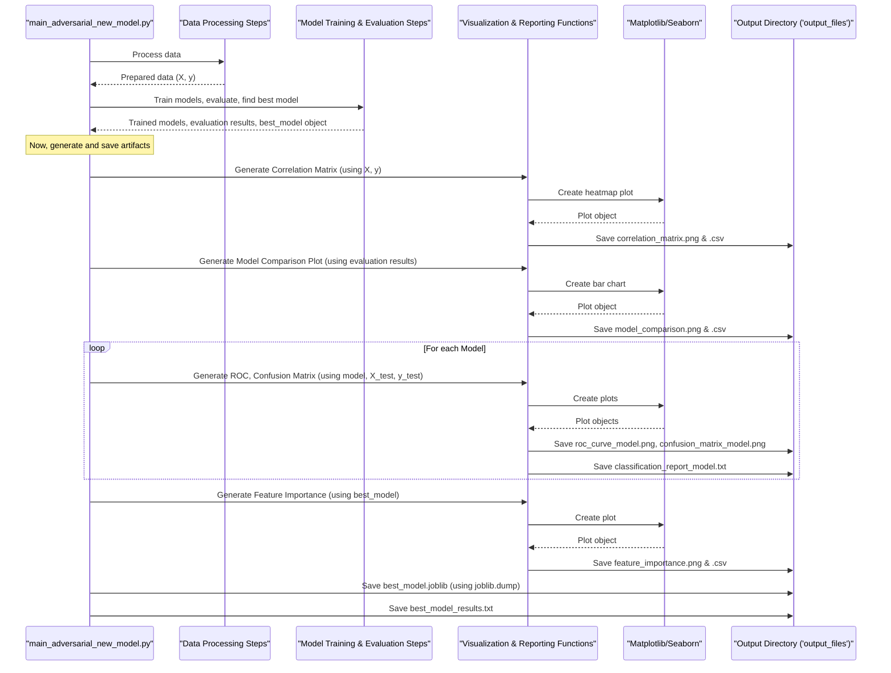

# Chapter 7: Results Visualization and Artifact Management

Welcome to the final chapter of our `five_model_adversarial` journey! In [Chapter 6: Comprehensive Model Evaluation and Comparison](06_comprehensive_model_evaluation_and_comparison_.md), we put our fine-tuned models to the test, evaluating their performance on unseen data and identifying our "champion" model. We've done a lot of complex work – data preparation, feature engineering, training, tuning, and evaluation. Now, what do we do with all these findings and our newly crowned best model?

Imagine you're a journalist who just finished a major investigation. You have notes, interview transcripts, data points, and a clear conclusion. Your final step is to compile a comprehensive report. This report needs:
*   **Visuals:** Charts and graphs to clearly show trends and comparisons.
*   **Detailed Summaries:** Textual reports explaining the findings.
*   **Key Evidence:** The most important pieces of information (like our best model) safely stored for future reference.

This is exactly what **Results Visualization and Artifact Management** is about in our project. We want to:
1.  Clearly visualize what our data looks like and how our models performed.
2.  Systematically save all important outputs – plots, models, and reports – so we can understand them, share them, and reuse them later.

This chapter will guide you through how `five_model_adversarial` acts like that good journalist, preparing a comprehensive "report package" in an `output_files` directory.

## Our Reporting Toolkit: What Gets Visualized and Saved?

After running our `main_adversarial_new_model.py` script, we don't just get a single answer. We get a collection of valuable insights and tools. Here are the key "pieces of our report":

1.  **Understanding Our Data's Landscape (Data Visualizations):**
    *   **Correlation Matrix Heatmap:** Shows how different features in our dataset relate to each other and to the 'Attack_Type'. Helps us spot potential relationships. (Saved as `correlation_matrix.png` and `correlation_matrix.csv`)
    *   **Feature Distribution Histograms:** For each feature, a plot showing the spread of its values. Helps us understand the nature of each input. (Saved as `feature_distribution_{col_name}.png`)

2.  **Showcasing Model Performance (Performance Visualizations):**
    *   **Model Comparison Bar Charts:** A bar chart showing the test accuracy and cross-validation scores of all five models side-by-side. Makes it easy to see who the top performers are. (Saved as `model_comparison.png` and data in `model_comparison_results.csv`)
    *   **ROC Curves (Individual Models):** For each of our five models, an ROC curve showing its ability to distinguish between 'normal' and 'adversarial' classes. (Saved as `roc_curve_{model_name}.png`)
    *   **ROC Curves (All Models Together):** A single plot overlaying the ROC curves of all models for a direct comparison of their distinguishing power. (Saved as `all_models_roc_curves.png`)
    *   **Confusion Matrices (Individual Models):** For each model, a matrix visualizing the types of correct and incorrect predictions it made on the test data (True Positives, False Positives, etc.). (Saved as `confusion_matrix_{model_name}.png`)

3.  **Digging Deeper (Model Insights):**
    *   **Feature Importance Plots (for the Best Model):** If our best model is one that can provide feature importances (like RandomForest, GradientBoosting or XGBoost), this plot shows which features the model found most influential in making its predictions. (Saved as `feature_importance.png`, `feature_importance.csv`, and `feature_importance_details.txt`)

4.  **Archiving Our Hard Work (Saving Artifacts):**
    *   **The Best Trained Model:** The "champion" model (the pipeline including the scaler and the optimized classifier) is saved as a file. This means we can load it later and use it to make predictions without retraining! (Saved as `best_model.joblib`)
    *   **Textual Reports (Individual Models):** For each model, a detailed classification report (showing precision, recall, F1-score for 'normal' and 'adversarial' classes) and its confusion matrix numbers are saved in a text file. (Saved as `classification_report_{model_name}.txt`)
    *   **Summary of the Best Model:** A text file summarizing the best model's name, its optimal hyperparameters, and its key performance scores. (Saved as `best_model_results.txt`)

All these files are neatly organized into a directory named `output_files`, which the script creates if it doesn't already exist.

## Creating Our Final "Report Package": How the Script Does It

Our main script, `main_adversarial_new_model.py`, has dedicated functions to generate these visualizations and save these files. You don't need to manually create them; the script does it for you!

Let's look at the general idea.

### 1. Setting Up the "Newsroom" (Output Directory)

Early in the script, it defines where all results will go:
```python
import os

# Define the output directory name
output_dir = 'output_files'

# Create the directory if it doesn't exist
if not os.path.exists(output_dir):
    os.makedirs(output_dir)

print(f"All outputs will be saved in: {output_dir}")
# Output:
# All outputs will be saved in: output_files
```
This ensures there's a dedicated folder ready to receive all our reports and visuals.

### 2. Generating and Saving Visuals (Plots)

Throughout the script, after certain calculations or evaluations are done, plotting functions are called. These functions typically use libraries like `matplotlib` and `seaborn` to create the visuals. The crucial last step in these functions is saving the plot.

**Example: Saving a Feature Importance Plot**
(Conceptual, the actual function `plot_feature_importance` is more detailed)
```python
import matplotlib.pyplot as plt
# Assume 'feature_names' and 'importances' are calculated
# model_name = "BestModel" # Example

# ... (code to create the bar chart for feature importances using plt) ...
# plt.title(f"Feature Importances for {model_name}")
# plt.bar(feature_names, importances)
# ... (other plot configurations) ...

# Save the plot to the output directory
# plot_filename = os.path.join(output_dir, f"feature_importance_{model_name}.png")
# plt.savefig(plot_filename)
# plt.close() # Close the plot to free up memory

# print(f"Saved plot: {plot_filename}")
# Output:
# Saved plot: output_files/feature_importance_BestModel.png
```
This pattern of `plt.savefig(filepath)` followed by `plt.close()` is common for all plot-generating functions in the script (like `plot_cv_comparison`, `plot_all_models_metrics`, `plot_all_models_roc`).

### 3. Saving the "Star Reporter" (The Best Model)

After all models are evaluated and the best one is identified, it's saved using `joblib`, a library good for saving Python objects, including trained scikit-learn models.
```python
import joblib
# Assume 'best_model_pipeline' is our best trained Sklearn pipeline object
# Assume 'output_dir' is defined

# model_filename = os.path.join(output_dir, 'best_model.joblib')
# joblib.dump(best_model_pipeline, model_filename)

# print(f"Saved best model to: {model_filename}")
# Output:
# Saved best model to: output_files/best_model.joblib
```
This allows us to load and reuse `best_model.joblib` in other scripts or at a later time.

### 4. Writing the "Articles" (Textual Reports)

Information like classification reports or comparison tables (which are often pandas DataFrames) are saved as text files or CSV files.

**Example: Saving a Classification Report**
(Conceptual, actual implementation is within functions like `plot_all_models_metrics`)
```python
# Assume 'report_text' contains the classification report for a model
# Assume 'model_name' and 'output_dir' are defined

# report_filename = os.path.join(output_dir, f"classification_report_{model_name}.txt")
# with open(report_filename, 'w') as f:
#     f.write(f"Classification Report for {model_name}\n\n")
#     f.write(report_text)

# print(f"Saved classification report: {report_filename}")
# Output:
# Saved classification report: output_files/classification_report_RandomForest.txt
```
Pandas DataFrames (like the `correlation_matrix` or `model_comparison_results`) are easily saved to CSV using `df.to_csv(filepath)`.

## Under the Hood: Organizing the "Evidence Locker"

The `main_adversarial_new_model.py` script works by first performing all the data processing, training, and evaluation steps. Then, often within helper functions, it generates the necessary data for plots or reports and immediately saves them to the `output_dir`.

Let's visualize this general flow:



In `main_adversarial_new_model.py`, you'll find specific functions responsible for these actions:
*   **Initial Data Plots (Correlation, Distributions):** These are generated early after data loading and initial preprocessing.
    ```python
    # File: main_adversarial_new_model.py (Simplified)
    # ... (load data, preprocess) ...
    # corr_matrix = X_with_target.corr()
    # corr_matrix.to_csv(os.path.join(output_dir, 'correlation_matrix.csv')) # Saving CSV
    # sns.heatmap(corr_matrix, ...)
    # plt.savefig(os.path.join(output_dir, 'correlation_matrix.png')) # Saving PNG
    # plt.close()
    ```

*   **Model Comparison Plots and Data (`plot_cv_comparison` function):** This function takes the results from all models, creates a pandas DataFrame, saves it to `model_comparison_results.csv`, and then uses `matplotlib` to generate `model_comparison.png`.
    ```python
    # File: main_adversarial_new_model.py (Inside plot_cv_comparison - conceptual)
    # def plot_cv_comparison(cv_results_dict, output_dir):
        # ... (process cv_results_dict into a DataFrame 'results_df') ...
        # results_df.to_csv(os.path.join(output_dir, 'model_comparison_results.csv'), index=False)
        # ... (plt.bar(...) to create the plot) ...
        # plt.savefig(os.path.join(output_dir, 'model_comparison.png'))
        # plt.close()
    ```

*   **Individual Model Metrics and Plots (`plot_all_models_metrics` function):** This function iterates through each trained model. For each one:
    *   It calculates the confusion matrix and uses `ConfusionMatrixDisplay(...).plot()` then `plt.savefig(...)` to save `confusion_matrix_{model_name}.png`.
    *   It calculates ROC curve data and uses `plt.plot(...)` then `plt.savefig(...)` to save `roc_curve_{model_name}.png`.
    *   It generates a `classification_report` string and writes it to `classification_report_{model_name}.txt`.

*   **Saving the Best Model and its Summary:**
    After identifying the `best_model_name` and its corresponding `GridSearchCV` object (`best_model_gs_object`):
    ```python
    # File: main_adversarial_new_model.py (Simplified snippet)
    # Retrieve the actual best pipeline (scaler + classifier)
    # best_pipeline = best_model_gs_object.best_estimator_ 
    # joblib.dump(best_pipeline, os.path.join(output_dir, 'best_model.joblib'))
    
    # Save text summary
    # with open(os.path.join(output_dir, 'best_model_results.txt'), 'w') as f:
    #    f.write(f"Best Model: {best_model_name}\n")
    #    # ... (write other details like params, scores) ...
    ```

*   **Feature Importance (`plot_feature_importance` function):**
    This function is called for the best model (if applicable). It extracts feature importances from the trained classifier, plots them, and saves `feature_importance.png`, `feature_importance.csv`, and a detailed text file.

By the time the script finishes, your `output_files` directory will be populated with a comprehensive set of results, ready for your review!

## Conclusion

And that's a wrap! Throughout this tutorial series, we've journeyed from raw data to a fully evaluated and optimized machine learning model. This final chapter on **Results Visualization and Artifact Management** showed you how `five_model_adversarial` ensures that all our hard work is well-documented and easily accessible. Like a meticulous journalist, the script:
*   Generates insightful visualizations (correlation matrices, feature distributions, model comparisons, ROC curves, feature importance plots).
*   Saves these visuals as image files.
*   Saves crucial textual information (classification reports, comparison tables, best model summaries).
*   Archives the best-performing trained model for future use.

All these outputs are neatly organized in the `output_files` directory, providing you with a complete "report package" of your analysis.

You've now seen the entire lifecycle of a machine learning project within `five_model_adversarial`, covering:
1.  [Data Ingestion and Preprocessing](01_data_ingestion_and_preprocessing_.md)
2.  [Feature Engineering](02_feature_engineering_.md)
3.  [Layer-Specific Analysis](03_layer_specific_analysis_.md)
4.  [Model Training Workflow](04_model_training_workflow_.md)
5.  [Hyperparameter Optimization (GridSearchCV)](05_hyperparameter_optimization__gridsearchcv_.md)
6.  [Comprehensive Model Evaluation and Comparison](06_comprehensive_model_evaluation_and_comparison_.md)
7.  And finally, Results Visualization and Artifact Management.

Thank you for following along! We hope this tutorial has given you a clear, beginner-friendly understanding of each stage in the `five_model_adversarial` project. Happy coding and exploring!

---

Generated by [AI Codebase Knowledge Builder](https://github.com/The-Pocket/Tutorial-Codebase-Knowledge)