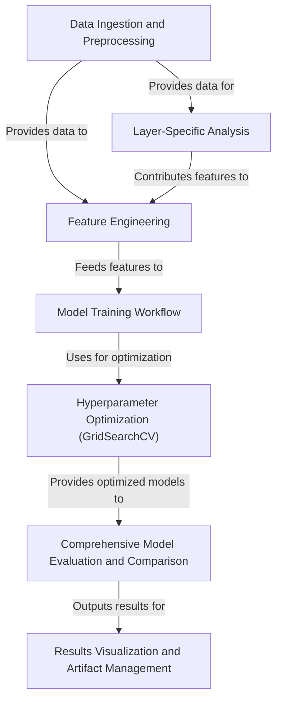

# Tutorial: five_model_adversarial

This project aims to **detect adversarial attacks** by analyzing data. It *loads and cleans* the input dataset, then *engineers new features*, including some specific to data 'layers' to enhance predictive power. Multiple *machine learning models are trained*, and their settings (hyperparameters) are *optimized using GridSearchCV*. These trained models are then *comprehensively evaluated and compared* based on various performance metrics. Finally, the project *visualizes these evaluation results* through plots and *saves the best-performing model*, along with detailed reports and generated artifacts.

**Source Repository:** [None](None)

## Chapters

1. [Data Ingestion and Preprocessing
](01_data_ingestion_and_preprocessing_.md)
2. [Feature Engineering
](02_feature_engineering_.md)
3. [Layer-Specific Analysis
](03_layer_specific_analysis_.md)
4. [Model Training Workflow
](04_model_training_workflow_.md)
5. [Hyperparameter Optimization (GridSearchCV)
](05_hyperparameter_optimization__gridsearchcv__.md)
6. [Comprehensive Model Evaluation and Comparison
](06_comprehensive_model_evaluation_and_comparison_.md)
7. [Results Visualization and Artifact Management
](07_results_visualization_and_artifact_management_.md)

---

Generated by [AI Codebase Knowledge Builder](https://github.com/The-Pocket/Tutorial-Codebase-Knowledge)