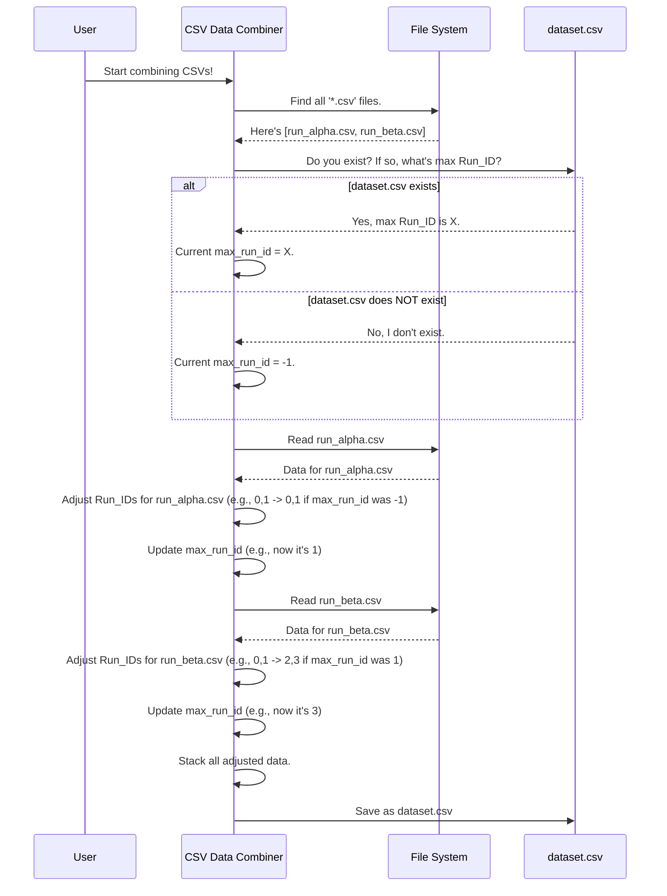

# Chapter 1: CSV Data Combiner

Welcome to the `fivemodel` project! If you're new to working with data for machine learning, you're in the right place. We'll start with a very common first step: getting all your data organized.

Imagine you've conducted several experiments, or maybe you've collected data in batches. Each time, you saved your findings in a separate digital spreadsheet called a CSV file. Now, you want to analyze all this information together. How do you do that without mixing everything up? That's where our first tool, the **CSV Data Combiner**, comes to the rescue!

Think of the CSV Data Combiner like a meticulous archivist. You hand them scattered historical records (your individual CSV files) from various sources. The archivist doesn't just staple them together. They carefully bind them into one comprehensive volume (a single `dataset.csv` file). And, most importantly, they assign unique folio numbers (a special `Run_ID`) to each original document section so you can always trace back where the information came from and ensure no two experiments are confused.

## What's a CSV File Anyway?

CSV stands for "Comma Separated Values." It's a very simple way to store table-like data in a plain text file. Each line in the file is a row of data, and each value in that row is separated by a comma.

For example, a file named `experiment1_data.csv` might look like this:
```
ID,Temperature,Result
1,25,0.5
2,30,0.8
```
Here, "ID", "Temperature", and "Result" are the column headers. The first row of data has an ID of 1, a Temperature of 25, and a Result of 0.5.

## The Challenge: Combining Data from Multiple Experiments

Let's say you have data from two experiments:

**`run_alpha.csv`:**
```csv
Run_ID,Measurement
0,10.5
0,10.7
1,12.1
```
This file represents "Run Alpha". It has two data points for its `Run_ID` 0, and one for its `Run_ID` 1.

**`run_beta.csv`:**
```csv
Run_ID,Measurement
0,9.8
0,9.9
1,11.5
```
This file represents "Run Beta". It *also* has `Run_ID`s starting from 0.

If we just copied and pasted these files together, we'd have a problem:
```csv
Run_ID,Measurement
0,10.5  -- From Run Alpha
0,10.7  -- From Run Alpha
1,12.1  -- From Run Alpha
0,9.8   -- From Run Beta (Oops! Same Run_ID as above!)
0,9.9   -- From Run Beta (Oops!)
1,11.5  -- From Run Beta (Oops!)
```
Now, if you see `Run_ID` 0, you don't know if it's from Run Alpha or Run Beta! This is where the CSV Data Combiner's cleverness with `Run_ID` comes in.

## How the CSV Data Combiner Solves This

The CSV Data Combiner is designed to:
1.  Find all the individual CSV files you want to combine.
2.  Read each file one by one.
3.  **Crucially, adjust the `Run_ID` in each file** so that `Run_ID`s from different original files don't clash. Each "run" or "experiment" from an original file will get a new, unique range of `Run_ID`s in the final combined file.
4.  Merge all this adjusted data into one big CSV file, usually named `dataset.csv`.

**Our Goal:** We want a single `dataset.csv` that looks something like this:
```csv
Run_ID,Measurement
0,10.5   -- Originally Run Alpha, Run_ID 0
0,10.7   -- Originally Run Alpha, Run_ID 0
1,12.1   -- Originally Run Alpha, Run_ID 1
2,9.8    -- Originally Run Beta, Run_ID 0 (now renumbered to 2)
2,9.9    -- Originally Run Beta, Run_ID 0 (now renumbered to 2)
3,11.5   -- Originally Run Beta, Run_ID 1 (now renumbered to 3)
```
See how `Run_ID`s from `run_beta.csv` (0 and 1) are now 2 and 3? This keeps them distinct from `run_alpha.csv`'s `Run_ID`s.

## A Peek Under the Hood: Step-by-Step

Let's imagine how the CSV Data Combiner works its magic.

1.  **List Taker**: First, it looks in your project folder for all the files ending with `.csv`.
2.  **ID Tracker**: It needs to keep track of the highest `Run_ID` it has used so far. Let's say it starts this counter at -1 if no combined `dataset.csv` exists yet. If `dataset.csv` *does* exist, it reads the existing `Run_ID`s and finds the current maximum to continue from there.
3.  **File by File**: It processes each CSV file:
    *   It opens a CSV file (e.g., `run_alpha.csv`).
    *   It looks at the `Run_ID` column. For each `Run_ID` in this file, it calculates a new `Run_ID` by adding the current "highest `Run_ID` used so far" plus 1.
        *   Example: If `max_run_id` is -1 (for the very first file):
            *   Original `Run_ID` 0  ->  `0 + (-1) + 1 = 0`
            *   Original `Run_ID` 1  ->  `1 + (-1) + 1 = 1`
        *   It updates its "highest `Run_ID` used so far" with the new maximum from this file (e.g., it's now 1).
    *   It keeps this adjusted data in memory.
4.  **Next File**: It opens the next CSV file (e.g., `run_beta.csv`).
    *   It calculates new `Run_ID`s again. Now, the "highest `Run_ID` used so far" is 1 (from processing `run_alpha.csv`).
        *   Original `Run_ID` 0  -> `0 + 1 + 1 = 2`
        *   Original `Run_ID` 1  -> `1 + 1 + 1 = 3`
    *   It updates its "highest `Run_ID` used so far" (now it's 3).
    *   It keeps this adjusted data in memory.
5.  **Combine & Save**: Once all files are processed, it takes all the adjusted data chunks from memory and stacks them on top of each other into one big table.
6.  **Final Output**: This big table is saved as `dataset.csv`.

Here's a simplified diagram of the process:



## Looking at the Code (Simplified)

The actual code for this might look a bit like programming magic, but let's break down the key parts. This is a Python script, a popular language for data science.

First, we need to tell Python about some tools we'll use:
```python
import pandas as pd # For working with tables of data (DataFrames)
import glob         # For finding files matching a pattern
import os           # For checking if files exist
```
*   `pandas` is a super helpful library for handling data in tables (which it calls "DataFrames").
*   `glob` helps us find files (like all `.csv` files).
*   `os` helps with operating system tasks, like checking if a file already exists.

Next, we decide the name for our final combined file:
```python
output_file = 'dataset.csv'
```
This means all the combined data will be saved in a file called `dataset.csv`.

We also need a place to temporarily store the data from each file after we've read and adjusted it:
```python
dataframes = [] # An empty list to hold our data tables
```

Now, the clever part about `Run_ID`. We check if `dataset.csv` already exists. If it does, we want to continue numbering `Run_ID`s from where it left off. If not, we start fresh.
```python
if os.path.exists(output_file):
    # If dataset.csv exists, read it
    combined_df = pd.read_csv(output_file)
    # Find the highest Run_ID in it
    max_run_id = combined_df['Run_ID'].max()
    # Add its data to our list (it's part of the final dataset)
    dataframes.append(combined_df)
else:
    # If dataset.csv doesn't exist, start Run_ID counting from -1
    max_run_id = -1
```
This `max_run_id` variable will help us make sure new `Run_ID`s are unique.

Then, we find all the CSV files in the current directory:
```python
# Find all files ending with .csv
csv_files = glob.glob('*.csv')
```
`glob.glob('*.csv')` returns a list of names of all files that end with `.csv`.

Now, we go through each found CSV file one by one:
```python
for file in csv_files:
    # Skip re-processing the output file if it was globbed
    if file == output_file and os.path.exists(output_file) and any(df.equals(pd.read_csv(output_file)) for df in dataframes):
        continue # Already loaded it

    df = pd.read_csv(file) # Read the current CSV file into a table (DataFrame)

    # This is the magic! Adjust the 'Run_ID'
    df['Run_ID'] = df['Run_ID'] + max_run_id + 1

    dataframes.append(df) # Add this adjusted table to our list

    # Update the overall maximum Run_ID encountered so far
    max_run_id = df['Run_ID'].max()
```
*   `for file in csv_files:`: This loop takes each filename from our list.
*   `df = pd.read_csv(file)`: `pandas` reads the CSV into a data table `df`.
*   `df['Run_ID'] = df['Run_ID'] + max_run_id + 1`: This is the core logic! It takes every value in the `Run_ID` column of the current file, adds the `max_run_id` we've seen so far from *previous* files, and adds 1. This ensures the `Run_ID`s from this file are higher than any from previous files.
*   `dataframes.append(df)`: The modified table `df` is added to our list.
*   `max_run_id = df['Run_ID'].max()`: We update `max_run_id` to be the highest `Run_ID` from the *current* file (after adjustment). This prepares us for the *next* file in the loop.

The small `if file == output_file ...` check is a safeguard. If `dataset.csv` already exists and `glob.glob('*.csv')` picks it up, we don't want to process it like a new input file, especially if we've already loaded its contents at the beginning.

Finally, after processing all files, we combine all the tables in our `dataframes` list into one big table:
```python
combined_df = pd.concat(dataframes, ignore_index=True)
```
*   `pd.concat(dataframes, ignore_index=True)` stacks all the individual (and `Run_ID`-adjusted) tables on top of each other. `ignore_index=True` makes sure the row numbers for the final big table are continuous (0, 1, 2, ...).

And save it to our `output_file`:
```python
combined_df.to_csv(output_file, index=False)
```
*   `index=False` means we don't want `pandas` to write its own extra row numbers into the CSV file, as we have our `Run_ID`.

And that's it! You now have a `dataset.csv` file with all your experimental data neatly combined, and each original experiment's data can still be uniquely identified using the adjusted `Run_ID`.

## What We've Learned

*   Data often comes in multiple CSV files.
*   To analyze it all together, we need to combine these files.
*   It's crucial to keep track of which data came from which original experiment or run. The `Run_ID` column helps with this.
*   The CSV Data Combiner intelligently merges files and adjusts `Run_ID`s to prevent clashes, creating a unified `dataset.csv`.

This combined dataset is the foundation for many exciting things you can do with `fivemodel`. Next, we'll see how to take this raw, combined data and start preparing it for machine learning.

Ready for the next step? Let's move on to the [Feature Engineering Engine](02_feature_engineering_engine_.md).

---

Generated by [AI Codebase Knowledge Builder](https://github.com/The-Pocket/Tutorial-Codebase-Knowledge)