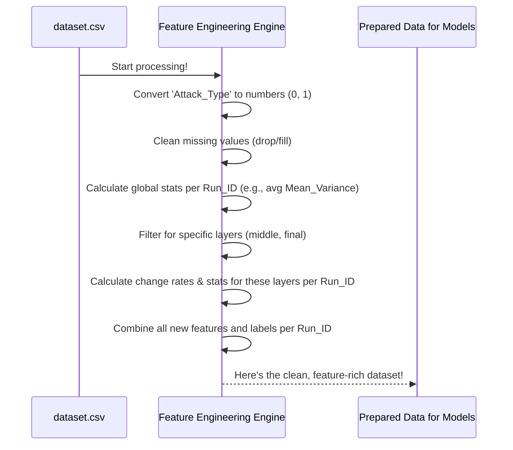

# Chapter 2: Feature Engineering Engine

Welcome back! In [Chapter 1: CSV Data Combiner](01_csv_data_combiner_.md), we learned how to gather all our scattered data into one neat file, `dataset.csv`, making sure each experimental run has a unique `Run_ID`. Now that we have all our raw ingredients in one place, it's time to prepare them for the main course: training our machine learning models.

Imagine you're a chef. You've received a box of groceries (our `dataset.csv`). You can't just throw everything into a pot and expect a delicious meal. You need to wash the vegetables, chop the onions, marinate the meat, and perhaps even create special sauces. This preparation phase is crucial, and in the world of machine learning, it's called **Feature Engineering**. Our **Feature Engineering Engine** is like our master chef, expertly transforming raw data into perfectly prepared components (features) that will make our models effective.

## What's the Big Deal with "Features"?

Machine learning models, at their core, learn patterns from numbers. They don't understand text like "normal" or "adversarial" directly, nor do they automatically know that the average temperature over a whole experiment is more important than a single temperature reading.

**Features** are the individual, measurable properties or characteristics of the data that a model uses to learn and make predictions. The Feature Engineering Engine's job is to:
1.  **Clean the data**: Handle any missing information.
2.  **Convert data**: Change text labels into numbers.
3.  **Create new, informative features**: Derive more meaningful information from the raw data. This is often the most important part!

Our goal is to take the data from `dataset.csv`, which might have many rows for each `Run_ID` (e.g., data for each `Round` or `Layer` within an experiment), and transform it into a new table where each `Run_ID` has *one row* containing a set of well-crafted features.

## Key Mincing and Dicing Operations

Let's look at the main tasks our Feature Engineering Engine performs, much like a chef's different preparation techniques:

### 1. Cleaning: Handling Missing Values

Sometimes, data can be incomplete. Maybe a sensor failed, or a value wasn't recorded. These are "missing values" (often represented as `NaN`, which means "Not a Number"). Models don't like `NaN`s!
*   **Filling**: We might fill missing numerical values with a default, like 0.
*   **Dropping**: If a crucial piece of information (like whether a run was 'normal' or 'adversarial') is missing for a particular run, we might decide to remove that run's data entirely.

```python
# Example: If 'Attack_Type' is missing for a run, drop that run
df = df.dropna(subset=['Attack_Type'])

# Example: Fill missing numbers in numeric columns with 0
numeric_cols = df.select_dtypes(include=[np.number]).columns
df[numeric_cols] = df[numeric_cols].fillna(0)
```
This code first removes rows where `Attack_Type` is missing. Then, for all columns that contain numbers, it fills any remaining missing values with 0.

### 2. Conversion: Turning Text into Numbers

Our `Attack_Type` column might have text like 'normal' or 'adversarial'. Models prefer numbers. So, we convert them:
*   'normal' might become `0`
*   'adversarial' might become `1`

```python
# Convert 'Attack_Type' text to numbers
df['Attack_Type'] = df['Attack_Type'].map({'normal': 0, 'adversarial': 1})
```
This tells Python to look in the `Attack_Type` column. If it sees 'normal', change it to 0; if 'adversarial', change it to 1.

### 3. Feature Derivation: Creating New, Informative Features

This is where the real "engineering" happens! We take existing raw data and create new columns (features) that summarize or highlight important aspects.

**a) Statistical Summaries per Run:**
For each `Run_ID`, we might want to know the overall behavior of certain metrics. For example, for `Mean_Variance` and `Number_of_outliers`, we can calculate:
*   Average (mean)
*   Standard deviation (std)
*   Minimum (min)
*   Maximum (max)
*   Median

```python
# Group data by 'Run_ID'
grouped = df.groupby('Run_ID')

# Calculate stats for 'Mean_Variance' and 'Number_of_outliers'
# for each Run_ID
agg_features = grouped.agg({
    'Mean_Variance': ['mean', 'std', 'min', 'max', 'median'],
    'Number_of_outliers': ['mean', 'std', 'min', 'max', 'median']
}).reset_index()

# Rename columns to be more descriptive, e.g., Mean_Variance_mean
agg_features.columns = ['Run_ID'] + \
                    ['_'.join(col).strip() for col in agg_features.columns.values[1:]]
```
This code first groups all rows by their `Run_ID`. Then, for each group (each unique `Run_ID`), it calculates the specified statistics for `Mean_Variance` and `Number_of_outliers`. The result is a new table where each `Run_ID` has one row with columns like `Mean_Variance_mean`, `Mean_Variance_std`, etc.

**b) Layer-Specific Information:**
In neural networks, different layers can provide different insights. Our engine can focus on specific layers (e.g., "middle" and "final" layers) and calculate statistics for them.
It also looks at how many unique layers were involved in each `Run_ID`.

```python
# Count unique layers per Run_ID
layer_counts = grouped['Layer'].nunique().reset_index()
layer_counts = layer_counts.rename(columns={'Layer': 'Num_Layers'})
```
This creates a feature `Num_Layers` for each `Run_ID`.

**c) Calculating Change Rates:**
Sometimes, how a metric *changes* over time (or `Round` in our case) is more informative than its absolute value. For instance, the rate of change of `Mean_Variance` within specific layers (`middle_layers_df`, `final_layers_df`) can be a powerful feature.

```python
# Simplified: Calculate change rate of 'Mean_Variance'
def calculate_change_rate(group):
    # Sort by 'Round' to ensure correct change calculation
    group = group.sort_values('Round')
    # Calculate percentage change from one round to the next
    group['Metric_Change_Rate'] = group['Mean_Variance'].pct_change()
    return group

# Apply this to data grouped by Run_ID (and filtered for specific layers)
# df_specific_layer = df_specific_layer.groupby('Run_ID').apply(calculate_change_rate)
```
*Note: The actual code involves applying this to data already filtered for specific layers, e.g., `middle_layers_df` or `final_layers_df`.*
This function, when applied to data grouped by `Run_ID`, calculates how `Mean_Variance` changes from one `Round` to the next within that run. We then typically aggregate these change rates (e.g., mean change rate, std of change rate) per `Run_ID`.

**d) Bringing It All Together:**
After creating all these new features from different perspectives (overall stats, layer stats, change rates), the engine merges them into one comprehensive table, using `Run_ID` as the key to join everything.

Imagine we have:
*   `run_summary_stats`: One row per `Run_ID` with stats like `Mean_Variance_mean`.
*   `middle_layer_stats`: One row per `Run_ID` with stats for middle layers.
*   `final_layer_stats`: One row per `Run_ID` with stats for final layers.
*   `attack_labels`: One row per `Run_ID` with the numeric `Attack_Type`.

```python
# Merge overall features with attack labels
data = pd.merge(run_summary_stats, attack_labels, on='Run_ID')
# Merge with middle layer features
data = pd.merge(data, middle_layer_stats, on='Run_ID', how='left')
# Merge with final layer features
data = pd.merge(data, final_layer_stats, on='Run_ID', how='left')

# The 'how=left' part ensures we keep all runs from our main 'data' table
# and add layer features if they exist, filling with NaN if not (which we'd then clean).
```
This creates our final dataset for modeling, where each row is an `Run_ID` and columns are the engineered features and the target label.

## A Peek Under the Hood: What Happens

Let's trace the journey of our data through the Feature Engineering Engine.

1.  **Load & Initial Prep**: The engine starts with the `dataset.csv` from the [CSV Data Combiner](01_csv_data_combiner_.md).
2.  **Label Encoding**: It first converts the `Attack_Type` column (e.g., 'normal', 'adversarial') into numerical labels (e.g., 0, 1).
3.  **Handle Missing Labels**: It checks if any `Attack_Type` labels are missing after conversion. If so, those rows (entire runs) are usually dropped because the label is crucial.
4.  **Handle Missing Numeric Data**: Other numeric columns with missing values are typically filled (e.g., with 0).
5.  **Layer-Specific Processing**:
    *   It identifies data related to specific neural network layers (e.g., 'middle layers' like `layer.3`, 'final layers' like `layer.5`).
    *   For these layer-specific subsets, it calculates `Mean_Variance_Change_Rate` for each `Run_ID` and `Round`.
    *   Then, it aggregates these change rates (mean, std, etc.) and raw `Mean_Variance` stats (mean, std, etc.) per `Run_ID` for each layer type (middle, final).
6.  **Global Feature Aggregation**:
    *   It groups the entire dataset by `Run_ID`.
    *   It calculates aggregate statistics (mean, std, min, max, median) for columns like `Mean_Variance` and `Number_of_outliers`.
    *   It counts the number of unique `Layer` values (`Num_Layers`) for each `Run_ID`.
7.  **Combine Features**: All these newly created features (global aggregates, middle layer aggregates, final layer aggregates) are merged into a single master table. Each `Run_ID` now has one row representing it, with many feature columns.
8.  **Add Labels**: The numerically encoded `Attack_Type` for each `Run_ID` is added to this master table.
9.  **Final Cleanup**: Any remaining missing values in the feature set (e.g., if a `Run_ID` didn't have data for a specific layer, its change rate features might be NaN) are filled, typically with 0.

Here's a simplified diagram:



## Looking at the Code (Simplified Snippets)

The actual scripts (`main_adversarial_new_model.py` or `main_random_five_model.py`) do all this. Let's see simplified parts:

**1. Loading data and initial cleaning/conversion:**
```python
# (from five_model_adversarial/main_adversarial_new_model.py)
# Load the combined dataset
df = pd.read_csv('dataset.csv', low_memory=False)

# Convert 'Attack_Type' to numbers
df['Attack_Type'] = df['Attack_Type'].map({'normal': 0, 'adversarial': 1})

# Drop rows where 'Attack_Type' couldn't be mapped (is missing)
df = df.dropna(subset=['Attack_Type'])

# Fill missing numeric values with 0
numeric_cols = df.select_dtypes(include=[np.number]).columns.tolist()
df[numeric_cols] = df[numeric_cols].fillna(0)
```
This reads our `dataset.csv`, converts attack types, and handles initial missing values.

**2. Calculating overall aggregate features:**
```python
# (from five_model_adversarial/main_adversarial_new_model.py)
# Group by Run_ID
grouped = df.groupby('Run_ID')

# Calculate overall statistics
features = grouped.agg({
    'Mean_Variance': ['mean', 'std', 'min', 'max', 'median'],
    'Number_of_outliers': ['mean', 'std', 'min', 'max', 'median'],
    'Layer': 'nunique' # Count unique layers
}).reset_index()

# Clean up column names
features.columns = ['Run_ID'] + ['_'.join(col).strip('_') for col in features.columns.values[1:]]
features = features.rename(columns={'Layer_nunique': 'Num_Layers'})
```
This part calculates statistics like the average `Mean_Variance` for each `Run_ID` across all its records.

**3. Calculating layer-specific features (e.g., for middle layers):**
```python
# (from five_model_adversarial/main_adversarial_new_model.py)
# Define keywords for middle layers
middle_layer_keywords = ['layer.3']
# Filter data for middle layers
middle_layers_df = df[df['Layer'].str.contains('|'.join(middle_layer_keywords), na=False)]

# Function to calculate change rate (simplified)
def calculate_change_rate(group):
    group = group.sort_values('Round')
    group['Mean_Variance_Change_Rate'] = group['Mean_Variance'].pct_change().fillna(0) # Fill NaN for 1st val
    return group

# Apply change rate calculation (actual code is slightly different for applying)
# This concept is applied within a groupby context for each Run_ID in practice
# middle_layers_df = middle_layers_df.groupby(['Run_ID']).apply(calculate_change_rate) # Conceptual

# Then aggregate for middle layers
middle_features = middle_layers_df.groupby('Run_ID').agg({
    'Mean_Variance': ['mean', 'std'], # Add other stats as needed
    'Mean_Variance_Change_Rate': ['mean', 'std'] # Add other stats
}).reset_index()
middle_features.columns = ['Run_ID'] + ['Middle_' + '_'.join(col).strip('_') \
                                        for col in middle_features.columns.values[1:]]
```
This isolates data for specific layers, computes change rates, and then aggregates statistics for those layers per `Run_ID`. Similar steps are done for `final_layers_df`.

**4. Merging all features and labels:**
```python
# (from five_model_adversarial/main_adversarial_new_model.py)
# Get the attack type for each Run_ID
attack_type_labels = grouped['Attack_Type'].first().reset_index()

# Merge overall features with labels
data = pd.merge(features, attack_type_labels, on='Run_ID')
# Merge with middle layer features
data = pd.merge(data, middle_features, on='Run_ID', how='left')
# Merge with final layer features (assuming final_features is created similarly)
data = pd.merge(data, final_features, on='Run_ID', how='left')

# Fill any NaNs that resulted from merges (e.g., a Run_ID had no middle layer data)
data = data.fillna(0)
```
Finally, all the individually crafted feature sets are combined with the labels to produce the `data` DataFrame that will be fed to the models. The `how='left'` in `pd.merge` is important: it keeps all `Run_ID`s from the left table and adds data from the right table if a match is found. If not, it puts `NaN`, which we then fill with `0`.

## What We've Learned

*   Raw data from [Chapter 1: CSV Data Combiner](01_csv_data_combiner_.md) needs preparation before machine learning.
*   The **Feature Engineering Engine** cleans data, converts types, and, most importantly, derives new, meaningful features.
*   This involves calculating statistics (mean, std, etc.) for various metrics, often grouped by `Run_ID` and specific layer information.
*   It also calculates things like change rates to capture dynamic behavior.
*   The goal is to create a table where each `Run_ID` has one row of rich features.
*   This prepared data is like a well-prepped set of ingredients, ready for our machine learning models to "cook" with.

This feature-rich dataset is now ready to be used to train our machine learning models. Are you ready to see how that's done?

Let's move on to the [Machine Learning Model Training Pipeline](03_machine_learning_model_training_pipeline_.md).

---

Generated by [AI Codebase Knowledge Builder](https://github.com/The-Pocket/Tutorial-Codebase-Knowledge)