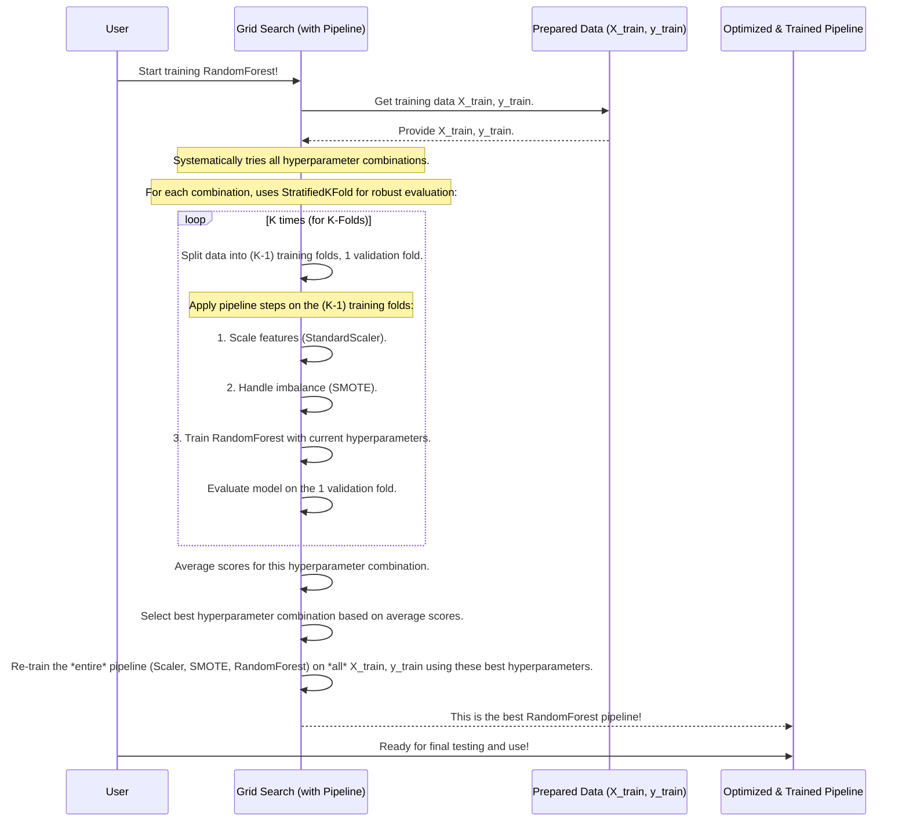

# Chapter 3: Machine Learning Model Training Pipeline

Welcome to Chapter 3! In [Chapter 2: Feature Engineering Engine](02_feature_engineering_engine_.md), we meticulously prepared our data, much like a chef preps ingredients. We transformed raw information from `dataset.csv` into a set of clean, informative features, ready for our machine learning models. Now, it's time for the main event: actually "cooking" or training these models!

Imagine you want to teach a computer to distinguish between a 'normal' system operation and an 'adversarial' one, based on the features we created. You could try different teaching methods (algorithms) and different settings for each method. How do you do this systematically and find the best approach? This is where our **Machine Learning Model Training Pipeline** comes in.

Think of this pipeline as a sophisticated, automated assembly line for building and testing different types of "prediction machines" (our machine learning models). Its job is to take our prepared data and:
1.  Train various types of models (like RandomForest, Logistic Regression, SVM, Gradient Boosting, and XGBoost).
2.  Fine-tune each model to find its best possible settings.
3.  Test each model thoroughly to ensure it's reliable.
The goal is to find the model that performs best for our specific task.

## What's on This "Assembly Line"? Key Steps in the Pipeline

Our model training pipeline follows a standardized set of procedures for every algorithm it builds and tests. This ensures fairness and consistency. Here are the main stations on our assembly line:

### 1. Standardizing Parts: Feature Scaling with `StandardScaler`

*   **Why?** Machine learning algorithms, especially ones that measure distances or gradients (like SVM or Logistic Regression), can be sensitive to the scale of input features. If one feature ranges from 0 to 1, and another from 0 to 1000, the algorithm might unfairly give more importance to the latter.
*   **What it does:** `StandardScaler` transforms our features so they all have a similar range (specifically, a mean of 0 and a standard deviation of 1).
*   **Analogy:** Imagine building a car. If some bolts are measured in inches and others in centimeters, assembly would be a nightmare! Scaling ensures all "parts" (features) use a common measurement system.

### 2. Balancing the Production: Handling Class Imbalance with `SMOTE`

*   **Why?** Sometimes, one type of data is much rarer. For example, 'adversarial' (attack) events might be far less common than 'normal' events in our `dataset.csv`. If we train a model on such imbalanced data, it might become very good at predicting the common class but terrible at spotting the rare (but often more important) one. It might just learn to always guess "normal" and still get a high accuracy.
*   **What it does:** `SMOTE` (Synthetic Minority Over-sampling Technique) is a clever way to address this. It creates new, synthetic examples of the rare class by looking at existing rare samples and generating similar ones. It doesn't just duplicate data; it creates believable new variations.
*   **Analogy:** If our assembly line is building cars and we only have a few rare, special red spoilers but many blue ones, SMOTE is like a specialized workshop that carefully crafts more red spoilers based on the design of the existing ones, ensuring we can build enough red-spoilered cars for testing.

### 3. Customization Station: Hyperparameter Tuning with `GridSearchCV`

*   **Why?** Each machine learning algorithm has its own set of "dials" or "settings" called hyperparameters. For example, a RandomForest model has hyperparameters like the number of trees to build or how deep each tree can be. The optimal values for these hyperparameters depend on the data and can significantly impact performance.
*   **What it does:** `GridSearchCV` (Grid Search Cross-Validation) automates the process of finding the best hyperparameter settings. You define a "grid" of possible values for each hyperparameter, and `GridSearchCV` systematically tries out all combinations.
*   **Analogy:** Think of customizing a car. `GridSearchCV` is like trying out every combination of engine type (e.g., V6, V8), tire size (e.g., 17-inch, 18-inch), and paint color (e.g., red, blue, black) to find the combination that results in the fastest, most fuel-efficient, and best-looking car according to some criteria.

### 4. Rigorous Quality Control: Cross-Validation with `StratifiedKFold`

*   **Why?** We need to be sure our model will perform well on new, unseen data, not just the data it was trained on. If we only test it on the training data, it might seem perfect but fail miserably in the real world (this is called overfitting).
*   **What it does:** Cross-validation is a technique to get a more reliable estimate of model performance. `StratifiedKFold` is a specific type of cross-validation. It splits the training data into several "folds" (e.g., 5 folds). The model is then trained on 4 folds and tested on the 1 remaining fold. This process is repeated 5 times, with each fold used as the test set once. "Stratified" means it ensures that each fold has roughly the same proportion of 'normal' and 'adversarial' samples as the original dataset, which is important for imbalanced datasets.
*   **Analogy:** Instead of just test-driving a car on a smooth factory floor, `StratifiedKFold` is like taking it for multiple test drives on different types of roads (city, highway, bumpy roads) and in different weather conditions. This gives a much better idea of its true all-around performance and robustness.

By combining these steps, the pipeline trains different algorithms (like RandomForest, Logistic Regression, SVM, Gradient Boosting, XGBoost) efficiently, trying to find the best configuration for each.

## Using the Pipeline: A Quick Tour

Let's say we have our prepared feature data (`X`) and the corresponding labels (`y` - e.g., 0 for 'normal', 1 for 'adversarial') from [Chapter 2: Feature Engineering Engine](02_feature_engineering_engine_.md). We want to train a RandomForest model.

Here's how the pipeline comes into play:

1.  **Load Data**: We start with our features (`X_train`) and labels (`y_train`).
2.  **Define Pipeline Steps**: We tell the pipeline what to do:
    *   Scale the features.
    *   Use SMOTE to balance the classes.
    *   Use the RandomForest algorithm.
3.  **Specify Hyperparameter Grid**: We give `GridSearchCV` a list of RandomForest settings to try (e.g., different numbers of trees).
4.  **Set Up Cross-Validation**: We tell `GridSearchCV` to use `StratifiedKFold`.
5.  **Train!**: `GridSearchCV` takes over, managing the pipeline, trying all hyperparameter combinations, and using cross-validation to evaluate each.
6.  **Get the Best Model**: After the search, `GridSearchCV` gives us the pipeline with the best-performing hyperparameter settings.

The output is not just any trained model, but the *best version* of that model type (e.g., RandomForest) that the pipeline could find, along with its optimal settings.

## A Peek Under the Hood: How It Works

Let's diagram the workflow for training a single type of algorithm (like RandomForest) using our pipeline with `GridSearchCV`.



This process is then repeated for other algorithms (Logistic Regression, SVM, etc.) if we want to compare them.

## Code Examples: Building and Running the Pipeline

Let's look at simplified Python code snippets that show how you'd set this up using libraries like `scikit-learn` and `imbalanced-learn`.

First, we need to import the tools:
```python
# For data handling
import pandas as pd
import numpy as np

# Pipeline tools
from imblearn.pipeline import Pipeline as ImbPipeline # Special pipeline for SMOTE
from sklearn.preprocessing import StandardScaler
from imblearn.over_sampling import SMOTE # For handling imbalance

# Model and tuning tools
from sklearn.ensemble import RandomForestClassifier # Our example algorithm
from sklearn.model_selection import GridSearchCV, StratifiedKFold
```
*   `ImbPipeline` is from `imbalanced-learn` and works well with samplers like `SMOTE`.
*   `StandardScaler` scales features.
*   `SMOTE` handles class imbalance.
*   `RandomForestClassifier` is the algorithm we're training.
*   `GridSearchCV` finds the best settings.
*   `StratifiedKFold` ensures fair testing during tuning.

Let's assume you have your training features `X_train` and labels `y_train` ready.

Next, we define the algorithm we want to try, for instance, `RandomForestClassifier`:
```python
# Choose the basic algorithm
# We'll tune its settings later using GridSearchCV
model_algorithm = RandomForestClassifier(random_state=42)
```
`random_state=42` helps ensure that if you run the code again, you get the same "random" results, making experiments repeatable.

Now, we construct the pipeline. This pipeline defines the sequence of operations.
```python
# Build the full training pipeline
pipeline = ImbPipeline([
    ('scaler', StandardScaler()), # First, scale the data
    ('smote', SMOTE(random_state=42)), # Then, balance classes with SMOTE
    ('classifier', model_algorithm) # Finally, train the classifier
])
```
This tells `GridSearchCV` to first apply `StandardScaler`, then `SMOTE`, and then train the `classifier` (our RandomForest) on the processed data for each step of the tuning process.

Next, we define the "grid" of hyperparameters for `GridSearchCV` to search through. The names for parameters must match how they're accessed in the pipeline (e.g., `classifier__n_estimators` refers to the `n_estimators` parameter of the step named `classifier`).
```python
# Define parameters for RandomForest to try
# 'classifier__' prefix refers to the 'classifier' step in the pipeline
param_grid = {
    'classifier__n_estimators': [50, 100], # Try 50 or 100 decision trees
    'classifier__max_depth': [10, 20]      # Try tree depth of 10 or 20
}
```
This is a small grid for simplicity. In practice, you might try more values.

We set up our cross-validation strategy:
```python
# Define the cross-validation strategy
# Use 3 folds for quicker example, 5 or 10 is common
cv_strategy = StratifiedKFold(n_splits=3, shuffle=True, random_state=42)
```

Now, we put it all together in `GridSearchCV`:
```python
# Set up GridSearchCV
grid_search = GridSearchCV(
    estimator=pipeline,       # The pipeline to tune
    param_grid=param_grid,    # The hyperparameters to search
    cv=cv_strategy,           # The cross-validation method
    scoring='accuracy',       # Judge combinations based on accuracy
    n_jobs=-1                 # Use all available CPU cores to speed up
)
```
`n_jobs=-1` is a handy trick to make the search faster if your computer has multiple processor cores.

Finally, we train it on our training data:
```python
# Start the training and tuning process!
grid_search.fit(X_train, y_train)
```
This command can take some time, as `GridSearchCV` is trying many combinations and doing cross-validation for each.

After `fit` is complete, we can get the best pipeline found:
```python
# Get the best model (pipeline with best settings)
best_model_pipeline = grid_search.best_estimator_

# See what the best settings were
print(f"Best settings found: {grid_search.best_params_}")
# Example output: Best settings found: {'classifier__max_depth': 20, 'classifier__n_estimators': 100}
```
`best_model_pipeline` is now a fully configured pipeline (scaler, SMOTE, and RandomForest with optimal hyperparameters) trained on the entire `X_train` and `y_train`. This is the "winner" from our assembly line for the RandomForest "car model".

This entire process (defining a pipeline, a parameter grid, and running `GridSearchCV`) would be repeated for other algorithms like Logistic Regression, SVM, etc., by changing `model_algorithm` and `param_grid` accordingly. The `fivemodel` project automates trying these multiple algorithms.

## What We've Learned

*   A **Machine Learning Model Training Pipeline** is an automated workflow for training, tuning, and validating models.
*   It's like a high-tech assembly line ensuring quality and finding the best "build" for each algorithm.
*   Key steps include:
    *   **Feature Scaling** (`StandardScaler`) for consistent feature ranges.
    *   **Class Imbalance Handling** (`SMOTE`) for fair representation of rare classes.
    *   **Hyperparameter Tuning** (`GridSearchCV`) to find optimal model settings.
    *   **Cross-Validation** (`StratifiedKFold`) for robust performance evaluation.
*   The `fivemodel` project uses this pipeline approach to train various classifiers (RandomForest, Logistic Regression, SVM, Gradient Boosting, XGBoost) and identify promising candidates.
*   We can use tools like `ImbPipeline` from `imbalanced-learn` along with `scikit-learn` to build these powerful pipelines.

We now have a well-trained model (or potentially several, if we ran the pipeline for multiple algorithms). But how good is it really? How do we measure its performance in detail and report our findings? That's what we'll cover next.

Ready to evaluate? Let's proceed to [Chapter 4: Model Performance Evaluator & Reporter](04_model_performance_evaluator___reporter_.md).

---

Generated by [AI Codebase Knowledge Builder](https://github.com/The-Pocket/Tutorial-Codebase-Knowledge)