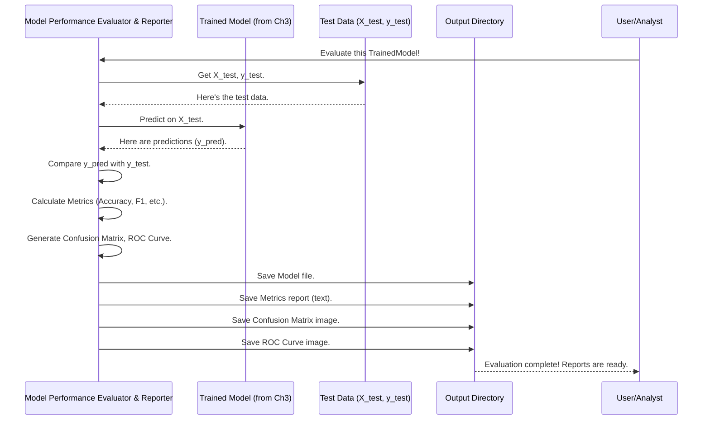

# Chapter 4: Model Performance Evaluator & Reporter

Welcome to Chapter 4! In [Chapter 3: Machine Learning Model Training Pipeline](03_machine_learning_model_training_pipeline_.md), we worked like master chefs in a high-tech kitchen, training and tuning various machine learning models. We ended up with a finely tuned `best_model_pipeline`, which is our best attempt at a "prediction machine."

But how good is this machine, really? If it's a car, we need to take it for a test drive, check its speed, fuel efficiency, safety features, and get a detailed inspection report. That's exactly what our **Model Performance Evaluator & Reporter** does for our trained models.

Imagine a meticulous vehicle inspector. After a car is assembled (our model is trained), the inspector performs comprehensive tests, checks every nut and bolt, and then writes up a detailed report with charts, numbers, and even photos. Our Model Performance Evaluator & Reporter is this diligent inspector for our machine learning models. It thoroughly assesses how well our model predicts 'normal' vs. 'adversarial' system behavior and presents the findings in an understandable way.

## Why Do We Need to Evaluate and Report?

Let's say our `best_model_pipeline` from the previous chapter looks at some system data and predicts "This is an attack!" How often is it right? When it misses an attack, why did it miss? Are there certain situations where it gets confused?

Simply training a model isn't enough. We need to:
1.  **Quantify its performance**: Use numbers (metrics) to understand how good it is.
2.  **Understand its mistakes**: See where it goes wrong.
3.  **Visualize its behavior**: Use charts and plots for a clear picture.
4.  **Keep records**: Save the model and its performance report for future reference or comparison.

This helps us trust our model, improve it, or decide if we need a different approach.

## Key Inspection Checks: Performance Metrics

The Evaluator & Reporter calculates several standard scores to tell us about the model's performance. Let's use our example of detecting 'adversarial' (attack) vs. 'normal' behavior.

*   **Accuracy**: This is like asking, "Overall, what percentage of predictions did the model get right?" If it made 100 predictions and 95 were correct, the accuracy is 95%.
    ```
    Accuracy = (Number of Correct Predictions) / (Total Number of Predictions)
    ```
    While simple, accuracy alone might not tell the whole story, especially if attacks are rare.

*   **Confusion Matrix**: This is a special table that shows us the types of correct and incorrect predictions.
    *   **True Positive (TP)**: The model correctly predicted "attack," and it *was* an attack. (Good!)
    *   **True Negative (TN)**: The model correctly predicted "normal," and it *was* normal. (Good!)
    *   **False Positive (FP)**: The model incorrectly predicted "attack," but it was actually normal. (A false alarm!)
    *   **False Negative (FN)**: The model incorrectly predicted "normal," but it was actually an attack. (A missed attack - usually bad!)

    Here's what a confusion matrix might look like:

    |                   | Predicted: Normal | Predicted: Attack |
    | :---------------- | :---------------: | :---------------: |
    | **Actual: Normal** |        TN         |        FP         |
    | **Actual: Attack** |        FN         |        TP         |

*   **Precision**: When the model predicts "attack," how often is it correct?
    ```
    Precision = TP / (TP + FP)
    ```
    High precision means fewer false alarms. If you're building a system that sends out alerts, you want high precision so you don't bother people unnecessarily.

*   **Recall (or Sensitivity)**: Of all the actual attacks that happened, how many did the model successfully detect?
    ```
    Recall = TP / (TP + FN)
    ```
    High recall means fewer missed attacks. If missing an attack is very costly or dangerous, you want high recall.

*   **F1-Score**: This is a single number that tries to balance Precision and Recall. It's useful if you care about both minimizing false alarms and minimizing missed detections.
    ```
    F1-Score = 2 * (Precision * Recall) / (Precision + Recall)
    ```
    A score of 1 is perfect, 0 is worst.

*   **ROC AUC Score (Area Under the ROC Curve)**: This metric tells us how well the model can distinguish between the 'normal' and 'adversarial' classes. An AUC of 1.0 means the model is a perfect separator. An AUC of 0.5 means the model is no better than random guessing. Generally, the higher the AUC, the better.

## Visual Aids: Seeing is Believing

Numbers are great, but pictures often tell a clearer story. The Evaluator & Reporter generates several plots:

*   **Confusion Matrix Plot**: A color-coded visual version of the confusion matrix table, making it easy to see where the model is getting confused.
*   **ROC Curve (Receiver Operating Characteristic Curve)**: This graph shows the trade-off between correctly identifying attacks (True Positive Rate, which is Recall) and incorrectly flagging normal instances as attacks (False Positive Rate). A good model will have a curve that bows towards the top-left corner.
*   **Correlation Matrix**: (Generated as part of data understanding before training) This heatmap shows how different features (like `Mean_Variance_mean`, `Number_of_outliers_std`) relate to each other and to the target (`Attack_Type`). It helps understand the data the model learned from.
*   **Feature Distribution Plots**: (Also generated before training) These histograms show the spread of values for each feature. They give context to the data's characteristics.

## The Evaluation and Reporting Process

So, how does this "inspection" happen?

1.  **Take the Trained Model**: We use the `best_model_pipeline` that we trained in [Chapter 3: Machine Learning Model Training Pipeline](03_machine_learning_model_training_pipeline_.md).
2.  **Use Unseen Test Data**: We evaluate the model on data it has *never seen before* (`X_test`, `y_test`). This is like test-driving the car on a brand new road.
3.  **Make Predictions**: The model predicts whether each instance in `X_test` is 'normal' or 'adversarial'.
4.  **Compare and Calculate**: The system compares these predictions to the true labels (`y_test`) and calculates all the metrics (Accuracy, Precision, Recall, F1-Score, ROC AUC).
5.  **Generate Visuals**: It creates the Confusion Matrix plot and ROC Curve.
6.  **Save Everything**: All this valuable information – the metrics, the plots, and even the trained model itself – is saved into an `output_files` directory. This way, we have a complete record.

Here's a simplified flow:



## A Look at the Code (Simplified Snippets)

The `fivemodel` scripts (`main_adversarial_new_model.py` or `main_random_five_model.py`) have functions like `plot_and_save_metrics` that handle much of this. Let's see the core ideas.

Assume we have our `best_model` (the trained pipeline), `X_test` (test features), and `y_test` (true test labels).

**1. Making Predictions:**
First, the model makes predictions on the test data.
```python
# best_model is our trained pipeline from GridSearchCV
y_pred = best_model.predict(X_test) # Predict labels (0 or 1)
y_prob = best_model.predict_proba(X_test)[:, 1] # Predict probability of being class '1' (attack)
```
*   `y_pred` will contain the model's guess (0 for 'normal', 1 for 'adversarial') for each sample in `X_test`.
*   `y_prob` contains the probability that each sample is an 'attack'. This is useful for the ROC curve.

**2. Calculating Basic Metrics:**
We can then calculate metrics using `sklearn.metrics`.
```python
from sklearn.metrics import accuracy_score, classification_report, roc_auc_score

accuracy = accuracy_score(y_test, y_pred)
print(f"Accuracy: {accuracy:.3f}")

# Get a detailed report with precision, recall, F1-score
report = classification_report(y_test, y_pred)
print(report)

roc_auc = roc_auc_score(y_test, y_prob)
print(f"ROC AUC Score: {roc_auc:.3f}")
```
*   `accuracy_score` compares true labels (`y_test`) with predicted labels (`y_pred`).
*   `classification_report` gives a nice text summary of precision, recall, and F1-score for each class.
*   `roc_auc_score` uses the true labels and the predicted probabilities for the positive class.

**3. Generating and Saving a Confusion Matrix Plot:**
```python
import matplotlib.pyplot as plt
from sklearn.metrics import confusion_matrix, ConfusionMatrixDisplay

cm = confusion_matrix(y_test, y_pred)
disp = ConfusionMatrixDisplay(confusion_matrix=cm)
disp.plot(cmap='Blues') # Show the plot
plt.title('Confusion Matrix')
# In the actual script, this is saved to a file:
# plt.savefig(os.path.join(output_dir, 'confusion_matrix_MODELNAME.png'))
plt.show() # For displaying in a notebook/script
plt.close() # Close the plot to free memory
```
This code calculates the confusion matrix and then uses `ConfusionMatrixDisplay` to create a visual plot. `plt.savefig` would be used to save it to a file in the `output_dir`.

**4. Generating and Saving an ROC Curve Plot:**
```python
from sklearn.metrics import roc_curve, auc

fpr, tpr, _ = roc_curve(y_test, y_prob) # False Positive Rate, True Positive Rate
roc_auc_value = auc(fpr, tpr)

plt.figure()
plt.plot(fpr, tpr, label=f'ROC curve (AUC = {roc_auc_value:.2f})')
plt.plot([0, 1], [0, 1], 'k--') # Dashed diagonal line (random guessing)
plt.xlabel('False Positive Rate')
plt.ylabel('True Positive Rate')
plt.title('Receiver Operating Characteristic (ROC) Curve')
plt.legend(loc="lower right")
# In the actual script, this is saved:
# plt.savefig(os.path.join(output_dir, 'roc_curve_MODELNAME.png'))
plt.show()
plt.close()
```
This calculates the points for the ROC curve (`fpr`, `tpr`) and the area under it (`roc_auc_value`). It then plots the curve.

**5. Saving the Trained Model:**
It's crucial to save the trained model itself if we want to use it later without retraining.
```python
import joblib
import os

output_dir = 'output_files' # Make sure this directory exists
# os.makedirs(output_dir, exist_ok=True) # Create it if it doesn't

model_filename = os.path.join(output_dir, 'best_model.joblib')
joblib.dump(best_model, model_filename)
print(f"Model saved to {model_filename}")
```
`joblib.dump` serializes the Python object (our trained pipeline `best_model`) and saves it to a file. We can later load it using `joblib.load()`.

**6. Saving Reports:**
The `classification_report` (text) and other metrics are usually written to a text file. The `fivemodel` scripts write a `best_model_results.txt` and specific files for each model, like `classification_report_MODELNAME.txt`.
```python
# Conceptual saving of the text report
report_filename = os.path.join(output_dir, 'classification_report_best_model.txt')
with open(report_filename, 'w') as f:
    f.write("Classification Report for Best Model:\n")
    f.write(report) # The 'report' variable from earlier
    f.write(f"\nAccuracy: {accuracy:.4f}\n")
    f.write(f"ROC AUC: {roc_auc:.4f}\n")
print(f"Report saved to {report_filename}")
```

## Under the Hood: Inside `fivemodel`'s Reporting

The `main_adversarial_new_model.py` and `main_random_five_model.py` scripts handle this evaluation for each model they train and for the overall best model.

Key functions and steps involved:
1.  **`plot_and_save_metrics(...)` function (or similar logic):** This function usually takes the trained model (`model.best_estimator_`), test data (`X_test`, `y_test`), model name, and `output_dir`.
    *   It calls `model.predict()` and `model.predict_proba()`.
    *   It computes `confusion_matrix()`, `roc_curve()`, `auc()`.
    *   It generates plots using `ConfusionMatrixDisplay.plot()` and `plt.plot()` for ROC.
    *   It saves these plots to `.png` files in `output_dir` using `plt.savefig()`.
    *   It generates a `classification_report()` and saves it to a `.txt` file.
2.  **Saving the Model:** After `GridSearchCV` finishes and identifies the `best_model` (which is `grid_search.best_estimator_`), this best model object is saved using `joblib.dump(best_model, os.path.join(output_dir, 'best_model.joblib'))`.
3.  **Saving Correlation and Distribution Plots:** As mentioned, the correlation matrix and feature distribution plots are generated *before* model training, usually right after feature engineering.
    ```python
    # (From scripts like main_adversarial_new_model.py)
    # ... (X and y are defined)
    X_with_target = X.copy()
    X_with_target['Attack_Type'] = y
    corr_matrix = X_with_target.corr()
    corr_matrix.to_csv(os.path.join(output_dir, 'correlation_matrix.csv'))
    # ... (plotting and saving heatmap of corr_matrix) ...

    for col in feature_cols:
        # ... (plotting and saving histogram of X[col]) ...
    ```
    These are saved to the `output_dir` and form part of the overall "report" on the experiment.

All these saved files in the `output_files` directory (`confusion_matrix_*.png`, `roc_curve_*.png`, `classification_report_*.txt`, `best_model.joblib`, `correlation_matrix.csv`, etc.) together constitute the comprehensive report from our "inspector."

## What We've Learned

*   Training a model is just one part; evaluating its performance is crucial.
*   The **Model Performance Evaluator & Reporter** acts like a thorough inspector, providing detailed feedback.
*   Key metrics like **Accuracy, Precision, Recall, F1-Score, and ROC AUC Score** help quantify model performance.
*   Visualizations like **Confusion Matrices** and **ROC Curves** provide intuitive understanding.
*   Contextual plots like **Correlation Matrices** and **Feature Distributions** (from earlier stages) are also part of the comprehensive report.
*   All results, including the trained model and various plots/reports, are systematically saved to an `output_dir` for analysis and safekeeping.

Now that we know how well our model performs and have its report card, what's next? We might want to understand *why* it performs that way, especially which features are most important for its decisions. This can lead to even better models!

Ready to dive into feature importance? Let's move on to [Chapter 5: Feature Importance Analysis & Selective Model Retraining](05_feature_importance_analysis___selective_model_retraining_.md).

---

Generated by [AI Codebase Knowledge Builder](https://github.com/The-Pocket/Tutorial-Codebase-Knowledge)