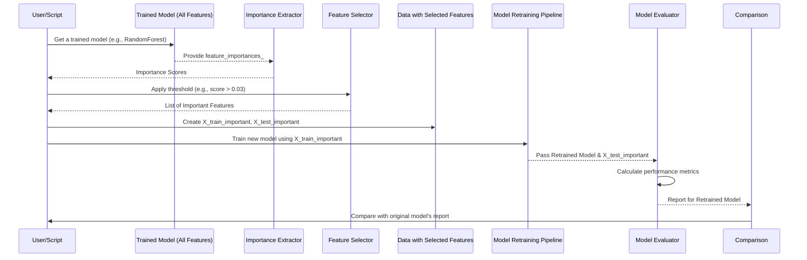

# Chapter 5: Feature Importance Analysis & Selective Model Retraining

Welcome to Chapter 5! In [Chapter 4: Model Performance Evaluator & Reporter](04_model_performance_evaluator___reporter_.md), we learned how to rigorously test our trained models and get a detailed "report card" on their performance. Now, we might wonder: "Which ingredients in our data recipe are *really* making the dish tasty, and can we make the recipe simpler without losing flavor?"

This is where **Feature Importance Analysis & Selective Model Retraining** comes in. It's like being a master chef who wants to refine a complex signature dish.
1.  **Analysis (Finding Key Spices)**: First, the chef tastes the dish carefully to identify which spices are the most crucial, the ones that truly define its unique flavor.
2.  **Selective Retraining (Creating a Simpler Recipe)**: Then, the chef tries creating a new, simpler version of the recipe, using *only* those essential spices. The goal is a dish that's just as delicious (or even better!) but less complicated and perhaps quicker to make.

Similarly, in machine learning:
1.  We analyze our trained model (especially tree-based ones like RandomForest or XGBoost) to see which data features (like `Mean_Variance_mean` or `Middle_Mean_Variance_Change_Rate_std`) had the biggest impact on its predictions. These are our "key spices."
2.  Then, we can try retraining the model using *only* this smaller set of highly influential features. We want to see if this simpler model can perform just as well as the original, or maybe even better! This could make our model faster, easier to understand, and sometimes more robust.

The `fivemodel` project, particularly in `main_random_five_model.py`, has a mechanism to do exactly this!

## What is Feature Importance?

When we train a model, especially complex ones like RandomForest, it learns to pay more attention to some features than others. **Feature Importance** gives us a score for each feature, indicating how useful it was in making correct predictions.
*   A **high score** means the feature was very influential.
*   A **low score** means the feature had little impact, or might even have been confusing noise.

For tree-based models (like the decision trees that make up a RandomForest), importance is often calculated by looking at how much a feature helps to improve the "purity" of the decisions at each split point in the trees. If a feature is frequently used to make good splits that separate 'normal' from 'adversarial' data, it gets a high importance score.

Knowing feature importance helps us:
*   **Understand our model better**: What information is it actually using?
*   **Simplify our model**: Can we remove features that aren't very important?
*   **Guide future data collection**: If some features are consistently useless, maybe we don't need to collect that data anymore.

## How Do We Get These Importance Scores?

Luckily, libraries like `scikit-learn` make this easy for many models. Once a tree-based model (like `RandomForestClassifier`) is trained, it often has an attribute called `feature_importances_`. This attribute holds an array of scores, one for each feature we used in training.

Let's say we have our `best_model` pipeline from [Chapter 3: Machine Learning Model Training Pipeline](03_machine_learning_model_training_pipeline_.md), where the classifier step was a RandomForest.

```python
# Assume 'best_model' is a trained scikit-learn pipeline
# and 'X_train' contains our training feature data (a pandas DataFrame)

# Access the classifier step (e.g., 'RandomForest') from the pipeline
classifier_step = best_model.best_estimator_.named_steps['classifier']

# Get the importance scores
importances = classifier_step.feature_importances_

# Get the names of the features
feature_names = X_train.columns

# Let's see them (this is often saved to a file)
for name, score in zip(feature_names, importances):
    print(f"Feature: {name}, Importance: {score:.4f}")
```
This code snippet first drills down into our `best_model` pipeline to get to the actual classifier (e.g., the RandomForest model). Then, it pulls out the `feature_importances_` scores. Finally, it loops through our feature names (which we know from `X_train.columns` that we prepared in [Chapter 2: Feature Engineering Engine](02_feature_engineering_engine_.md)) and prints each feature's name alongside its importance score.

**Example Output:**
```
Feature: Mean_Variance_mean, Importance: 0.1523
Feature: Number_of_outliers_std, Importance: 0.0876
Feature: Middle_Mean_Variance_Change_Rate_median, Importance: 0.2105
... and so on for all other features
```
From this, we can see `Middle_Mean_Variance_Change_Rate_median` seems quite important in this hypothetical example.

The `fivemodel` scripts usually save this information into files like `feature_importance.csv` and `feature_importance_details.txt` in the `output_files` directory, often with a bar chart visualization too.

## Selective Model Retraining: Cooking with Fewer Spices

Once we have these importance scores, we can decide on a strategy to select the "most valuable players" (MVPs) among our features. This could be:
*   Choosing all features with an importance score above a certain **threshold** (e.g., any feature with importance > 0.05).
*   Picking the **top N** features (e.g., the 10 features with the highest scores).

After selecting our subset of important features, we then **retrain our model (or a similar one) using only these features.**

**Why Bother Retraining?**
*   **Simplicity & Interpretability**: A model with fewer features is often easier to understand and explain.
*   **Efficiency**: Training and prediction can be faster with less data to process.
*   **Reduced Overfitting**: Removing irrelevant or noisy features can sometimes help the model generalize better to new, unseen data.
*   **Cost Savings**: If some features are derived from expensive-to-collect raw data, and they turn out to be unimportant, we might save resources by not collecting that raw data in the future.

The big question is: *Does this simpler model perform as well as, or even better than, the original model that used all features?* To answer this, we need to evaluate the retrained model using the techniques from [Chapter 4: Model Performance Evaluator & Reporter](04_model_performance_evaluator___reporter_.md).

## The Process of Selective Retraining

Let's outline the steps:

1.  **Train Initial Model & Get Importances**: Train your model (e.g., RandomForest) on all available features. Extract feature importance scores. (We covered this above).
2.  **Select Top Features**: Based on the scores, choose a subset of important features.
    ```python
    # (Continuing from previous example)
    # Let's say we set a threshold
    threshold = 0.03 # Example from main_random_five_model.py

    important_feature_names = []
    for name, score in zip(feature_names, importances):
        if score >= threshold:
            important_feature_names.append(name)

    print(f"Selected {len(important_feature_names)} important features: {important_feature_names}")
    ```
    This code defines a `threshold`. It then iterates through our features and their scores, adding the name of any feature whose score meets or exceeds the threshold to a new list called `important_feature_names`.

3.  **Prepare New Data Subsets**: Create new training and testing datasets that *only* include these selected important features.
    ```python
    # X_train and X_test are our original full feature DataFrames
    X_train_important = X_train[important_feature_names]
    X_test_important = X_test[important_feature_names]

    # y_train and y_test (the labels) remain the same
    ```
    Here, we're using pandas DataFrame slicing. `X_train[important_feature_names]` creates a new DataFrame `X_train_important` containing all the same rows as `X_train` but only the columns (features) whose names are in our `important_feature_names` list.

4.  **Retrain the Model**: Use the *exact same* model training pipeline from [Chapter 3: Machine Learning Model Training Pipeline](03_machine_learning_model_training_pipeline_.md) (including scaling, SMOTE if used, hyperparameter tuning with GridSearchCV), but feed it `X_train_important` and `y_train`.
    ```python
    # Define your model (e.g., RandomForest again)
    # model_algorithm_retrain = RandomForestClassifier(random_state=42)

    # Build the pipeline (scaler, smote, classifier)
    # pipeline_retrain = ImbPipeline([... , ('classifier', model_algorithm_retrain)])

    # Define parameter grid for GridSearchCV
    # param_grid_retrain = { 'classifier__n_estimators': [50, 100], ... }

    # Setup GridSearchCV
    # grid_search_retrain = GridSearchCV(pipeline_retrain, param_grid_retrain, ...)

    # Fit on the data with important features
    # grid_search_retrain.fit(X_train_important, y_train)
    # best_retrained_model = grid_search_retrain.best_estimator_
    ```
    This conceptual code shows that the process is identical to what we did in Chapter 3, simply using the reduced feature set (`X_train_important`).

5.  **Evaluate the Retrained Model**: Use the methods from [Chapter 4: Model Performance Evaluator & Reporter](04_model_performance_evaluator___reporter_.md) to assess the `best_retrained_model` on `X_test_important` and `y_test`. Compare its performance (accuracy, F1-score, ROC AUC, etc.) to the original model.

## Under the Hood: A Simplified Workflow

Here's a diagram illustrating the selective retraining process:



## How `fivemodel` Implements Selective Retraining

The `main_random_five_model.py` script within the `fivemodel` project demonstrates this concept. After training and evaluating models with all features, and identifying the overall best model (which, if it's a tree-based model like RandomForest, provides feature importances), it then performs these steps:

1.  **Reads Feature Importances**: It typically reads the `feature_importance_details.txt` file (saved by a previous step when analyzing the best model trained on all features).
2.  **Selects Based on Threshold**: It iterates through these importances and selects features that meet a predefined threshold (e.g., `importance >= 0.030`).
    ```python
    # Simplified logic from main_random_five_model.py
    important_features = []
    # ... code to open and read 'feature_importance_details.txt' ...
    for line in lines: # Assuming 'lines' are from the file
        feature, importance_str = line.split(': ')
        if float(importance_str) >= 0.030: # The threshold
            important_features.append(feature.strip())
    ```
3.  **Creates New Data Subsets**:
    ```python
    # X is the original full feature DataFrame
    X_important = X[important_features]

    # Then split this X_important into train and test sets
    X_train_important, X_test_important, y_train_important, y_test_important = train_test_split(
        X_important, y, test_size=0.2, random_state=42, stratify=y
    )
    ```
4.  **Retrains Models**: It then loops through the same list of models (RandomForest, Logistic Regression, etc.) and trains them *again* from scratch, but this time using `X_train_important` (after SMOTE, if applicable) and the corresponding `y_train_important`. The hyperparameter tuning (GridSearchCV) process is repeated for each model on this new, smaller feature set.
    ```python
    # (Inside a loop for each model type in main_random_five_model.py)
    # model_results_important = {} # To store results for retrained models
    # ...
    # pipeline = ImbPipeline([('scaler', StandardScaler()), ('classifier', model_algorithm)])
    # X_train_resampled, y_train_resampled = smote.fit_resample(X_train_important, y_train_important)
    # model_result = train_and_evaluate_model( # This is a helper function in the script
    #     model_name, pipeline, param_grid,
    #     X_train_resampled, X_test_important,
    #     y_train_resampled, y_test_important, cv
    # )
    # model_results_important[model_name] = model_result
    ```
5.  **Saves Results in a New Directory**: The evaluation reports (metrics, plots) for these retrained models are typically saved in a new subdirectory, like `output_files/important_features_results/`, to keep them separate from the results of models trained on all features. This allows for a direct comparison.

The key takeaway is that `main_random_five_model.py` automates this process of identifying crucial features and then seeing if models built only on those features can still deliver strong performance.

## What We've Learned

*   **Feature Importance** tells us which data features our model found most useful for making predictions.
*   Tree-based models like RandomForest provide these importance scores directly.
*   **Selective Model Retraining** involves:
    1.  Identifying the most important features.
    2.  Creating a new dataset using only these features.
    3.  Training a new model on this reduced dataset.
    4.  Evaluating the new model's performance.
*   The goal is to potentially create simpler, faster, and more interpretable models that perform comparably (or even better) than models trained on all features.
*   The `fivemodel` script `main_random_five_model.py` includes functionality to carry out feature importance analysis and then retrain models using a selected subset of important features, saving the results for comparison.

This is a powerful technique for refining your models and gaining deeper insights into your data. But what if we want to compare these "important feature" models not just against the original "all features" model, but also against models trained on other specific, hand-picked sets of features? That's where our next chapter comes in.

Ready to explore more targeted comparisons? Let's move on to [Chapter 6: Targeted Feature Set Comparison Framework](06_targeted_feature_set_comparison_framework_.md).

---

Generated by [AI Codebase Knowledge Builder](https://github.com/The-Pocket/Tutorial-Codebase-Knowledge)