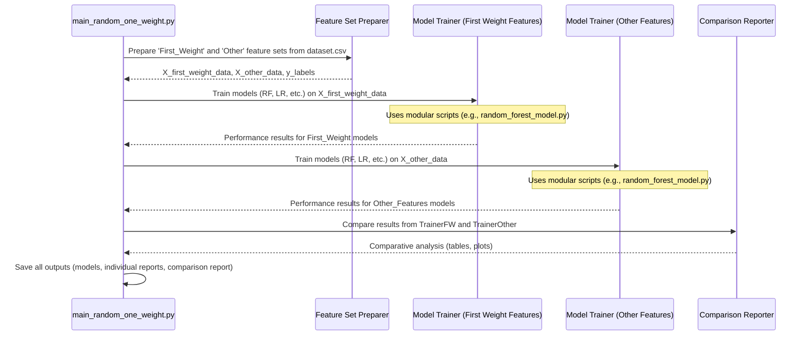

# Chapter 6: Targeted Feature Set Comparison Framework

Welcome to Chapter 6! In [Chapter 5: Feature Importance Analysis & Selective Model Retraining](05_feature_importance_analysis___selective_model_retraining_.md), we learned how to identify the most influential "ingredients" (features) in our data and even tried retraining models with just those key features. That was like finding the star players on a team.

But what if we want to conduct a different kind of experiment? Imagine you're a sports analyst, and you want to compare two specific strategies:
1.  How well does a team perform if it *only* relies on its star players?
2.  How well does a *different* team, composed of *all other* supporting players (no stars), perform?

This comparison helps understand the distinct contributions and overall strength of these predefined groups. Our **Targeted Feature Set Comparison Framework** is designed for exactly this kind of investigation in machine learning. We're going to focus on a specific example, the script `main_random_one_weight.py`, to understand this concept.

## What is the Targeted Feature Set Comparison Framework?

This framework allows us to conduct comparative experiments by training and evaluating machine learning models on different, pre-selected *subsets* of features. Instead of just picking the "top N%" important features like in Chapter 5, here we define specific groups of features based on our hypothesis or interest.

For instance, using `main_random_one_weight.py`, we can ask:
*   How good are models if they are trained *only* using features related to 'First_Weight'? (Our "star player" team)
*   How good are models if they are trained *only* using all features *except* those related to 'First_Weight'? (Our "supporting player" team)

By comparing these, we can gain a focused understanding of the predictive power held within specific feature categories. This is super useful for domain experts who might believe certain types of data are more critical than others and want to test that belief.

## How It Works: A Step-by-Step Experiment with `main_random_one_weight.py`

Let's walk through how `main_random_one_weight.py` sets up and runs this kind of comparison.

### Step 1: Define Your "Teams" (Feature Subsets)

First, we need to decide which groups of features we want to compare. `main_random_one_weight.py` does this by looking for feature names:
*   **Team A (First_Weight Features)**: All features whose names contain the string 'First_Weight'. These are features derived specifically from the "First_Weight" data points we encountered in [Chapter 2: Feature Engineering Engine](02_feature_engineering_engine_.md).
*   **Team B (Other Features)**: All other features available in our dataset *excluding* those in Team A and also excluding identifiers like 'Run_ID' or the target 'Attack_Type'.

The script has a function, `prepare_feature_sets()`, that does this sorting.

```python
# Conceptual: Inside prepare_feature_sets(data)
first_weight_cols = []
other_feature_cols = []

for col_name in data.columns:
    if 'First_Weight' in col_name:
        first_weight_cols.append(col_name)
    elif col_name not in ['Run_ID', 'Attack_Type']: # + other exclusions
        other_feature_cols.append(col_name)

# data_team_A = data[first_weight_cols]
# data_team_B = data[other_feature_cols]
```
This Python snippet shows the logic. It iterates through all column names in the dataset. If 'First_Weight' is in the name, it's assigned to one list; otherwise (and if it's not an ID or target), it's assigned to another.

### Step 2: Prepare the Data for Each "Team"

Once the feature names for each "team" (subset) are identified, the script creates separate datasets:
*   `X_first_weight`: Contains only the 'First_Weight' related features.
*   `X_other`: Contains all the other features.
*   The target variable `y` (our 'Attack_Type' labels) remains the same for both.

Then, each of these datasets is split into training and testing sets, just like we learned in [Chapter 3: Machine Learning Model Training Pipeline](03_machine_learning_model_training_pipeline_.md).
So we'll have:
*   `X_first_train`, `X_first_test`, `y_first_train`, `y_first_test`
*   `X_other_train`, `X_other_test`, `y_other_train`, `y_other_test`

### Step 3: Train and Evaluate Models for Each "Team"

Now, for each feature subset ("Team A" and "Team B"), the framework trains a suite of machine learning models (RandomForest, Logistic Regression, SVM, Gradient Boosting, XGBoost). This is where the modularity of `fivemodel` shines!

The script `main_random_one_weight.py` calls separate, dedicated training scripts for each model type, such as:
*   `random_forest_model.py`
*   `logistic_regression_model.py`
*   `svc_model.py`
*   `gradient_boosting_model.py`
*   `xgboost_model.py`

Each of these modular scripts takes the appropriately subsetted training data (e.g., `X_first_train`, `y_first_train`) and performs the full training pipeline we discussed in [Chapter 3: Machine Learning Model Training Pipeline](03_machine_learning_model_training_pipeline_.md), including:
*   Feature Scaling
*   SMOTE for class imbalance
*   GridSearchCV for hyperparameter tuning

After training, each model is evaluated on its corresponding test set (e.g., `X_first_test`, `y_first_test`) using the methods from [Chapter 4: Model Performance Evaluator & Reporter](04_model_performance_evaluator___reporter_.md). The results (metrics, plots, trained models) are saved, typically in separate subdirectories like `output_files/first_weight/` and `output_files/other_features/` to keep things organized.

```python
# Conceptual: Inside train_and_evaluate_both_sets()
# ... X_first_train, X_first_test, y_first_train, y_first_test are ready ...
# ... X_other_train, X_other_test, y_other_train, y_other_test are ready ...

# For "First_Weight" features:
output_fw_dir = os.path.join(output_dir, 'first_weight')
# rf_model_fw = train_random_forest(X_first_train, ..., output_fw_dir) # Calls the module
# lr_model_fw = train_logistic_regression(X_first_train, ..., output_fw_dir)
# ... and so on for other models

# For "Other" features:
output_other_dir = os.path.join(output_dir, 'other_features')
# rf_model_other = train_random_forest(X_other_train, ..., output_other_dir)
# lr_model_other = train_logistic_regression(X_other_train, ..., output_other_dir)
# ... and so on
```
This illustrates how the main script would invoke the specialized training functions for each feature set and each model type, directing outputs to distinct folders.

### Step 4: Compare the "Team" Performances

After all models are trained and evaluated for both feature sets, `main_random_one_weight.py` gathers the key performance metrics (like accuracy or F1-score from the `best_score_` attribute of the `GridSearchCV` object). It then:
*   Creates a summary table comparing these metrics side-by-side for each model type.
*   Generates plots to visually compare the performances.
*   Saves these comparison reports, often in a `comparison` subdirectory within `output_files`.

This allows us to directly see, for example, if RandomForest trained on 'First_Weight' features performed better or worse than RandomForest trained on 'Other' features.

## A Peek Under the Hood: `main_random_one_weight.py` in Action

Let's visualize the overall process managed by `main_random_one_weight.py`:



### Key Functions in `main_random_one_weight.py`

The script `main_random_one_weight.py` orchestrates this through several key functions:

1.  **`prepare_feature_sets(data)`**:
    *   **Input**: The full DataFrame `data` (read from `dataset.csv` after initial processing).
    *   **Action**: Identifies columns belonging to 'First_Weight' features and columns belonging to 'Other' features.
    *   **Output**: Two DataFrames: `first_weight_features` and `other_features`.

    ```python
    # From main_random_one_weight.py (simplified)
    def prepare_feature_sets(data):
        first_weight_cols = [col for col in data.columns if 'First_Weight' in col]
        other_feature_cols = [col for col in data.columns
                              if col not in first_weight_cols + ['Run_ID', 'Attack_Type']]
        return data[first_weight_cols], data[other_feature_cols]
    ```
    This shows the core logic for separating the feature columns based on their names.

2.  **`train_and_evaluate_both_sets(X_first_weight, X_other, y, output_dir)`**:
    *   **Input**: The two feature DataFrames, the common labels `y`, and the base output directory.
    *   **Action**: Coordinates the training and evaluation for both feature sets.
        *   Splits each feature set into train/test.
        *   Calls the individual model training scripts (e.g., `train_random_forest(...)`) for each set, passing the correct data and a specific output sub-directory (e.g., `output_dir/first_weight`).
    *   **Output**: Dictionaries containing the results (e.g., trained `GridSearchCV` objects) for models trained on 'First_Weight' features and on 'Other' features.

    ```python
    # From main_random_one_weight.py (conceptual call)
    # (Inside train_and_evaluate_both_sets)
    # For the 'First_Weight' features:
    # X_fw_train, X_fw_test, y_fw_train, y_fw_test = train_test_split(X_first_weight, y, ...)
    # output_fw = os.path.join(output_dir, 'first_weight')
    # results_fw['RandomForest'] = train_random_forest(X_fw_train, ..., output_fw)
    
    # Similarly for 'Other' features...
    ```
    This highlights that the main script calls functions like `train_random_forest` (imported from `random_forest_model.py`). These functions encapsulate the entire pipeline from [Chapter 3: Machine Learning Model Training Pipeline](03_machine_learning_model_training_pipeline_.md).

3.  **`compare_and_visualize_results(first_weight_results, other_features_results, output_dir)`**:
    *   **Input**: The dictionaries of results from the previous step and the base output directory.
    *   **Action**: Extracts key performance metrics (e.g., `best_score_`) from each model's results. Creates comparative tables and plots.
    *   **Output**: Saves CSV files and PNG plots summarizing the comparison into a `comparison` or `plots` subdirectory of `output_dir`.

    ```python
    # Conceptual logic within compare_and_visualize_results
    # comparison_data = []
    # for model_name in first_weight_results.keys():
    #     score_fw = first_weight_results[model_name].best_score_
    #     score_other = other_features_results[model_name].best_score_
    #     comparison_data.append({'Model': model_name, 'FW_Score': score_fw, ...})
    # comparison_df = pd.DataFrame(comparison_data)
    # comparison_df.to_csv(os.path.join(output_dir, 'comparison', 'summary.csv'))
    # ... code to plot this DataFrame ...
    ```
    This snippet shows how the best scores are extracted and could be compiled into a summary DataFrame for comparison.

The beauty of this framework is its **modularity**. The main script (`main_random_one_weight.py`) focuses on *what* feature sets to compare and *how* to present the comparison. The actual model training details are handled by the separate model-specific scripts (e.g., `random_forest_model.py`), which apply the consistent training and tuning pipeline we've established in earlier chapters.

## What We've Learned

*   The **Targeted Feature Set Comparison Framework** allows for controlled experiments comparing model performance on predefined, distinct subsets of features.
*   It helps answer questions like "Is group X of features more predictive than group Y?"
*   The script `main_random_one_weight.py` is an example that compares models trained on 'First_Weight' features versus models trained on all other features.
*   The process involves:
    1.  Defining the feature subsets.
    2.  Preparing separate data for each subset.
    3.  Leveraging modular training scripts (e.g., `random_forest_model.py`) to train and evaluate models on each subset, following the established pipeline from [Chapter 3: Machine Learning Model Training Pipeline](03_machine_learning_model_training_pipeline_.md).
    4.  Collating and comparing the performance metrics across the feature sets.
*   This approach is highly valuable for hypothesis testing and understanding the specific contributions of different kinds of data.

This framework gives us a powerful way to dissect our data and understand it better. But what if we want to go even deeper with one specific model, like RandomForest, and see how its performance changes as we remove features one by one? That's called an ablation study, and it's what we'll explore next.

Ready for a deep dive into model robustness? Let's move on to [Chapter 7: RandomForest Ablation Study System](07_randomforest_ablation_study_system_.md).

---

Generated by [AI Codebase Knowledge Builder](https://github.com/The-Pocket/Tutorial-Codebase-Knowledge)