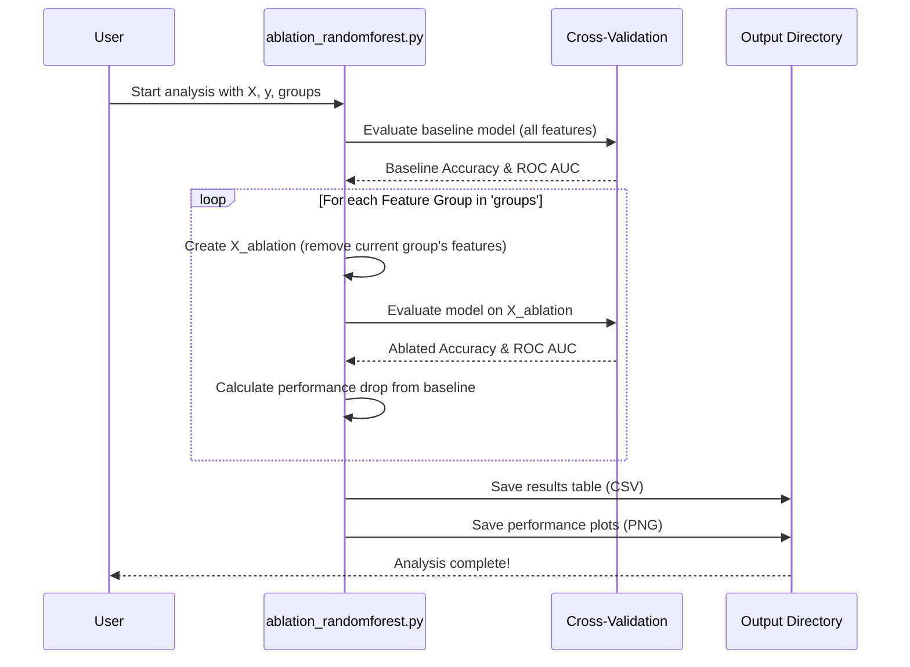

# Chapter 7: RandomForest Ablation Study System

Welcome to the final chapter of our `fivemodel` journey! In [Chapter 6: Targeted Feature Set Comparison Framework](06_targeted_feature_set_comparison_framework_.md), we learned how to compare models trained on different, predefined sets of features, like seeing how a team of "star players" performs against a team of "supporting Roster." Now, we're going to zoom in on one specific model type, RandomForest, and use a technique to understand which *categories* of features are most vital to its success.

Imagine an aircraft engineer designing a new plane. Before the first real flight, they might run simulations or tests where they temporarily "remove" or disable different parts of the plane (like a wing section, or a specific control system) to see how it affects stability and performance. This helps them understand how crucial each part is. Our **RandomForest Ablation Study System** does something very similar for our machine learning models!

This system, found in the `ablation_randomforest.py` script, performs an **ablation analysis**. For RandomForest models, it measures the impact of removing *entire groups of features*. It systematically takes away predefined feature categories (for example, all statistical features related to 'layer.3_Weight_Std') and then re-checks how well the model performs (using Accuracy and ROC AUC scores with cross-validation). By comparing the model's performance with and without these feature groups, we can figure out which categories of information are the most critical for the model to make good predictions.

## What Problem Does This Solve? Understanding Critical Feature Categories

In [Chapter 2: Feature Engineering Engine](02_feature_engineering_engine_.md), we created a lot of different features. These features often fall into natural groups. For example, we might have:
*   All features related to the standard deviation of weights in Layer 0 (`layer.0_Weight_Std_mean`, `layer.0_Weight_Std_std`, `layer.0_Weight_Std_median`, etc.)
*   All features related to the number of outliers in Layer 3 (`layer.3_Number_of_outliers_mean`, `layer.3_Number_of_outliers_std`, etc.)

The ablation study helps us answer: "If we remove *all* information about 'Weight_Std for Layer 0', how much does our model's ability to detect attacks suffer?" If the performance drops a lot, then that category of features is very important. If it barely changes, that category might not be as crucial.

This is different from [Chapter 5: Feature Importance Analysis & Selective Model Retraining](05_feature_importance_analysis___selective_model_retraining_.md) where we looked at individual feature scores. Here, we're assessing the collective importance of *groups* of related features.

## How the Ablation Study System Works: A Step-by-Step Guide

The system follows a clear, scientific approach to test the importance of feature groups:

1.  **Establish the Baseline:**
    *   First, a RandomForest model is trained using **all** available features.
    *   Its performance (Accuracy and ROC AUC) is measured carefully using cross-validation (a technique we learned about in [Chapter 3: Machine Learning Model Training Pipeline](03_machine_learning_model_training_pipeline_.md) to get a reliable performance estimate).
    *   This baseline performance is our "normal flight" – how well the model does with everything intact.

2.  **Systematic "Removal" (Ablation):**
    *   The system is given a list of predefined feature groups. For example, a group might be "all features starting with `layer.0_Weight_Std`".
    *   For each group in this list:
        *   A new version of the dataset is created where all features belonging to that specific group are temporarily removed.
        *   A new RandomForest model is trained using the **exact same settings and pipeline** (including data scaling with `StandardScaler` and handling class imbalance with `SMOTE`) but on this dataset with the feature group missing.
        *   The performance of this "ablated" model is measured using cross-validation.

3.  **Compare and Analyze:**
    *   The performance of each ablated model (the one missing a feature group) is compared to the baseline model's performance.
    *   If removing a particular feature group causes a significant drop in Accuracy or ROC AUC, it indicates that this group of features is highly important for the model's predictive power.
    *   The results are typically presented in a table and visually with bar charts, making it easy to see which feature groups are most critical.

## A Peek Under the Hood: `ablation_randomforest.py`

The magic happens inside the `ablation_randomforest.py` script, primarily in the `perform_rf_ablation_analysis` function.

**Inputs:**
*   `X`: A table (pandas DataFrame) containing all your features (e.g., `layer.0_Weight_Std_mean`, `layer.1_Number_of_outliers_median`, etc.).
*   `y`: A list or column of the true labels (e.g., 0 for 'normal', 1 for 'adversarial').
*   `groups`: A list of strings representing the "prefixes" of feature groups to test. For instance, if you have features named `layer.0_Weight_Std_mean` and `layer.0_Weight_Std_std`, a group name could be `layer.0_Weight_Std`. The script will remove all features that start with this prefix.
*   `output_dir`: The name of a folder where the results (CSV file and plots) will be saved.

**The Core Process (Simplified Sequence):**



**Looking at the Code (`perform_rf_ablation_analysis`):**

1.  **Setup the Pipeline:**
    A standard machine learning pipeline is defined. This ensures that both the baseline model and all ablated models are trained and evaluated consistently.
    ```python
    # From ablation_randomforest.py
    pipeline = ImbPipeline([
        ('smote', SMOTE(random_state=42)),         # Handle class imbalance
        ('scaler', StandardScaler()),             # Scale features
        ('classifier', RandomForestClassifier(n_estimators=100, random_state=42)) # The model
    ])
    ```
    This pipeline first uses SMOTE to balance the data, then scales the features, and finally trains a RandomForest classifier.

2.  **Calculate Baseline Performance:**
    The pipeline is evaluated using cross-validation on the full dataset `X` and `y`.
    ```python
    # From ablation_randomforest.py
    skf = StratifiedKFold(n_splits=5, shuffle=True, random_state=42) # Cross-validation strategy
    
    # Baseline with all features
    baseline_acc = np.mean(cross_val_score(pipeline, X, y, cv=skf, scoring='accuracy', n_jobs=-1))
    baseline_roc = np.mean(cross_val_score(pipeline, X, y, cv=skf, scoring='roc_auc', n_jobs=-1))
    ```
    `cross_val_score` does the heavy lifting of splitting data, training, and testing multiple times. We take the average score.

3.  **Iterate Through Feature Groups for Ablation:**
    The script loops through each `group` prefix provided by the user.
    ```python
    # From ablation_randomforest.py
    results = []
    for group in groups: # e.g., group = "layer.0_Weight_Std"
        # Find all columns starting with the group prefix + "_"
        # e.g., "layer.0_Weight_Std_mean", "layer.0_Weight_Std_std" etc.
        cols_to_drop = [col for col in X.columns if col.startswith(group + "_")]
        
        if not cols_to_drop: # Skip if no features match this group
            continue

        X_ablation = X.drop(columns=cols_to_drop) # Remove the group's features
        
        # Evaluate model on data MISSING this group
        acc_scores = cross_val_score(pipeline, X_ablation, y, cv=skf, scoring='accuracy', n_jobs=-1)
        roc_scores = cross_val_score(pipeline, X_ablation, y, cv=skf, scoring='roc_auc', n_jobs=-1)
        
        mean_acc = np.mean(acc_scores)
        mean_roc = np.mean(roc_scores)
        
        # Calculate drop in performance
        acc_drop = baseline_acc - mean_acc
        roc_drop = baseline_roc - mean_roc
        
        results.append({
            '特徴量／群名': group, # Feature/Group Name
            'Accuracy': mean_acc, 'ROC_AUC': mean_roc,
            'Accuracy低下': acc_drop, 'ROC_AUC低下': roc_drop # Drop in Acc/ROC
        })
    ```
    For each `group`, it identifies the actual feature columns to remove (e.g., if group is `layer.0_Weight_Std`, it drops `layer.0_Weight_Std_mean`, `layer.0_Weight_Std_std`, etc.). Then, it calculates new performance scores on the dataset `X_ablation` which is missing these features.

4.  **Save and Plot Results:**
    The collected results are put into a pandas DataFrame, saved as a CSV file, and plotted.
    ```python
    # From ablation_randomforest.py
    results_df = pd.DataFrame(results)
    # ... (code to add baseline row to results_df) ...
    
    csv_path = os.path.join(output_dir, 'rf_ablation_results.csv')
    results_df.to_csv(csv_path, index=False) # Save as CSV
    
    # ... (code using matplotlib and seaborn to create bar plots) ...
    # plt.savefig(plot_path) # Save plot as image
    ```
    The CSV file gives you the raw numbers, and the plots give a quick visual comparison.

**How to Define Feature Groups for the Study (`main` function example):**

The `main()` function in `ablation_randomforest.py` shows how you might define these groups. If your features are named systematically (e.g., `layer.LAYERNUMBER_STATISTICNAME_AGGREGATION`), you can generate group prefixes:
```python
# Simplified from main() in ablation_randomforest.py
layers = ['layer.0', 'layer.1', 'layer.2', 'layer.3', 'layer.4', 'layer.5']
stats = ['Number_of_outliers', 'Weight_Min', 'Weight_Max', 'Weight_Mean',
         'Weight_Median', 'Weight_Std', 'Weight_Q25', 'Weight_Q75']
groups_to_test = []
for layer in layers:
    for stat in stats:
        groups_to_test.append(f"{layer}_{stat}") # e.g., "layer.0_Number_of_outliers"

# ... (load X and y data) ...
# results_df = perform_rf_ablation_analysis(X, y, groups_to_test, 'rf_ablation_output')
```
This code would create group prefixes like `layer.0_Number_of_outliers`, `layer.0_Weight_Min`, ..., `layer.5_Weight_Q75`. When `perform_rf_ablation_analysis` gets `layer.0_Weight_Std` as a group, it will look for and remove all features like `layer.0_Weight_Std_mean`, `layer.0_Weight_Std_std`, etc.

## Interpreting the Results

After running the script, you'll find two main outputs in your specified directory (e.g., `rf_ablation_output/`):
1.  `rf_ablation_results.csv`: A CSV file. Each row represents a scenario:
    *   The "Baseline" row shows performance with all features.
    *   Other rows show performance when a specific feature `group` was removed.
    *   Columns include `Accuracy`, `ROC_AUC`, and `Accuracy低下` (Accuracy Drop), `ROC_AUC低下` (ROC AUC Drop) compared to the baseline.

    **Example CSV Output (Simplified):**
    | 特徴量／群名 (Group Name) | Accuracy | ROC_AUC | Accuracy低下 (Drop) | ROC_AUC低下 (Drop) |
    | :---------------------- | :------- | :------ | :------------------ | :----------------- |
    | Baseline (全特徴量)     | 0.95     | 0.98    | 0.00                | 0.00               |
    | layer.3_Weight_Std      | 0.85     | 0.88    | 0.10                | 0.10               |
    | layer.0_Number_of_outliers| 0.94     | 0.97    | 0.01                | 0.01               |
    | ...                     | ...      | ...     | ...                 | ...                |

    From this example, removing `layer.3_Weight_Std` caused a big drop (0.10) in both Accuracy and ROC AUC, suggesting it's a very important feature group. Removing `layer.0_Number_of_outliers` had a much smaller impact.

2.  `rf_ablation_performance.png`: A bar plot visually comparing the Accuracy and ROC_AUC scores for the baseline and for each ablation scenario. This makes it easy to spot the groups whose removal hurts performance the most.

By examining these outputs, you can pinpoint which categories of features are most critical to your RandomForest model's ability to distinguish between, for example, 'normal' and 'adversarial' operations.

## What We've Learned

*   The **RandomForest Ablation Study System** helps understand the importance of *entire categories* of features for a RandomForest model.
*   It works by systematically removing predefined feature groups and observing the impact on model performance (Accuracy and ROC AUC) using cross-validation.
*   The system compares the performance of models missing a feature group to a baseline model trained on all features.
*   A significant drop in performance when a group is removed indicates that the feature group is critical.
*   The `ablation_randomforest.py` script implements this, providing CSV and visual plot outputs for easy analysis.
*   This technique is like an engineer testing components of a system to find the most crucial ones.

This chapter concludes our structured tour through the `fivemodel` project! You've journeyed from combining raw data in [Chapter 1: CSV Data Combiner](01_csv_data_combiner_.md), through crafting features, training and evaluating models, and diving deep into analyzing feature importance and model behavior.

With the knowledge from these seven chapters, you're now well-equipped to understand, use, and even extend the capabilities of the `fivemodel` project. Happy modeling!

---

Generated by [AI Codebase Knowledge Builder](https://github.com/The-Pocket/Tutorial-Codebase-Knowledge)