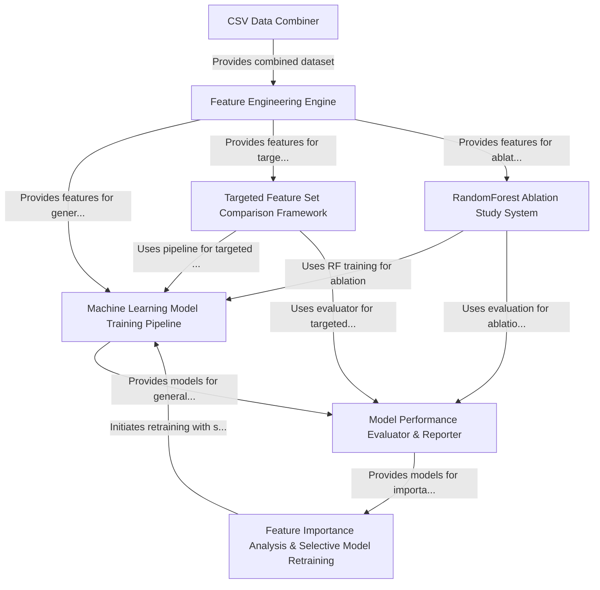

# Tutorial: fivemodel

This project, `fivemodel`, focuses on **building and analyzing machine learning models** to classify data, for instance, distinguishing 'normal' from 'adversarial' activities.
It features a pipeline that starts with a *CSV Data Combiner* to unify raw data. A *Feature Engineering Engine* then cleans this data and creates new, meaningful features.
These features feed into a *Machine Learning Model Training Pipeline* that trains various classification algorithms like RandomForest and XGBoost.
The performance of these models is then thoroughly checked by a *Model Performance Evaluator & Reporter*.
Finally, the project includes advanced tools like *Feature Importance Analysis* for model interpretability and refinement, a *Targeted Feature Set Comparison Framework* for focused experiments, and a *RandomForest Ablation Study System* to assess the impact of feature groups.

**Source Repository:** [None](None)

## Chapters

1. [CSV Data Combiner
](01_csv_data_combiner_.md)
2. [Feature Engineering Engine
](02_feature_engineering_engine_.md)
3. [Machine Learning Model Training Pipeline
](03_machine_learning_model_training_pipeline_.md)
4. [Model Performance Evaluator & Reporter
](04_model_performance_evaluator___reporter_.md)
5. [Feature Importance Analysis & Selective Model Retraining
](05_feature_importance_analysis___selective_model_retraining_.md)
6. [Targeted Feature Set Comparison Framework
](06_targeted_feature_set_comparison_framework_.md)
7. [RandomForest Ablation Study System
](07_randomforest_ablation_study_system_.md)

---

Generated by [AI Codebase Knowledge Builder](https://github.com/The-Pocket/Tutorial-Codebase-Knowledge)