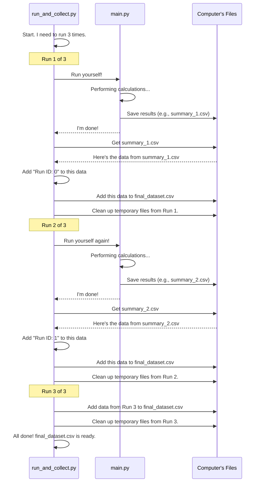

# Chapter 1: Automated Experiment Conductor (`run_and_collect.py`)

Welcome to your first step in understanding the `for_dataset` project! This chapter will introduce you to a very helpful tool called the "Automated Experiment Conductor," which is a script named `run_and_collect.py`.

## What's the Big Idea?

Imagine you're a scientist studying how a new plant food affects plant growth. You wouldn't just test it on one plant, one time, right? You'd probably want to run many tests on many plants to get reliable results. You'd plant a seed, add the food, wait, measure the growth, record it, and then repeat this whole process many times.

In the world of computer simulations, especially in fields like Federated Learning (which we'll explore more later!), running an experiment just once often isn't enough. We need to run it multiple times to:
*   See if our results are consistent.
*   Gather enough data to make meaningful conclusions.
*   Test different variations or scenarios (though our current `run_and_collect.py` focuses on repetition).

Doing this manually – running the simulation, saving the output, cleaning up files, and then starting all over again for, say, 100 times – would be incredibly boring and time-consuming!

This is where the `run_and_collect.py` script comes in. **It acts like an automated lab assistant for your computer experiments.** You tell it how many times to run your main simulation (which happens in a file called `main.py`). For each run, it:
1.  Starts the simulation.
2.  Waits for it to finish.
3.  Collects the key results generated by that simulation.
4.  Adds these results to a growing, single master file.
5.  Cleans up any temporary files to get ready for the next run.

This way, you can set up your experiment, let `run_and_collect.py` do its work (even overnight!), and come back to a comprehensive dataset ready for analysis.

## How It Works: The Conductor and the Orchestra

Think of `run_and_collect.py` as the conductor of an orchestra. The main simulation, defined in `main.py` (which we'll learn about in [Chapter 2: Federated Learning Simulation Engine](02_federated_learning_simulation_engine_.md)), is like the orchestra itself.

*   The **Conductor (`run_and_collect.py`)** doesn't play any instruments. Instead, it tells the orchestra (`main.py`) when to play, how many times to play a piece, and collects the "recordings" (data) after each performance.
*   The **Orchestra (`main.py`)** performs the actual simulation and produces results.

Let's peek at what the conductor needs to know:

```python
# How many times we want to repeat our experiment
NUM_RUNS = 100
```
This line in `run_and_collect.py` tells our conductor, "We need to run the main simulation 100 times." You can change this number if you want to run it more or fewer times.

```python
# Information about where main.py puts its results
summary_dir = 'summary_results_normal(10c10r)'
summary_file = 'all_layers_summary.csv'

# The name for our big, combined dataset
final_dataset_file = 'final_dataset.csv'
```
These lines tell the conductor where to find the specific result file (e.g., `all_layers_summary.csv` located inside `summary_results_normal(10c10r)/`) from each simulation run, and what to name the final big file where all results are combined. We'll explore how this `all_layers_summary.csv` is generated in [Chapter 6: Structured Results Reporting (CSV Generation)](06_structured_results_reporting__csv_generation__.md).

## What Happens Step-by-Step?

Let's imagine `NUM_RUNS` is set to 3. Here's a simplified flow of what `run_and_collect.py` does:



This diagram shows `run_and_collect.py` coordinating the whole process. It calls `main.py`, gets the results, adds them to a master list (`final_dataset.csv`), and then cleans up.

## A Closer Look at the Code

Let's look at some key parts of `run_and_collect.py` to see how this automation is achieved.

**1. Running the Main Simulation (`main.py`)**

How does `run_and_collect.py` tell `main.py` to run? It uses a Python module called `subprocess`.

```python
# This part is inside a function called run_main_and_collect
import subprocess # A tool to run other programs

# This line tells the computer: "Run the 'main.py' script located in the same directory"
subprocess.run(['python', 'main.py'], check=True)
```
This is like typing `python main.py` into your terminal, but `run_and_collect.py` does it automatically. The `check=True` part means if `main.py` runs into an error, the whole process will stop.

**2. Collecting the Results**

After `main.py` finishes, `run_and_collect.py` needs to find the results.

```python
# (Still inside run_main_and_collect function)
import os       # For working with file paths
import pandas as pd # For working with data tables (CSVs)

# Define the full path to the summary file
summary_path = os.path.join(summary_dir, summary_file)

if os.path.exists(summary_path):
    df = pd.read_csv(summary_path) # Read the CSV file into a data table
    df['Run ID'] = run_id          # Add a new column to know which run this data is from
    # return df (this data table is then returned)
else:
    print(f"Error: {summary_path} was not found!")
    # return None
```
This code snippet locates the `all_layers_summary.csv` file from the recently completed run. It reads this CSV file using the `pandas` library (a very popular tool for data analysis in Python) and, importantly, adds a new column called 'Run ID'. This 'Run ID' helps you later identify which specific run each row of data in your `final_dataset.csv` came from.

**3. Aggregating Results into `final_dataset.csv`**

Each time `run_main_and_collect` successfully gets data, that data is added to `final_dataset.csv`.

```python
# This part is inside a function called append_to_final_dataset

# df is the data collected from one run of main.py
# header=True means write column names (only for the first run)
# mode='a' means append (add to the end of the file if it exists)
df.to_csv(final_dataset_file, mode='a', index=False, header=header)
```
This uses `pandas` again. The `mode='a'` is key here: it means "append". So, the first time data is written, the file `final_dataset.csv` is created with headers (column names). For all subsequent runs, new data is simply added as new rows to this existing file, without repeating the headers.

**4. The Main Loop**

All of this happens inside a loop that runs `NUM_RUNS` times:

```python
# This is the main function: create_final_dataset

header = True # For the first run, we want to write headers to the CSV

for run_id in range(NUM_RUNS): # Loop from 0 up to NUM_RUNS-1
    print(f"--- Running experiment {run_id + 1} of {NUM_RUNS} ---")
    
    # Run main.py and get its summary data
    single_run_data = run_main_and_collect(run_id)
    
    if single_run_data is not None:
        # Add this run's data to our final dataset
        append_to_final_dataset(single_run_data, header)
        header = False # After the first time, don't write headers again
    
    # Clean up temporary files for the next run
    cleanup()
```
This loop coordinates everything for each run: executing `main.py`, collecting its specific results, appending them to the cumulative dataset, and then cleaning up.

**5. Cleaning Up**

To ensure each run of `main.py` is independent and doesn't get affected by files from previous runs, `run_and_collect.py` performs a cleanup:

```python
# This is a simplified version of the cleanup() function
import shutil # For deleting directories

def cleanup():
    # If the directory where main.py saves detailed results exists...
    if os.path.exists(result_dir):
        shutil.rmtree(result_dir) # ...delete it and everything inside it
    # ... similar cleanup for weight_dir and summary_dir ...
```
This `cleanup()` function removes directories like `result(10c10r)` and `summary_results_normal(10c10r)` after the necessary data (`all_layers_summary.csv`) has been extracted from them. This ensures that when `main.py` runs again, it starts with a clean slate.

## How Do You Use It?

Using `run_and_collect.py` is straightforward:
1.  Make sure `run_and_collect.py` and `main.py` are in the same directory.
2.  You can open `run_and_collect.py` in a text editor and change the `NUM_RUNS` variable if you want to run the simulation a different number of times than the default (e.g., change `NUM_RUNS = 100` to `NUM_RUNS = 5` for a quick test).
3.  Open your terminal or command prompt, navigate to the directory containing the scripts, and type:
    ```bash
    python run_and_collect.py
    ```
4.  Press Enter. The script will start running. You'll see output like:
    ```
    --- 実行 1 ---
    (Output from main.py will appear here for its run)
    --- 実行 2 ---
    (Output from main.py will appear here for its run)
    ... and so on ...
    ```
    *(Note: "実行" is Japanese for "execution" or "run". Your output messages might be in English depending on the script version, like "--- Running experiment 1 of 100 ---")*

When it's finished, you'll find a new file named `final_dataset.csv` (or whatever `final_dataset_file` is set to) in your directory. This file contains the combined results from all the runs.

## What We've Learned

*   `run_and_collect.py` is an **Automated Experiment Conductor**.
*   It saves you from manually running your main simulation (`main.py`) over and over again.
*   It runs `main.py` a specified number of times (`NUM_RUNS`).
*   After each run, it collects key results (like `all_layers_summary.csv`).
*   It aggregates these individual results into a single, comprehensive file (`final_dataset.csv`).
*   It cleans up temporary files between runs to ensure each run is fresh.

This little script is a huge time-saver and helps ensure you can gather robust data from your simulations!

Now that we understand how experiments are *automated*, you might be wondering what exactly happens inside that `main.py` simulation during each run. That's precisely what we'll explore next!

Stay tuned for [Chapter 2: Federated Learning Simulation Engine](02_federated_learning_simulation_engine_.md).

---

Generated by [AI Codebase Knowledge Builder](https://github.com/The-Pocket/Tutorial-Codebase-Knowledge)