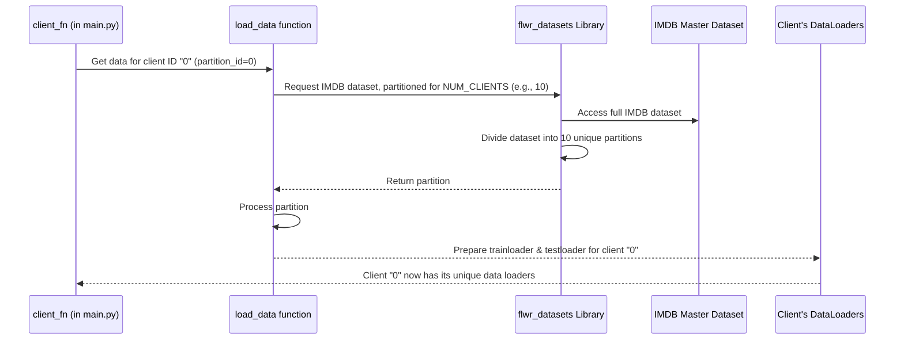

# Chapter 3: Decentralized Dataset Management (`load_data`)

In [Chapter 2: Federated Learning Simulation Engine](02_federated_learning_simulation_engine_.md), we saw how the `main.py` script orchestrates a Federated Learning simulation using Flower. The engine acts like a conductor, guiding multiple clients. But a crucial question is: how does each of these simulated clients get its *own* unique piece of data to learn from, just like in the real world where data is spread out?

This is where our "Decentralized Dataset Management" system, primarily handled by the `load_data` function, comes into play!

## What's the Big Idea? Fair Shares for Everyone!

Imagine a city-wide Food Bank that has a huge collection of food (our entire dataset, like all IMDB movie reviews). This Food Bank needs to distribute food parcels to many different local community centers (our clients).

Now, it wouldn't be very fair or efficient if every community center got the exact same parcel, or if they all had to sort through the entire Food Bank's stock. Instead, the Food Bank prepares specific, tailored parcels for each community center. Center A gets its allocated share, Center B gets its different allocated share, and so on. Neither center sees the other's parcel.

The `load_data` function does something very similar for our simulated clients in Federated Learning:

*   **It takes a complete dataset** (e.g., the IMDB movie review dataset).
*   **It splits this dataset into smaller, unique portions.**
*   **It assigns one unique portion to each client.**

This ensures that each client trains on different data, mimicking real-world scenarios where user data is naturally siloed on their own devices (like phones) or within different organizations (like hospitals). This is vital for simulating Federated Learning realistically.

## How Does `load_data` Work for a Client?

When the Federated Learning simulation starts, and it's time for a client to do some learning, the system needs to give that client its specific data. This is where `load_data` is called.

Think of it like this: Client number 5 (let's call her "Client Mia") is ready. The simulation engine says, "Hey, `load_data` function, can you please get the data for Client Mia?"

The `load_data` function then:
1.  Knows there's a big dataset (e.g., IMDB reviews).
2.  Knows how many total clients are participating (e.g., 10 clients).
3.  Figures out which specific slice of the IMDB dataset belongs to Client Mia (client ID 5).
4.  Prepares this slice so Client Mia's learning algorithm can easily use it.

Let's see how this is initiated in `main.py`. Remember the `client_fn` from Chapter 2, which sets up each client?

```python
# main.py (inside client_fn)

def client_fn(cid: str) -> fl.client.Client: # cid is the client's ID, e.g., "0", "1", ... "9"
    # ... model setup ...
    
    # Get the data for this specific client!
    # The `cid` (client ID) is passed as `int(cid)` to load_data
    trainloader, testloader = load_data(int(cid))
    
    # ... create and return the client instance with its data ...
    return IMDBClient(cid, model, trainloader, testloader).to_client()
```
In this snippet:
*   `cid` is the unique ID for the client being set up (e.g., "0", "1", "2", etc.).
*   `load_data(int(cid))` is the magic call. It tells `load_data` to fetch the data portion for *this specific `cid`*.
*   The function returns `trainloader` and `testloader`. These are like organized boxes of training data and testing data, specially prepared for the client.

## Under the Hood: How `load_data` Serves the Data

So, what happens inside the `load_data` function when it's asked to get data for, say, client "0"?

Let's visualize the process:



**Step-by-Step Breakdown:**

1.  **Request for Data:** The `client_fn` calls `load_data` with a specific `partition_id` (which is just the client's ID, like 0, 1, 2, etc.).
2.  **Accessing the Master Dataset:** `load_data` uses a helper from the Flower library called `FederatedDataset`. It tells `FederatedDataset`, "I need the 'imdb' dataset, and I want you to imagine it's pre-split for `NUM_CLIENTS` (e.g., 10 clients)."
    *   `FederatedDataset` might download the dataset if it's not already there, and it knows how to logically divide it without actually creating 10 separate copies on your disk yet.
3.  **Getting the Specific Slice:** `load_data` then asks `FederatedDataset` for the particular slice (partition) that matches the `partition_id`. So, if `partition_id` is 0, it gets the first slice; if it's 1, it gets the second, and so on. Each slice is unique.
4.  **Preparing the Data:** This raw slice of data isn't quite ready for a machine learning model.
    *   **Train/Test Split:** It's often split again into a smaller "training" piece (for the client to learn from) and a "testing" piece (for the client to check its learning).
    *   **Tokenization:** For text data like IMDB reviews, words are converted into numbers (tokens) that the model can understand. This is done by a "tokenizer."
    *   **Data Loaders:** Finally, the processed and tokenized data is put into special containers called `DataLoader`s. These `DataLoader`s feed the data to the model in an organized way (e.g., in small batches).
5.  **Ready for the Client:** `load_data` returns two `DataLoader`s: one for training (`trainloader`) and one for testing (`testloader`), both containing data *only* from that client's unique partition.

## A Peek into the `load_data` Code

Let's look at the key parts of the `load_data` function defined in `main.py`:

```python
# main.py

# Import the tool that helps us get pre-partitioned datasets
from flwr_datasets import FederatedDataset
# ... other imports for tokenizer, dataloader ...

# NUM_CLIENTS is defined elsewhere (e.g., NUM_CLIENTS = 10)
# MODEL_NAME is defined elsewhere (e.g., MODEL_NAME = "distilbert-base-uncased")

def load_data(partition_id): # partition_id is the client's ID (0, 1, 2...)
    
    # 1. Tell FederatedDataset about our dataset and how to split it
    fds = FederatedDataset(
        dataset="imdb",                     # We want the IMDB dataset
        partitioners={"train": NUM_CLIENTS} # Split the 'train' part for NUM_CLIENTS
    )

    # 2. Load the specific partition for this client
    partition = fds.load_partition(partition_id) # e.g., if partition_id is 0, get slice 0
    
    # 3. Split this client's partition into its own train and test sets
    partition_train_test = partition.train_test_split(test_size=0.2)
    
    # 4. Prepare for tokenization (converting text to numbers)
    tokenizer = AutoTokenizer.from_pretrained(MODEL_NAME)
    
    def tokenize_function(examples):
        # This function takes text and turns it into model-readable numbers
        return tokenizer(examples["text"], truncation=True)
    
    # Apply tokenization to the client's data
    partition_train_test = partition_train_test.map(tokenize_function, batched=True)
    
    # ... Some cleanup of columns ...
    
    # 5. Create DataLoaders to feed data to the model
    data_collator = DataCollatorWithPadding(tokenizer=tokenizer)
    trainloader = DataLoader(
        partition_train_test["train"], batch_size=16, collate_fn=data_collator
    )
    testloader = DataLoader(
        partition_train_test["test"], batch_size=16, collate_fn=data_collator
    )
    
    return trainloader, testloader
```

Let's break this down:

*   **`FederatedDataset(dataset="imdb", partitioners={"train": NUM_CLIENTS})`**:
    This is the starting point. We're saying we want the "imdb" dataset, and we want its "train" part to be virtually partitioned (divided) for `NUM_CLIENTS`. If `NUM_CLIENTS` is 10, it means the dataset will be split into 10 unique, non-overlapping chunks.

*   **`partition = fds.load_partition(partition_id)`**:
    This line actually fetches the specific chunk of data assigned to the client identified by `partition_id`. If `partition_id` is `0`, it gets the first chunk; if `1`, the second, and so on.

*   **`partition.train_test_split(test_size=0.2)`**:
    Each client's chunk is further divided. 80% (`test_size=0.2` means 20% for testing) becomes training data for that client, and 20% becomes its local testing data.

*   **`tokenizer = AutoTokenizer.from_pretrained(MODEL_NAME)` and `partition_train_test.map(tokenize_function, ...)`**:
    These lines handle turning the text reviews (e.g., "This movie was great!") into a sequence of numbers that the AI model (specified by `MODEL_NAME`) can process.

*   **`DataLoader(...)`**:
    These create the `trainloader` and `testloader` objects. They organize the client's data into batches, making it easy for the model to consume during training and evaluation. They also handle things like shuffling the data.

And that's it! The `load_data` function has successfully acted like our Food Bank, delivering a unique, prepared parcel of data to the requesting client.

## What We've Learned

*   **Decentralized Dataset Management** is crucial for realistic Federated Learning simulations, ensuring each client trains on different data.
*   The `load_data` function is responsible for this in our project.
*   It uses Flower's `FederatedDataset` utility to access a large dataset (like IMDB) and retrieve a unique **partition** (slice) for each client based on its `partition_id` (client ID).
*   This client-specific data partition is then further processed (split into train/test, tokenized) and prepared into `DataLoader`s.
*   This process mimics how data is naturally siloed in real-world FL scenarios. Each client gets its "tailored food parcel" without seeing others'.

Now that each client has its unique data, what does it actually *do* with it? How does it train a model and participate in the federated learning process? That's what we'll explore when we look at the client agent itself.

Up next: [Chapter 4: FL Client Agent (`IMDBClient`)](04_fl_client_agent___imdbclient___.md).

---

Generated by [AI Codebase Knowledge Builder](https://github.com/The-Pocket/Tutorial-Codebase-Knowledge)