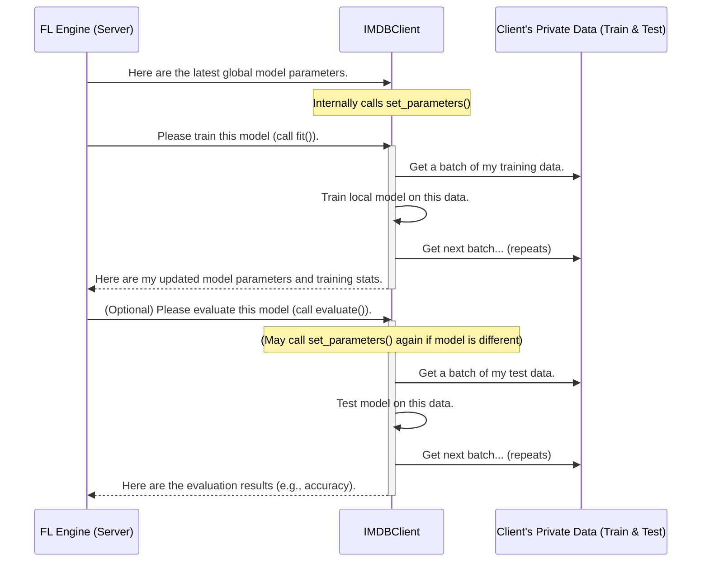

# Chapter 4: FL Client Agent (`IMDBClient`)

Welcome to Chapter 4! In [Chapter 3: Decentralized Dataset Management (`load_data`)](03_decentralized_dataset_management___load_data___.md), we learned how each simulated participant in our federated learning setup gets its own unique slice of the IMDB movie review dataset. Now, we'll look at the "participant" itself: the **FL Client Agent**, which in our project is called `IMDBClient`.

## What's the Big Idea? The Diligent Student

Imagine a large study group where students are learning a new subject (like predicting movie review sentiments). Each student has:
*   Their own **private set of textbooks and notes** (their local, private data).
*   A **copy of the group's current understanding** (the current shared model).

When the study session begins:
1.  Each student first updates their understanding based on the group's latest notes (gets the newest global model).
2.  Then, they study **privately** using their own textbooks to improve their understanding (train the model on their local data).
3.  Finally, they share **only summarized key insights** (model updates or improvements) with the group leader, not their entire set of notes or textbooks. This way, their private study materials remain private.

The `IMDBClient` in our project is exactly like one of these diligent students. It's an agent that:
*   Represents an individual participant (like a user's phone or a specific organization's data).
*   Holds its own private data, which it received via the `load_data` function we discussed in the previous chapter.
*   Keeps a local copy of the machine learning model.
*   Performs training on its local data when instructed by the central [Federated Learning Simulation Engine](02_federated_learning_simulation_engine_.md) (the "study group leader").
*   Sends only the learned changes (model parameters or updates) back, ensuring data privacy.

## The `IMDBClient`'s Responsibilities in Federated Learning

The Flower library, which powers our federated learning simulation (as seen in [Chapter 2: Federated Learning Simulation Engine](02_federated_learning_simulation_engine_.md)), expects each client to be able to perform a few key tasks. The `IMDBClient` implements these:

1.  **`get_parameters`**: When the server asks, "What have you learned?" or "What's your current model like?", the client packages up its model's learnable parts (weights and biases) and sends them.
2.  **`set_parameters`**: When the server says, "Here's the latest improved model from the group," the client updates its local model with these new parameters.
3.  **`fit`**: This is the "local study" phase. The server tells the client, "Take the current model, train it on your private data, and tell me what you've learned." The client trains, and then sends back its updated parameters and some training statistics.
4.  **`evaluate`**: This is like a local "quiz." The server might say, "Take this model (usually the latest global one) and see how well it performs on your private *test* data." The client runs the model on its local test set and reports back performance metrics like accuracy.

Let's see how these are put into action.

## A Day in the Life of an `IMDBClient` (One FL Round)

Here's how an `IMDBClient` interacts with the central server/engine during one round of federated learning:



**Step-by-Step "Study Session":**

1.  **Get Latest Notes (`set_parameters`)**: The Flower engine sends the current global model's parameters to the `IMDBClient`. The client updates its internal model with these.
2.  **Private Study (`fit`)**:
    *   The engine calls the `fit` method on the `IMDBClient`.
    *   The client uses its `trainloader` (which contains its private training data from `load_data`) to teach its local model. This usually involves going through the data multiple times or for a set number of steps.
    *   After training, the client prepares its *newly updated model parameters*.
    *   It sends these parameters (the "key insights") back to the engine, along with how many data samples it trained on.
3.  **Local Quiz (`evaluate`, optional but common)**:
    *   The engine might then call the `evaluate` method.
    *   The client takes the model (often the one it just received before `fit`, or a new global one) and tests it on its private *test* data (from `testloader`).
    *   It calculates how well the model did (e.g., its accuracy) and sends these results back to the engine.

This cycle repeats for many rounds, with the global model hopefully getting better each time.

## A Peek Inside `IMDBClient` (Code from `main.py`)

Our `IMDBClient` is a Python class that inherits from `fl.client.NumPyClient`. This base class from Flower helps manage the communication, expecting model parameters to be exchanged as NumPy arrays.

**1. Setting Up the Client (`__init__`)**

When an `IMDBClient` is created (we'll see how in a bit), it needs its ID, a copy of the model, and its unique data loaders.

```python
# main.py (Simplified from class IMDBClient)

# DEVICE is set elsewhere, e.g., to use a GPU if available
# DEVICE = torch.device("cuda" if torch.cuda.is_available() else "cpu")

class IMDBClient(fl.client.NumPyClient):
    def __init__(self, cid, model, trainloader, testloader):
        self.cid = cid               # Client's unique ID (e.g., "0", "1")
        self.model = model           # Its personal copy of the AI model
        self.trainloader = trainloader # Loader for its private training data
        self.testloader = testloader   # Loader for its private test data
        # self.model.to(DEVICE) # Move model to CPU/GPU (done in client_fn)
```
This is like giving the student their ID badge, a blank notebook (the initial model), their textbooks (`trainloader`), and practice quizzes (`testloader`).

**2. Sharing Its Knowledge (`get_parameters`)**

This method is called by Flower when the server wants the client's current model parameters.

```python
# main.py (Inside class IMDBClient)
    def get_parameters(self, config=None):
        # Collect all learnable parts (weights) from the model
        # Convert them to NumPy arrays for Flower
        return [val.cpu().numpy() for _, val in self.model.state_dict().items()]
```
The `model.state_dict()` gives all the model's parameters (weights and biases). These are converted to NumPy arrays and returned as a list.

**3. Receiving Wisdom (`set_parameters`)**

When Flower sends updated parameters from the server, this method is used to load them into the client's local model.

```python
# main.py (Inside class IMDBClient)
    def set_parameters(self, parameters):
        # Get the names of the model's layers/parameters
        keys = self.model.state_dict().keys()
        
        # Match received parameters with model's layers
        params_dict = zip(keys, parameters)
        
        # Create a dictionary of state: layer_name -> parameter_tensor
        # Ensure parameters are PyTorch tensors and on the correct device
        state_dict = OrderedDict(
            {k: torch.tensor(v).to(self.model.device) for k, v in params_dict}
        )
        self.model.load_state_dict(state_dict, strict=True)
```
This carefully takes the list of NumPy arrays (`parameters`), matches them to the corresponding parts of the client's `self.model`, converts them to PyTorch Tensors, and loads them. The `self.model.device` ensures they are on the same device (CPU/GPU) as the model.

**4. The Learning Process (`fit`)**

This is where the client trains its model on its local data. The actual training loop can be quite involved, so we'll show a simplified representation.

```python
# main.py (Inside class IMDBClient)
    def fit(self, parameters, config):
        self.set_parameters(parameters) # Update model with server's parameters
        self.model.train()              # Set model to "training mode"
        
        # --- Simplified Training ---
        # An optimizer is set up here (e.g., AdamW)
        # The client iterates through its self.trainloader:
        # For each batch of data:
        #   1. Move data to the model's device (CPU/GPU)
        #   2. Model makes predictions
        #   3. Calculate error (loss)
        #   4. Adjust model weights to reduce error (backpropagation & optimizer step)
        # Loss and number of examples are tracked.
        # --- End Simplified Training ---

        # After training, we'll save the weights.
        # This is important for analysis covered in 
        # [Chapter 5: Model Weight Archiving & Scrutiny](05_model_weight_archiving___scrutiny_.md)
        # (Actual weight saving code from main.py is here)

        num_examples_trained = len(self.trainloader.dataset) # Total data points used
        # Return the updated model parameters, number of samples, and any metrics
        return self.get_parameters(), num_examples_trained, {"loss": 0.123} # Dummy loss
```
Key takeaways:
*   It first calls `self.set_parameters()` to get the latest global model.
*   It then trains this model using its `self.trainloader`.
*   Finally, it returns its *new* local model parameters using `self.get_parameters()`, the number of data samples it trained on, and a dictionary of metrics (here, just a dummy loss).

**5. The Evaluation Process (`evaluate`)**

This method tests how well a given set of model parameters performs on the client's local test data.

```python
# main.py (Inside class IMDBClient)
    def evaluate(self, parameters, config):
        self.set_parameters(parameters) # Update model with server's parameters
        self.model.eval()               # Set model to "evaluation mode"
        
        # --- Simplified Evaluation ---
        # The client iterates through its self.testloader (no gradients needed):
        # For each batch of data:
        #   1. Move data to the model's device
        #   2. Model makes predictions
        #   3. Compare predictions to true labels to count correct ones
        #   4. Calculate loss
        # Accuracy and loss are tracked.
        # --- End Simplified Evaluation ---

        num_examples_tested = len(self.testloader.dataset)
        accuracy = 0.75 # Calculate actual accuracy here
        loss = 0.456    # Calculate actual loss here
        return float(loss), num_examples_tested, {"accuracy": accuracy}
```
Key takeaways:
*   It updates its model with the provided `parameters`.
*   It uses `self.testloader` (the client's private test set) to see how good the model is.
*   It returns the loss, the number of test samples, and a dictionary with metrics like "accuracy."

## How is an `IMDBClient` Birthed?

Remember the `client_fn` from [Chapter 2: Federated Learning Simulation Engine](02_federated_learning_simulation_engine_.md)? That's the function Flower calls whenever it needs to create a client for the simulation.

```python
# main.py (Simplified client_fn)
# NUM_CLIENTS, MODEL_NAME, DEVICE are defined elsewhere

def client_fn(cid: str) -> fl.client.Client: # cid is like "0", "1", ...
    # 1. Create a fresh model instance for this client
    model = AutoModelForSequenceClassification.from_pretrained(
        MODEL_NAME, num_labels=2
    )
    model.to(DEVICE) # Move model to the designated CPU/GPU

    # 2. Load this client's unique data partition (Chapter 3)
    trainloader, testloader = load_data(partition_id=int(cid))
    
    # 3. Create and return the IMDBClient agent for this client
    return IMDBClient(cid, model, trainloader, testloader).to_client()
```
So, for each simulated participant, `client_fn` does three main things:
1.  Creates a new, fresh copy of the AI model.
2.  Calls `load_data` (from [Chapter 3: Decentralized Dataset Management (`load_data`)](03_decentralized_dataset_management___load_data___.md)) to get the specific data for that client ID (`cid`).
3.  Initializes an `IMDBClient` instance with this model and data, and then calls `.to_client()` to make it ready for Flower.

## What We've Learned

*   The **`IMDBClient`** is our project's FL Client Agent, acting like an individual student in a federated learning "study group."
*   It holds its own private data (thanks to `load_data`) and a local copy of the model.
*   It implements key methods required by Flower:
    *   `get_parameters()`: To send its model state to the server.
    *   `set_parameters()`: To receive model updates from the server.
    *   `fit()`: To train the model on its local data and send back improvements.
    *   `evaluate()`: To test a model on its local data and report performance.
*   This design ensures that the client's raw data never leaves its simulated environment, only model parameters (insights) are exchanged.
*   The `client_fn` in `main.py` is responsible for creating these `IMDBClient` instances.

The `IMDBClient` plays a crucial role, not just in training, but also in how its model weights change over time. These changes can tell us a lot. In the next chapter, we'll explore how we save these weights and get ready to scrutinize them.

Up next: [Chapter 5: Model Weight Archiving & Scrutiny](05_model_weight_archiving___scrutiny_.md).

---

Generated by [AI Codebase Knowledge Builder](https://github.com/The-Pocket/Tutorial-Codebase-Knowledge)