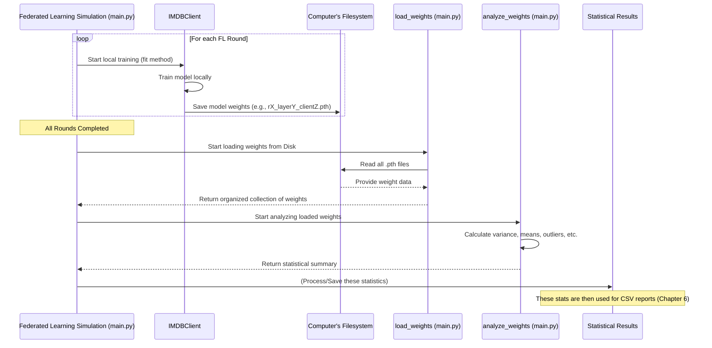

# Chapter 5: Model Weight Archiving & Scrutiny

Welcome to Chapter 5! In [Chapter 4: FL Client Agent (`IMDBClient`)](04_fl_client_agent___imdbclient___.md), we got to know the `IMDBClient`, our diligent student who learns from its private data and contributes to the global model. Now, we're going to peek into its "notebook" – the actual learned parameters, or "weights," of its model. This chapter is about how we save these weights, and then later examine them to understand what's happening inside our federated learning system.

## What's the Big Idea? Inspecting the Bridge's Components

Imagine you're an engineer building a massive, complex bridge (our global AI model). This bridge is made of many components, and each component is built or tested by different teams (our clients). As an engineer, you'd want to meticulously record test results from each component after each stress test. You'd then analyze these recordings to:
*   See how different components are behaving.
*   Check if any component is showing unusual stress (an anomaly).
*   Understand how the overall bridge structure is strengthening (or weakening) over time.

"Model Weight Archiving & Scrutiny" is just like this.
*   **Archiving**: After each client (team) finishes its local training (a "stress test"), we save the internal parameters (weights) of its model (the "test results" from that component).
*   **Scrutiny**: Later, we load these saved weights and perform statistical analysis on them (like calculating averages, how much they vary, and looking for unusual values or "outliers").

This helps us understand the training dynamics: Are all clients learning similarly? Are some clients struggling or behaving strangely? Is the overall learning process stable?

## Why Look Inside the Model's "Brain"?

Model weights are the numerical values that a machine learning model learns during training. They represent the "knowledge" captured by the model. By saving and analyzing these weights from each client at different stages of federated learning, we can:

*   **Understand Training Dynamics**: See how weights change over rounds and across different clients. Are they smoothly converging, or are they wildly fluctuating?
*   **Identify Anomalies**: Detect if a client's model weights are significantly different from others. This could indicate issues like:
    *   The client having very different data.
    *   A problem with the client's training process.
    *   Potentially, a misbehaving or "malicious" client trying to disrupt learning (though our current project focuses on normal behavior).
*   **Debug and Improve**: If the overall model isn't learning well, inspecting weights can give clues about what might be going wrong.
*   **Research**: For researchers, analyzing weight divergence and convergence is key to understanding and developing new federated learning algorithms.

In our `for_dataset` project, this scrutiny is particularly focused on calculating statistics like variance (how spread out the weights are), means (average weight values), and detecting outliers.

## The Two Main Steps: Archiving & Scrutiny

Let's break down this process.

### Step 1: Archiving - Saving the "Stress Test Results"

Every time an [FL Client Agent (`IMDBClient`)](04_fl_client_agent___imdbclient___.md) finishes its local training round (the `fit` method), we save its model's weights.

**When and Where?**
This happens at the end of the `fit` method within the `IMDBClient` class (defined in `main.py`). The weights are saved as individual files, typically in a dedicated directory. In our `main.py` script, this directory is specified by the variable `directory1` (e.g., `'weight_pth_file_normal(10c10r)'`).

**What Do the Saved Files Look Like?**
Each saved file usually contains the weights for a *specific layer* from a *specific client* for a *specific round*. The naming convention helps us identify them later. In `main.py`, the filename looks something like this:
`r<round_number>_<layer_name>_client<client_id>.pth`

For example:
*   `r1_distilbert.embeddings.word_embeddings.weight_client0.pth`: Weights for the "word_embeddings" layer from client "0" after round 1.
*   `r5_pre_classifier.weight_client3.pth`: Weights for the "pre_classifier" layer from client "3" after round 5.

The `<round_number>` in the filename is determined by counting how many times that particular client has saved weights for that particular layer. In a standard FL setup where `fit` is called once per client per FL round, this count effectively becomes the FL round number.

Let's see a simplified piece of code from `IMDBClient.fit` in `main.py` that does this saving:

```python
# Inside IMDBClient.fit() method in main.py
# (After local training is done)

# Get the model's current state (all layers and their weights)
state_dict = self.model.state_dict() 

# Loop through each layer and its weights
for layer_name, weight_tensor in state_dict.items():
    # We're interested in actual weight parameters, not biases etc.
    if ".weight" in layer_name: 
        # Determine how many times this client/layer has saved weights before
        # This count becomes our round identifier in the filename
        # (directory1 is like 'weight_pth_file_normal(10c10r)')
        num_existing = len([f for f in os.listdir(directory1) 
                            if f.endswith(f'_{layer_name}_client{self.cid}.pth')])
        
        round_for_filename = num_existing + 1
        filename = f"r{round_for_filename}_{layer_name}_client{self.cid}.pth"
        
        # Save the weight_tensor to a file
        # os.path.join correctly creates the full path, e.g.,
        # 'weight_pth_file_normal(10c10r)/r1_some_layer.weight_client0.pth'
        torch.save(weight_tensor, os.path.join(directory1, filename))
```
This code snippet iterates through all parts of the model. If a part is a "weight" parameter, it constructs a unique filename indicating the round (based on previous saves for this client/layer), layer name, and client ID. Then, `torch.save()` writes the actual weight values (the `weight_tensor`) into that file. The result is a folder full of `.pth` files, which are our archived weights.

### Step 2: Scrutiny - Examining the Results

After the [Federated Learning Simulation Engine](02_federated_learning_simulation_engine_.md) (from `main.py`) has completed all its rounds, and all the relevant weights have been saved, the "scrutiny" part begins. This is also handled by `main.py`, after the `fl.simulation.start_simulation(...)` call.

This involves two sub-steps:
1.  **Loading the Saved Weights**: We need to read all those `.pth` files back into memory.
2.  **Analyzing the Weights**: Once loaded, we perform calculations on them.

**A. Loading the Weights (`load_weights` function)**

The `load_weights` function in `main.py` is responsible for going through the `directory1` (where weights were saved), reading each `.pth` file, and organizing them.

```python
# Simplified from load_weights() in main.py
import glob # For finding files matching a pattern
import os   # For path operations
import torch # For loading .pth files

def load_weights(directory_path):
    weights_collection = {} # A dictionary to store all loaded weights
    
    # Find all .pth files in the given directory
    for filepath in glob.glob(os.path.join(directory_path, "*.pth")):
        filename = os.path.basename(filepath) # e.g., r1_layer.weight_client0.pth
        
        # Parse filename to get round, layer_name, client_id
        parts = filename.split('_')
        round_num = int(parts[0][1:]) # "r1" -> 1
        layer_name = '_'.join(parts[1:-1]) # Reconstruct layer name
        client_id_str = parts[-1][6:-4] # "client0.pth" -> "0"
        
        # Load the actual weight tensor from the file
        weight_data = torch.load(filepath).cpu().numpy() # Load and convert to NumPy array
        
        # Organize into a nested dictionary:
        # weights_collection[layer_name][round_num] will be a list of weights from all clients
        if layer_name not in weights_collection:
            weights_collection[layer_name] = {}
        if round_num not in weights_collection[layer_name]:
            weights_collection[layer_name][round_num] = []
        weights_collection[layer_name][round_num].append(weight_data)
        
    return weights_collection
```
This function:
1.  Uses `glob.glob` to find all file paths ending with `.pth` in the specified `directory_path`.
2.  For each file, it extracts the `round_num`, `layer_name`, and `client_id_str` from the filename.
3.  `torch.load(filepath)` reads the tensor data from the file. `.cpu().numpy()` converts it to a NumPy array (a common format for numerical operations) and ensures it's on the CPU.
4.  It stores these NumPy arrays in a nested dictionary, making it easy to access, for example, all weights for "layer_X" from "round_Y".

**B. Analyzing the Weights (`analyze_weights` function)**

Once the weights are loaded and organized by `load_weights`, the `analyze_weights` function takes over. It iterates through the weights for each layer and each round, calculating various statistics.

```python
# Simplified from analyze_weights() in main.py
import numpy as np
from scipy import stats # For Z-score calculation (outlier detection)

def analyze_weights(loaded_weights_collection):
    analysis_summary = {}
    
    for layer_name, rounds_data in loaded_weights_collection.items():
        analysis_summary[layer_name] = {}
        for round_num, client_weights_list in rounds_data.items():
            # client_weights_list is a list of NumPy arrays (weights from each client for this layer/round)
            client_weights_array = np.array(client_weights_list)
            
            # Calculate variance across clients for this layer/round
            # axis=0 means calculate variance across the "clients" dimension
            variance_per_weight_element = np.var(client_weights_array, axis=0)
            mean_variance = np.mean(variance_per_weight_element)
            
            # Detect outliers using Z-scores
            # A Z-score tells how many standard deviations a data point is from the mean.
            # Values with Z-score > 3 are often considered outliers.
            z_scores = np.abs(stats.zscore(client_weights_array, axis=0))
            num_outliers = (z_scores > 3).sum() # Count how many elements are outliers
            
            # ... calculate other stats like min, max, mean, median of weights ...
            # (The full function in main.py calculates more detailed weight statistics)
            
            analysis_summary[layer_name][round_num] = {
                'mean_variance': mean_variance,
                'outliers': num_outliers,
                # ... other_stats ...
            }
    return analysis_summary
```
For each layer and round, this function:
1.  Converts the list of individual client weights (which are NumPy arrays themselves) into a single, larger NumPy array `client_weights_array`. If there are 10 clients and a layer has 100 weights, this array might be shaped (10, 100).
2.  `np.var(..., axis=0)`: Calculates the variance for *each weight position* across all clients. For example, it compares the first weight from client 0, client 1, ..., client 9, and finds the variance of these 10 values. Then it does this for the second weight, and so on. `mean_variance` then averages these variances. A high variance suggests clients' weights for this layer are very spread out.
3.  `stats.zscore(...)`: Calculates Z-scores for each weight from each client, relative to the mean and standard deviation of weights *at that position* across other clients. If a client's specific weight is very far from what other clients have for that same weight, it gets a high Z-score.
4.  `num_outliers`: Counts how many weight values are considered outliers (Z-score > 3).
5.  The actual function in `main.py` also calculates the minimum, maximum, mean, median, standard deviation, and quartiles of the weight values themselves.

The `analysis_summary` is a dictionary containing these statistical insights for every layer at every round. This is the "scrutiny" result!

## The Bigger Picture: From Training to Insights

Let's visualize the overall workflow:


1.  During the Federated Learning simulation, each `IMDBClient` saves its weights to disk after its local training in each round.
2.  After the simulation finishes, `main.py` calls `load_weights` to read all these saved files.
3.  Then, `main.py` calls `analyze_weights` to compute statistics from these loaded weights.
4.  These statistics (variance, outlier counts, etc.) are then ready to be further processed, often by being saved into a summary file, which we'll see in the next chapter.

## What We've Learned

*   **Model Weight Archiving** is the process of saving a client's model parameters (weights) after local training, usually to disk.
    *   In `main.py`, `IMDBClient.fit()` saves weights of specific layers as `.pth` files.
    *   Filenames include round, layer name, and client ID for easy identification.
*   **Model Weight Scrutiny** is the process of loading these archived weights and performing statistical analysis on them.
    *   `load_weights()` in `main.py` reads and organizes the saved `.pth` files.
    *   `analyze_weights()` in `main.py` calculates metrics like variance, mean, and detects outliers across client weights for each layer and round.
*   This entire process helps us understand how models are evolving across clients and rounds, similar to an engineer inspecting bridge components.
*   The insights gained can reveal training dynamics, identify anomalies, and help debug the FL process.

The statistics we generate from this scrutiny don't just disappear! They form the basis of comprehensive reports that summarize the experiment. How these reports are created is our next topic.

Up next: [Chapter 6: Structured Results Reporting (CSV Generation)](06_structured_results_reporting__csv_generation__.md).

---

Generated by [AI Codebase Knowledge Builder](https://github.com/The-Pocket/Tutorial-Codebase-Knowledge)