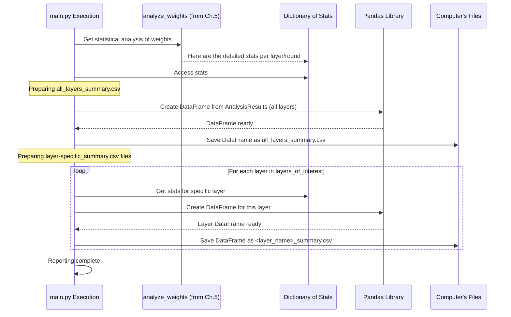

# Chapter 6: Structured Results Reporting (CSV Generation)

Welcome to Chapter 6! In the previous chapter, [Chapter 5: Model Weight Archiving & Scrutiny](05_model_weight_archiving___scrutiny_.md), we saw how `main.py` saves and analyzes the "weights" (learned parameters) of our client models after each round of training. This gives us a treasure trove of information about how each client is learning. But raw data and complex statistical dictionaries aren't always easy to work with or understand at a glance.

This is where **Structured Results Reporting** comes in!

## What's the Big Idea? The Accountant's Summary

Imagine you're running a big company. Every day, countless transactions happen. At the end of the month, your accountant doesn't just hand you a giant box of all the receipts and say "Good luck!" Instead, they prepare **detailed financial statements and summaries** – like profit and loss statements, balance sheets, and key performance indicators. These reports organize the raw data into a structured, understandable format, making it easy to see how the company is doing, compare performance over time, and make informed decisions.

Our "Structured Results Reporting" system in `for_dataset` acts like that diligent accountant for our federated learning experiments. It takes:
1.  The detailed statistical analysis of model weights we generated in Chapter 5 (e.g., how much weights vary, number of unusual 'outlier' weights).
2.  Information about the experiment setup (like the type of attack simulated, if any).
3.  Performance metrics from the federated learning process itself, like accuracy or loss values (though our current `main.py` focuses primarily on weight statistics for the main summary CSV, overall model performance metrics are indeed calculated by clients as seen in [Chapter 4: FL Client Agent (`IMDBClient`)](04_fl_client_agent___imdbclient___.md)).

It then organizes all this information and exports it into **CSV (Comma-Separated Values) files**.

## What's a CSV File, and Why Use It?

A CSV file is a simple text file where data is stored in a table-like format.
*   Each line in the file represents a **row** of data.
*   Within each row, values are separated by **commas** (hence "Comma-Separated").
*   The first line often contains **headers**, which are names for each column.

Here’s a tiny example of what CSV data might look like:
```csv
Round,Layer,Mean_Variance,Outliers
1,embeddings.weight,0.0025,2
1,classifier.weight,0.0010,0
2,embeddings.weight,0.0023,1
```

**Why are CSVs so handy?**
*   **Human-Readable**: You can open them in a simple text editor and see the data.
*   **Spreadsheet-Friendly**: Programs like Microsoft Excel, Google Sheets, or LibreOffice Calc can easily open, display, and let you work with CSV files as if they were regular spreadsheets.
*   **Easy to Process**: Many programming languages (including Python, using libraries like `pandas`) can read and write CSV files effortlessly.
*   **Good for Analysis & Visualization**: Once your data is in a CSV, it's much easier to perform further analysis, create charts, or feed it into other data tools.

## What Gets Reported in `main.py`?

After our [Federated Learning Simulation Engine](02_federated_learning_simulation_engine_.md) finishes all its rounds and the [Model Weight Archiving & Scrutiny](05_model_weight_archiving___scrutiny_.md) phase has produced its `analysis_results`, `main.py` gets to work creating these structured reports.

It mainly generates two types of CSV files:

1.  **An Overall Summary (`all_layers_summary.csv`)**: This file contains the statistical analysis results for *all* relevant layers of the model, across *all* rounds of federated learning, from a single run of `main.py`.
2.  **Layer-Specific Summaries (e.g., `pre_classifier.weight_summary.csv`)**: For a few pre-selected "layers of interest," `main.py` also creates individual CSV files that just contain the stats for that specific layer over all rounds. This can be useful for focused analysis on key parts of the model.

Let's see how these are made.

### 1. The Grand Ledger: `all_layers_summary.csv`

This is the main report. It combines the insights from the `analysis_results` (which we learned about in Chapter 5) into a single, comprehensive CSV file.

**How it's Created in `main.py`:**

The script iterates through the `analysis_results` dictionary, which holds statistics for each layer at each round. For every layer and round, it creates a new row of data for our summary.

```python
# Simplified from main.py - after analyze_weights()

# analysis_results is the dictionary from analyze_weights()
# attack_type, MALICIOUS_NODE_RATIO, etc. are predefined variables

all_layers_data_rows = [] # Start with an empty list to collect rows
for layer_name, rounds_data in analysis_results.items():
    for round_number, stats in rounds_data.items():
        # Create a dictionary for one row of data
        row = {
            'Round': round_number,
            'Layer': layer_name,
            'Mean_Variance': stats['mean_variance'],
            'Number_of_outliers': stats['outliers'],
            'Weight_Min': stats['weight_min'], # Min weight value
            'Weight_Max': stats['weight_max'], # Max weight value
            'Weight_Mean': stats['weight_mean'], # Average weight value
            # ... other statistics like median, std, quartiles ...
            'First_Weight': stats['first_weight'], # The very first weight value
            'Attack_Type': attack_type, # Experiment setting
            # ... other experiment settings ...
        }
        all_layers_data_rows.append(row)

# Convert the list of rows into a pandas DataFrame (a table structure)
import pandas as pd
summary_df = pd.DataFrame(all_layers_data_rows)

# Define where to save it and the filename
# summary_directory is 'summary_results_normal(10c10r)'
# summary_csv_file_name is "all_layers_summary.csv"
output_path = os.path.join(summary_directory, summary_csv_file_name)

# Save the DataFrame to a CSV file!
summary_df.to_csv(output_path, index=False) # index=False means don't write row numbers
```

Let's break this down:
1.  We loop through `analysis_results`. `layer_name` could be "distilbert.embeddings.word_embeddings.weight", `round_number` could be 1, 2, etc., and `stats` is the dictionary of calculated statistics for that specific layer and round (e.g., `{'mean_variance': 0.005, 'outliers': 3, ...}`).
2.  For each combination, we create a `row` dictionary mapping column names (like 'Round', 'Layer') to their values.
3.  All these `row` dictionaries are collected in the `all_layers_data_rows` list.
4.  `pd.DataFrame(all_layers_data_rows)`: The `pandas` library (often imported as `pd`) is a powerful tool for working with data in Python. This line converts our list of dictionaries into a `DataFrame`, which is like an in-memory spreadsheet.
5.  `summary_df.to_csv(output_path, index=False)`: This magical line tells pandas to take the `DataFrame` and write it out to the `output_path` as a CSV file. `index=False` prevents pandas from writing its own row numbers into the file, as we already have our 'Round' column.

**What does `all_layers_summary.csv` contain?**
Each row in this file represents a specific model layer at a specific federated learning round. The columns typically include:
*   `Round`: The federated learning round number.
*   `Layer`: The name of the model layer (e.g., "pre_classifier.weight").
*   `Mean_Variance`: The average variance of weights for that layer, across clients, at that round.
*   `Number_of_outliers`: The count of weight values considered outliers for that layer/round.
*   `Weight_Min`, `Weight_Max`, `Weight_Mean`, `Weight_Median`, `Weight_Std`, `Weight_Q25`, `Weight_Q75`: Various statistical measures of the actual weight values themselves.
*   `First_Weight`: The value of the very first weight element in that layer's tensor (can be useful for quick checks or tracking a specific parameter).
*   `Attack_Type`, `MALICIOUS_NODE_RATIO`, `MALICIOUS_DATA_RATIO`: Information about the experimental setup.

This `all_layers_summary.csv` file is crucial because, as we saw in [Chapter 1: Automated Experiment Conductor (`run_and_collect.py`)](01_automated_experiment_conductor___run_and_collect_py___.md), the `run_and_collect.py` script reads this file after each `main.py` run to aggregate results into a larger dataset.

### 2. Focused Reports: Layer-Specific Summaries

Sometimes, you might be particularly interested in how specific layers of your model are behaving. For this, `main.py` also generates separate CSV files for a predefined list of `layers_of_interest`.

```python
# Simplified from main.py

layers_of_interest = [
    "distilbert.embeddings.LayerNorm.weight",
    # ... other important layer names ...
    "pre_classifier.weight"
]

for layer_name_to_check in layers_of_interest:
    layer_specific_rows = []
    if layer_name_to_check in analysis_results: # Check if we have data for it
        for round_number, stats in analysis_results[layer_name_to_check].items():
            # Create a row, similar to all_layers_summary but might be simpler
            row = {
                "Round": round_number,
                "Mean_Variance": stats['mean_variance'],
                "Number_of_outliers": stats['outliers'],
                # ... other relevant stats from 'stats' ...
            }
            layer_specific_rows.append(row)
        
        # Create DataFrame and save to CSV for this specific layer
        layer_df = pd.DataFrame(layer_specific_rows)
        # Filename like 'layer_specific_results/pre_classifier.weight_summary.csv'
        layer_output_path = os.path.join(layer_specific_directory, 
                                         f"{layer_name_to_check}_summary.csv")
        layer_df.to_csv(layer_output_path, index=False)
```
This code:
1.  Defines a `layers_of_interest` list.
2.  Loops through each `layer_name_to_check` in this list.
3.  If data exists for that layer in `analysis_results`, it collects all round-specific statistics for *just that layer*.
4.  It then creates a pandas DataFrame and saves it to a CSV file named after the layer (e.g., `pre_classifier.weight_summary.csv`) inside the `layer_specific_directory`.

These focused reports make it easier to track the behavior of critical model components without needing to filter the larger `all_layers_summary.csv`.

## The Reporting Pipeline

Let's visualize how these CSV reports are generated at the end of a `main.py` run:



This diagram shows `main.py` coordinating with the `analyze_weights` output and the Pandas library to produce the final CSV files stored on your computer's filesystem.

**What about overall performance metrics like accuracy?**
As mentioned, the `IMDBClient` (Chapter 4) calculates metrics like accuracy and loss during training (`fit`) and evaluation (`evaluate`). The Flower framework ([Chapter 2: Federated Learning Simulation Engine](02_federated_learning_simulation_engine_.md)) collects and can aggregate these. While the `main.py` script we've examined focuses on saving detailed *weight statistics* into `all_layers_summary.csv`, these client-level and aggregated server-level performance metrics (like average accuracy per round) are also very important. They are typically logged by Flower itself or available through its `History` object after a simulation. For a more comprehensive analysis, you might:
*   Modify `main.py` to explicitly save these Flower-aggregated metrics into a separate CSV or merge them.
*   Use Flower's built-in logging capabilities to capture them.

For the purpose of `for_dataset` and the `run_and_collect.py` script, the `all_layers_summary.csv` containing detailed weight behavior is the key output for understanding model stability and detecting anomalies across multiple experimental runs.

## What We've Learned

*   **Structured Results Reporting** is like an accountant creating easy-to-understand financial statements from complex data.
*   It organizes federated learning experiment outputs (primarily detailed model weight statistics from [Chapter 5: Model Weight Archiving & Scrutiny](05_model_weight_archiving___scrutiny_.md) and experiment settings) into **CSV files**.
*   **CSV files** are text-based, table-like, and easily used by spreadsheets or programming tools.
*   `main.py` uses the **Pandas library** to create and save these CSVs.
*   Key outputs include:
    *   `all_layers_summary.csv`: A comprehensive report of weight statistics for all layers across all rounds for one `main.py` run. This is vital for the [Automated Experiment Conductor (`run_and_collect.py`)
](01_automated_experiment_conductor___run_and_collect_py___.md).
    *   Layer-specific CSVs: Focused reports for predefined important layers.
*   These reports make complex experimental data accessible for review, comparison, and further analysis.

This chapter concludes our journey through the core components of the `for_dataset_v2` project! We've seen how experiments are automated, how federated learning is simulated, how data is managed for clients, what clients do, how their internal workings (weights) are saved and scrutinized, and finally, how all this information is neatly reported.

We hope this tutorial has given you a clear and beginner-friendly understanding of how these pieces fit together. Happy experimenting!

---

Generated by [AI Codebase Knowledge Builder](https://github.com/The-Pocket/Tutorial-Codebase-Knowledge)