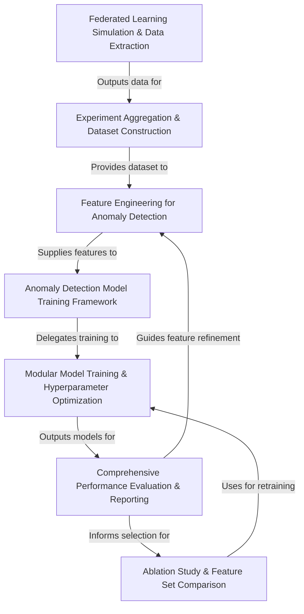

# Tutorial: explanation

This project simulates **Federated Learning (FL)** environments to generate experimental data. This data, which includes metrics like model *weight statistics* from different clients and rounds (possibly under attack conditions), is then collected and organized into a comprehensive dataset. Subsequently, this dataset powers a machine learning pipeline designed to train and evaluate various **anomaly detection models**. The core goal is to effectively identify malicious activities or *attacks* occurring within the simulated FL processes. The project also focuses on optimizing these models through *hyperparameter tuning*, understanding which *features* are most important via techniques like *ablation studies*, and comparing different model performances.

**Source Repository:** [None](None)

## Chapters

1. [Federated Learning Simulation & Data Extraction
](01_federated_learning_simulation___data_extraction_.md)
2. [Experiment Aggregation & Dataset Construction
](02_experiment_aggregation___dataset_construction_.md)
3. [Feature Engineering for Anomaly Detection
](03_feature_engineering_for_anomaly_detection_.md)
4. [Anomaly Detection Model Training Framework
](04_anomaly_detection_model_training_framework_.md)
5. [Modular Model Training & Hyperparameter Optimization
](05_modular_model_training___hyperparameter_optimization_.md)
6. [Comprehensive Performance Evaluation & Reporting
](06_comprehensive_performance_evaluation___reporting_.md)
7. [Ablation Study & Feature Set Comparison
](07_ablation_study___feature_set_comparison_.md)

---

Generated by [AI Codebase Knowledge Builder](https://github.com/The-Pocket/Tutorial-Codebase-Knowledge)