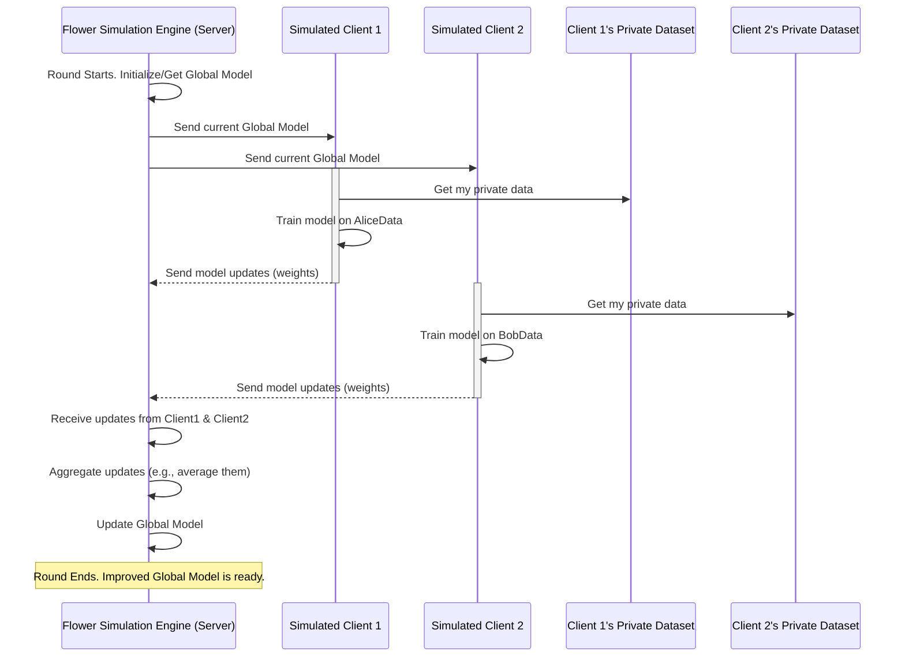

# Chapter 2: Federated Learning Simulation Engine

In [Chapter 1: Automated Experiment Conductor (`run_and_collect.py`)](01_automated_experiment_conductor___run_and_collect_py___.md), we learned how `run_and_collect.py` automates running our main experiment multiple times. Now, let's dive into what that "main experiment" (`main.py`) actually does. At its core, `main.py` sets up and runs a **Federated Learning Simulation Engine**.

## What's the Big Idea? The Orchestra Conductor

Imagine a group of musicians, each wanting to contribute to a beautiful symphony. However, they are very private and don't want to share their individual sheet music or practice sessions with anyone else, not even the conductor directly. How can they create a harmonious piece together?

This is similar to a common problem in machine learning: we have lots of data spread across many devices (like phones or hospitals), but this data is private and cannot be moved to a central place for training a model.

The **Federated Learning Simulation Engine** is like a very skilled conductor for this unique orchestra.
*   Each **musician** is a "client" (e.g., a simulated phone or hospital server).
*   Each client has its own **private data** (their personal sheet music and practice notes).
*   The clients **practice locally** (train a machine learning model on their own data).
*   They then share **insights** from their practice (model improvements, like "my part sounds better if I play these notes this way") with the conductor, but *not* their raw sheet music.
*   The **conductor (the Engine)** intelligently combines these insights to improve the overall symphony (the shared, global machine learning model).

This engine, powered by a library called **Flower (fl)**, manages this whole collaborative learning process without any client needing to reveal its private data. It dictates how many "practice sessions" (rounds of training) there are, how insights are combined, and the entire workflow.

## How Does Federated Learning Work (In a Nutshell)?

Federated Learning (FL) is a training technique that allows multiple devices (clients) to build a good, shared machine learning model together, without sharing their actual private data. Here's the basic recipe:

1.  **Start**: The "conductor" (server) has an initial version of the model (an empty score or a basic tune).
2.  **Distribute**: The server sends this current model to a selection of clients.
3.  **Local Training**: Each client takes the model and improves it using *only its own local data*. This is like each musician practicing their part using the conductor's latest score version.
4.  **Share Updates**: Each client sends its *improvements* (changes to the model, often called "weights" or "parameters") back to the server. They don't send their data!
5.  **Aggregate**: The server collects these updates and intelligently combines them (e.g., by averaging them) to create a new, improved global model. This is like the conductor listening to suggestions and refining the main score.
6.  **Repeat**: Steps 2-5 are repeated for several "rounds." With each round, the global model (the symphony) hopefully gets better and better.

Our `main.py` script simulates this entire process.

## The Engine in Action: Using Flower in `main.py`

The `for_dataset` project uses the **Flower** library (`flwr` or `fl` in Python code) to implement this Federated Learning Simulation Engine. Let's look at how `main.py` sets this up.

**1. Setting the Stage: Number of Clients and Rounds**

First, we tell the engine how many clients (musicians) will participate and how many rounds of learning (practice sessions) we'll have.

```python
# main.py
# How many simulated devices (clients) we'll have
NUM_CLIENTS = 10
# How many rounds of learning will occur
NUM_ROUNDS = 10
```
In this setup, we're simulating 10 clients collaborating over 10 rounds.

**2. Creating the Clients (Musicians)**

The engine needs to know how to create or "spawn" these clients for the simulation. This is done through a function, often called `client_fn`.

```python
# main.py (simplified)
def client_fn(cid: str): # cid is the client's ID, like "0", "1", etc.
    # ... code to set up a model for the client ...
    # ... code to load data for this specific client using load_data() ...
    # (We'll explore load_data in [Chapter 3: Decentralized Dataset Management (`load_data`)](03_decentralized_dataset_management___load_data___.md))
    
    # Create and return an IMDBClient instance
    # (We'll explore IMDBClient in [Chapter 4: FL Client Agent (`IMDBClient`)](04_fl_client_agent___imdbclient___.md))
    return IMDBClient(cid, model, trainloader, testloader).to_client()
```
This function is like a blueprint. Whenever Flower needs a client, it calls `client_fn` with a unique ID (`cid`), and this function sets up everything that client needs: its own copy of the model, its private data, and the ability to train and evaluate (which is handled by `IMDBClient`).

**3. The Conductor's Strategy: How to Combine Insights**

The engine needs a strategy for combining the model updates from different clients. A very common one is called `FedAvg` (Federated Averaging).

```python
# main.py (simplified)
# Tell the server (conductor) to use FedAvg
strategy = fl.server.strategy.FedAvg(
    min_fit_clients=NUM_CLIENTS, # Wait for all clients in a round
    # ... other settings ...
)
```
`FedAvg` basically means the server will take the model updates (weights) from all participating clients in a round and average them to produce the new global model.

**4. Starting the Simulation!**

With everything set up, one command kicks off the entire Federated Learning simulation process:

```python
# main.py
fl.simulation.start_simulation(
    client_fn=client_fn,         # How to create clients
    num_clients=NUM_CLIENTS,     # Total number of clients
    config=fl.server.ServerConfig(num_rounds=NUM_ROUNDS), # Server settings
    strategy=strategy            # The aggregation strategy (e.g., FedAvg)
)
```
This line tells Flower:
*   "Here's how to make a client (`client_fn`)."
*   "You'll need to manage this many clients in total (`num_clients`)."
*   "The whole show will last this many rounds (`num_rounds`)."
*   "And here's how you'll combine their work (`strategy`)."

Once this line runs, the Flower engine takes over and manages the rounds of training, communication with clients (simulated, of course), and model aggregation.

## What Happens Under the Hood? A Round of Federated Learning

Let's visualize the flow of a single round managed by the Flower simulation engine:



**Step-by-Step for a Round:**

1.  **Server-Side (Engine): Get Ready**
    *   The Flower engine (acting as the server) takes the current version of the global model. For the very first round, this might be a freshly initialized model.
2.  **Server-Side (Engine): Select & Distribute**
    *   The engine selects which clients will participate in this round (in our `main.py` example, it's typically all `NUM_CLIENTS`).
    *   It sends the current global model parameters to each selected (simulated) client.
3.  **Client-Side (Simulated Clients using `IMDBClient`): Local Work**
    *   Each client (an `IMDBClient` instance, which we'll study in [Chapter 4: FL Client Agent (`IMDBClient`)](04_fl_client_agent___imdbclient___.md)) receives the model parameters.
    *   It loads its **own unique, private dataset** using the `load_data` function (covered in [Chapter 3: Decentralized Dataset Management (`load_data`)](03_decentralized_dataset_management___load_data___.md)).
    *   It trains the model on this local data for a few iterations, creating an updated set of model parameters (weights).
    *   Crucially, the actual private data *never leaves the client*.
4.  **Client-Side: Send Updates Back**
    *   Each client sends its *updated model parameters* (the insights it learned) back to the Flower engine/server.
5.  **Server-Side (Engine): Aggregate**
    *   The engine waits to receive updates from a sufficient number of clients (as defined in the `strategy`).
    *   It then applies its aggregation strategy (e.g., `FedAvg`) to combine all the received model updates. This creates a new, improved version of the global model.
6.  **Repeat!**
    *   The engine then starts the next round, using this newly aggregated global model as the starting point. This continues for `NUM_ROUNDS`.

After all rounds are complete, `main.py` proceeds to save information about the model weights, which we'll look at in [Chapter 5: Model Weight Archiving & Scrutiny](05_model_weight_archiving___scrutiny_.md), and then generates a summary CSV as discussed in [Chapter 6: Structured Results Reporting (CSV Generation)](06_structured_results_reporting__csv_generation__.md).

## What We've Learned

*   The **Federated Learning Simulation Engine** is the heart of the distributed, privacy-preserving training process in `main.py`.
*   It's powered by the **Flower (fl)** library.
*   It acts like a **conductor**, coordinating multiple simulated **clients** (musicians) to train a shared model.
*   Clients train on their **local, private data** and only send model **updates** (not data) to a central server (simulated by the engine).
*   The server **aggregates** these updates to improve a **global model** over several **rounds**.
*   Key components in `main.py` include defining `NUM_CLIENTS`, `NUM_ROUNDS`, the `client_fn` for creating clients, the aggregation `strategy` (like `FedAvg`), and starting it all with `fl.simulation.start_simulation`.

Now that we understand *how* this collaborative learning is orchestrated, you might be wondering: how does each simulated client get its own unique slice of data to learn from? That's exactly what we'll explore in the next chapter!

Up next: [Chapter 3: Decentralized Dataset Management (`load_data`)](03_decentralized_dataset_management___load_data___.md).

---

Generated by [AI Codebase Knowledge Builder](https://github.com/The-Pocket/Tutorial-Codebase-Knowledge)