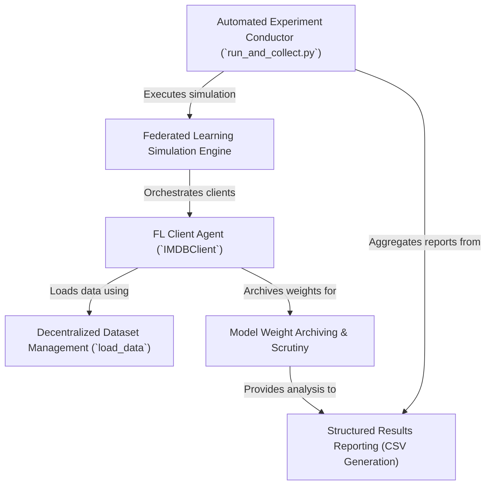

# Tutorial: for_dataset

This project *simulates* **federated learning**, where multiple *participants* (clients) collaboratively train a machine learning model on their respective *private data* without sharing it. The system focuses on **archiving and meticulously analyzing** the internal **model weights** from these clients throughout the simulation. An *automated experiment conductor* script repeatedly runs this entire simulation process, gathers comprehensive statistics about the model weights and training performance from each run, and then organizes these findings into **structured CSV files** for detailed review and further analysis.

**Source Repository:** [None](None)

## Chapters

1. [Automated Experiment Conductor (`run_and_collect.py`)
](01_automated_experiment_conductor___run_and_collect_py___.md)
2. [Federated Learning Simulation Engine
](02_federated_learning_simulation_engine_.md)
3. [Decentralized Dataset Management (`load_data`)
](03_decentralized_dataset_management___load_data___.md)
4. [FL Client Agent (`IMDBClient`)
](04_fl_client_agent___imdbclient___.md)
5. [Model Weight Archiving & Scrutiny
](05_model_weight_archiving___scrutiny_.md)
6. [Structured Results Reporting (CSV Generation)
](06_structured_results_reporting__csv_generation__.md)

---

Generated by [AI Codebase Knowledge Builder](https://github.com/The-Pocket/Tutorial-Codebase-Knowledge)